# IMX219PQH5-C — Sony / Quectel datasheet

Source: `IMX219_datasheet_Quectel.pdf` · 96 pages · page images `imx219_ds_pNNN.png` (200 DPI)

Project mode to check against: **1920×1080 RAW10 Bayer GBRG, 2-lane CSI-2, 30 fps**.

Figures are cropped from the datasheet and inserted next to each `Fig. N` caption (`figures/fig_01.png` … `fig_50.png`). Test-pattern color charts on p64–66 have no Fig. number; they are `figures/tp_*.png`. Full page scans remain in this folder as `imx219_ds_pNNN.png` if you need the whole page.

Checked against page PNGs (2026-09-11): pin tables 10–12, CSI DT (p47/p49), crop defaults (p26/p28/p30/p31), array (p52), orientation (p55), frame-rate formula (p56), EXCK/clock examples (p81–p82), Bayer (p89). Dense register-map pages still use auto-extracted grids — **hex defaults were spot-checked**; if a grid looks scrambled, trust the PNG.

## Quick index

| What | Pages |
|------|-------|
| Chip, 2/4-lane CSI-2, 60 fps @1080p V-crop, max 912 Mbps/lane @2-lane | [1](#page-1) |
| Pins / MIPI D0 D1 CLK | [10](#page-10)–[16](#page-16) |
| I2C / CCI, Repeated Start, slave address | [17](#page-17)–[23](#page-23) |
| Register map areas | [24](#page-24)–[26](#page-26) |
| Chip ID `0x0000` = `0x0219` | [26](#page-26) |
| Streaming `0x0100`, CSI lanes `0x0114` (01=2-lane, 03=4-lane), EXCK `0x012A/B` | [28](#page-28) |
| Frame bank A: `FRM_LENGTH` `LINE_LENGTH` crop `0x0164+` format `0x018C/D` | [30](#page-30) |
| PLL / clock regs `0x0300–0x030D` | [33](#page-33) |
| CSI-2 frame: FS=`0x00` FE=`0x01` | [47](#page-47) |
| CSI DT: RAW8=`0x2A` (`0x0808`), **RAW10=`0x2B` (`0x0A0A`)** | [49](#page-49) |
| RAW10 packing / embedded data | [50](#page-50) |
| Array 3280×2464 active / 3296×2480 effective | [52](#page-52) |
| Binning (1080p = no binning, V-crop) | [53](#page-53) |
| Image size / readout / flip (Bayer order) | [54](#page-54)–[55](#page-55) |
| Frame-rate formula, shutter, gain | [56](#page-56) |
| Test pattern | [62](#page-62) |
| Power on / off | [77](#page-77) |
| PLL / INCK / EXCK_FREQ | [81](#page-81)–[82](#page-82) |
| Color filter / readout | [89](#page-89) |

Key facts:

- `0x0114` = `0x01` → 2-lane (set **before** leaving standby). Default is 4-lane (`0x03`).
- `0x018C/0x018D` = `0x0A/0x0A` → CSI DT **0x2B RAW10**. Word count = width × 10/8.
- FS short packet DT=`0x00`, FE DT=`0x01`.
- 1080p is **V-crop**; datasheet max is **60 frame/s @1080p**. RPi/Quectel 1080p30 is slower clocking of that crop.
- I2C 16-bit index + 8-bit data; **read requires Repeated Start** (§3-1-2 / Fig. 12).
- Bayer on the wire depends on flip / `0x0174` vs Pin 1 orientation.

## Contents

- [p.1 Description](#page-1)
- [p.1 Features](#page-1)
- [p.2 Device Structure](#page-2)
- [p.3 USE RESTRICTION NOTICE](#page-3)
- [p.10 1. Block Diagram and Pin Configuration](#page-10)
  - [p.10 1-1 Block Diagram](#page-10)
  - [p.10 1-2 Pin Description](#page-10)
  - [p.13 1-3 Pin Equivalent Circuit](#page-13)
  - [p.14 1-4 Chip Center, Optical Center and Pin Assignment](#page-14)
  - [p.15 1-5 Pin Coordinates](#page-15)
- [p.16 2. Pixel Signal Output Specifications](#page-16)
  - [p.16 2-1 CSI-2 Signalling Mode](#page-16)
    - [p.16 2-1-1 MIPI Transmitter](#page-16)
    - [p.16 2-1-2 Output Lane](#page-16)
      - [p.16 2-1-2-1 2Lane Output](#page-16)
- [p.17 3. Control Registers](#page-17)
  - [p.17 3-1 2-wire Serial Communication Operation Specifications](#page-17)
    - [p.17 3-1-1 Communication Protocol](#page-17)
    - [p.19 3-1-2 2-wire serial communication read/write operation supported](#page-19)
    - [p.23 3-1-3 2-wire serial communication block characteristics](#page-23)
    - [p.24 3-1-4 2-wire serial communication register map](#page-24)
    - [p.25 3-1-5 Register Synchronization (Frame Bank )](#page-25)
  - [p.26 3-2 2-wire Serial Communication Register Map (Configuration register, Parameter limit register)](#page-26)
    - [p.26 3-2-1 Configuration Registers – [0x0000-0x0FFF]](#page-26)
    - [p.28 3-2-2 Set-up Registers – [0x0100-0x0147]](#page-28)
    - [p.30 3-2-3 Frame Bank Control and Group “A” – [0x0150-0x018D]](#page-30)
    - [p.32 3-2-4 Frame Bank Control Group “B” – [0x0254-0x028D]](#page-32)
    - [p.33 3-2-5 Set-up Registers – [0x0300-0x0627]](#page-33)
  - [p.36 3-3 Parameter Limit Registers – [0x1000-0x1FFF] (Read Only and Static)](#page-36)
    - [p.36 3-3-1 Integration Time and Gain Parameter Limit Registers – [0x1000-0x1301]](#page-36)
  - [p.41 3-4 Manufacturer Specific Registers – [0x3000-0x5FFF ]](#page-41)
  - [p.43 3-5 Frame Bank A and Bank B specific output samples](#page-43)
- [p.47 4. Output Data Format](#page-47)
  - [p.47 4-1 CSI-2 Output Data Format](#page-47)
    - [p.47 4-1-1 CSI-2 Output Data Channels](#page-47)
    - [p.47 4-1-2 CSI-2 Frame Structure](#page-47)
    - [p.48 4-1-3 Short Packet & Long Packet](#page-48)
    - [p.49 4-1-4 Data type](#page-49)
    - [p.49 4-1-5 CSI-2 Frame Format](#page-49)
    - [p.50 4-1-6 CSI-2 Embedded Data Line](#page-50)
  - [p.52 5-1 Pixel Array Physical Image](#page-52)
  - [p.53 5-2 Pixel Binning Mode](#page-53)
  - [p.54 5-3 image size](#page-54)
  - [p.55 5-4 Readout Position](#page-55)
  - [p.56 5-5 Frame Rate Calculation Formula](#page-56)
  - [p.56 5-6 Black Level Control](#page-56)
  - [p.56 5-7 Storage Time (Electronic Shutter) Settings](#page-56)
    - [p.56 5-7-1 Storage Time (Electronic Shutter) Setting Registers](#page-56)
    - [p.57 5-7-2 Storage Time Calculation Method](#page-57)
  - [p.58 5-8 Gain Settings](#page-58)
    - [p.58 5-8-1 Analogue Gain Settings](#page-58)
    - [p.60 5-8-2 Digital gain settings](#page-60)
- [p.62 6. On Chip Image Processing](#page-62)
  - [p.62 6-1 Test Pattern Generator](#page-62)
    - [p.62 6-1-1 Test Pattern](#page-62)
  - [p.67 6-2 Digital Gain Setting](#page-67)
  - [p.67 6-3 Black Level Adjust](#page-67)
  - [p.67 6-4 Defect Correction](#page-67)
  - [p.67 6-5 Pixel Re-alignment H Direction](#page-67)
  - [p.68 6-6 Pixel Re-alignment V Direction](#page-68)
- [p.69 7. NVM Memory Map](#page-69)
  - [p.69 7-1 Block Diagram](#page-69)
  - [p.69 7-2 NVM Functions](#page-69)
  - [p.70 7-3 Related Registers](#page-70)
  - [p.72 7-4 NVM Memory Map](#page-72)
  - [p.75 7-5 Defects Address registration](#page-75)
    - [p.75 7-5-1 Single defect address](#page-75)
    - [p.75 7-5-2 Same Color Adjoining defect address](#page-75)
    - [p.75 7-5-3 2x4 defect address](#page-75)
    - [p.76 7-5-4 Example Setting](#page-76)
- [p.77 8. How to operate IMX219PQH5-C](#page-77)
  - [p.77 8-1 Power on sequence](#page-77)
  - [p.79 8-2 Power off sequence](#page-79)
- [p.81 9. Other Functions](#page-81)
  - [p.81 9-1 Clock System](#page-81)
    - [p.81 9-1-1 Clock Structure](#page-81)
    - [p.81 9-1-2 EXCK_FREQ setting depend on INCK frequency](#page-81)
  - [p.82 9-2 Clock Setting Example](#page-82)
  - [p.83 9-3 Temperature Sensor](#page-83)
- [p.84 10. Electrical Characteristics](#page-84)
  - [p.84 10-1 Absolute Maximum Ratings](#page-84)
  - [p.84 10-2 Recommended Operating Conditions](#page-84)
  - [p.85 10-3 Electrical Characteristics](#page-85)
  - [p.86 10-4 AC Characteristics](#page-86)
    - [p.86 10-4-1 Master Clock Waveform Diagram](#page-86)
  - [p.86 10-5 Electrical Characteristics](#page-86)
- [p.87 11. Spectral Sensitivity Characteristic](#page-87)
- [p.88 12. Image Sensor Characteristics](#page-88)
  - [p.88 12-1 Image Sensor Characteristics](#page-88)
  - [p.88 12-2 Zone Definition used for specifying image sensor characteristics](#page-88)
- [p.89 13. Measurement Method for Image Sensor Characteristics](#page-89)
  - [p.89 13-1 Measurement conditions](#page-89)
  - [p.89 13-2 Color Coding of This Image Sensor and Readout](#page-89)
  - [p.89 13-3 Definition of Standard Imaging Conditions](#page-89)
  - [p.90 13-4 Measurement method](#page-90)
- [p.91 14. Spot Pixel Specification](#page-91)
- [p.92 15. Notice on White Pixels Specifications](#page-92)
  - [p.93 15-1 Measurement Method for Spot Pixels](#page-93)
  - [p.93 15-2 Spot Pixel Pattern Specifications](#page-93)
- [p.94 16. Chief Ray Angle Characteristics](#page-94)
- [p.95 17. Connection Example](#page-95)
- [p.96 18. Notes On Handling](#page-96)

---

## Page 1 — Description; Features

Diagonal 4.60 mm (Type 1/4.0) 8 Mega-Pixel CMOS Image Sensor with Square Pixel for Color Cameras

## IMX219PQH5-C

### Description

The IMX219PQH5-C is a diagonal 4.60 mm (Type 1/4.0) CMOS active pixel type image sensor with a square pixel array and 8.08M effective pixels. This chip operates with three power supplies, analogue 2.8 V, digital 1.2 V, and IF 1.8 V, and has low power consumption. High sensitivity, low dark current, and no smear are achieved through the adoption of R, G, and B primary color pigment mosaic filters. This chip features an electronic shutter with variable charge-storage time. In addition, this product is designed for use in cellular phone and tablet pc. When using this for another application, Sony does not guarantee the quality and reliability of product. Therefore, don't use this for applications other than cellular phone and tablet pc. Consult your Sony sales representative if you have any questions.

### Features

- Back-illuminated CMOS image sensor Exmor R™

- 2-wire serial communication circuit on chip

- CSI2 serial data output (selection of 4lane/2lane)

- Timing generator, H and V driver circuits on chip

- CDS/PGA on chip

- 10-bit A/D converter on chip

- Automatic optical black (OB) clamp circuit on chip

- PLL on chip (rectangular wave)

- High sensitivity, low dark current, no smear

- Excellent anti-blooming characteristics

- Variable-speed shutter function (1 H units)

- R, G, B primary color pigment mosaic filters on chip

- Max. 30 frame/s in all-pixel scan mode

- Pixel rate: 280 [Mpixel/s] (All-pixels mode)

- 180 frame/s @720p with 2x2 analog (special) binning, 60 frame/s @1080p with V-crop

- Data rate: Max. 755 Mbps/lane(@4lane), 912Mbps/Lane(@2lane)

* Exmor R is a trademark of Sony Corporation. The Exmor R is a Sony's CMOS image sensor with significantly enhanced imaging characteristics including sensitivity and low noise by changing fundamental structure of Exmor TM pixel adopted column parallel A/D converter to back-illuminated type. Sony reserves the right to change products and specifications without prior notice. This information does not convey any license by any implication or otherwise under any patents or other right. Application circuits shown, if any, are typical examples illustrating the operation of the devices. Sony cannot assume responsibility for any problems arising out of the use of these circuits.

---

## Page 2 — Device Structure

### Device Structure

- CMOS image sensor

- Image size Diagonal 4.60 mm (Type 1/4.0)

- Total number of pixels 3296 (H) × 2512 (V) approx. 8.28 M pixels

- Number of effective pixels 3296 (H) × 2480 (V) approx. 8.17 M pixels

- Number of active pixels 3280 (H) × 2464 (V) approx. 8.08 M pixels

- Chip size 5.095 mm (H) × 4.930 mm (V) (w/ Scribe)

- Unit cell size 1.12 µm (H) × 1.12 µm (V)

- Substrate material Silicon

---

## Page 3 — USE RESTRICTION NOTICE

### USE RESTRICTION NOTICE

This USE RESTRICTION NOTICE ("Notice") is for customers who are considering or currently using the image sensor products ("Products") set forth in this specifications book. Sony Corporation ("Sony") may, at any time, modify this Notice which will be available to you in the latest specifications book for the Products. You should abide by the latest version of this Notice. If a Sony subsidiary or distributor has its own use restriction notice on the Products, such a use restriction notice will additionally apply between you and the subsidiary or distributor. You should consult a sales representative of the subsidiary or distributor of Sony on such a use restriction notice when you consider using the Products. Use Restrictions  The Products are intended for incorporation into such general electronic equipment as office products, communication products, measurement products, and home electronics products in accordance with the terms and conditions set forth in this specifications book and otherwise notified by Sony from time to time.  You should not use the Products for critical applications which may pose a life- or injury- threatening risk or are highly likely to cause significant property damage in the event of failure of the Products. You should consult your sales representative beforehand when you consider using the Products for such critical applications. In addition, you should not use the Products in weapon or military equipment.  Sony disclaims and does not assume any liability and damages arising out of misuse, improper use, modification, use of the Products for the above-mentioned critical applications, weapon and military equipment, or any deviation from the requirements set forth in this specifications book. Design for Safety  Sony is making continuous efforts to further improve the quality and reliability of the Products; however, failure of a certain percentage of the Products is inevitable. Therefore, you should take sufficient care to ensure the safe design of your products such as component redundancy, anti-conflagration features, and features to prevent mis-operation in order to avoid accidents resulting in injury or death, fire or other social damage as a result of such failure. Export Control  If the Products are controlled items under the export control laws or regulations of various countries, approval may be required for the export of the Products under the said laws or regulations. You should be responsible for compliance with the said laws or regulations. No License Implied  The technical information shown in this specifications book is for your reference purposes only. The availability of this specifications book shall not be construed as giving any indication that Sony and its licensors will license any intellectual property rights in such information by any implication or otherwise. Sony will not assume responsibility for any problems in connection with your use of such information or for any infringement of third-party rights due to the same. It is therefore your sole legal and financial responsibility to resolve any such problems and infringement. Governing Law  This Notice shall be governed by and construed in accordance with the laws of Japan, without reference to principles of conflict of laws or choice of laws. All controversies and disputes arising out of or relating to this Notice shall be submitted to the exclusive jurisdiction of the Tokyo District Court in Japan as the court of first instance. Other Applicable Terms and Conditions  The terms and conditions in the Sony additional specifications, which will be made available to you when you order the Products, shall also be applicable to your use of the Products as well as to this specifications book. You should review those terms and conditions when you consider purchasing and/or using the Products.

---

## Page 4

---

## Page 5

---

## Page 6

---

## Page 7

---

## Page 8

---

## Page 9

---

## Page 10 — 1. Block Diagram and Pin Configuration; 1-1 Block Diagram; 1-2 Pin Description

### 1.  Block Diagram and Pin Configuration

#### 1-1  Block Diagram

*Fig. 1 Block Diagram*

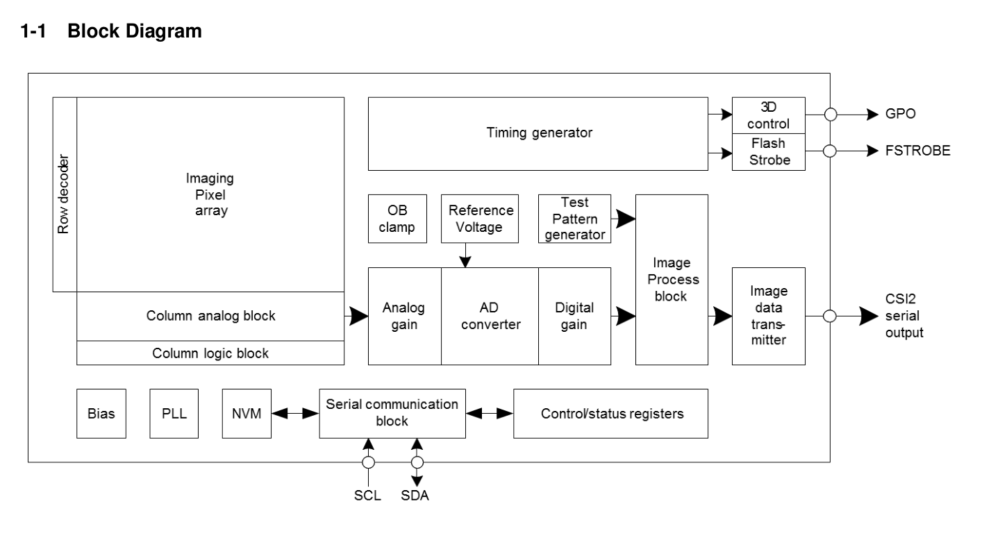

#### 1-2  Pin Description

**Table 1 Pin Description**

| Pin No. | Symbol | I/O | A/D | Description | Remarks |
| --- | --- | --- | --- | --- | --- |
| 1 | VDDLSC1 | Power | D | 1.2 V Power | |
| 2 | VSSLSC1 | GND | D | 1.2 V GND | |
| 3 | VDDHCM1 | Power | A | 2.8 V Power | |
| 4 | VSSHCM1 | GND | A | 2.8 V GND | |
| 5 | VSSLCN1 | GND | D | 1.2 V GND | |
| 6 | VDDLCN1 | Power | D | 1.2 V Power | |
| 7 | VSSLDM1 | | | Dummy | NC |
| 8 | VSSLSC2 | GND | D | 1.2 V GND | |
| 9 | VDDHFIL1 | Power | A | 2.8 V Power | = VANA |
| 10 | VDDLCN2 | Power | D | 1.2 V Power | |
| 11 | VSSLCN2 | GND | D | 1.2 V GND | |
| 12 | VSSHCM2 | GND | A | 2.8 V GND | |
| 13 | VDDHCM2 | Power | A | 2.8 V Power | |
| 14 | VSSLSC3 | GND | D | 1.2 V GND | |
| 15 | VDDLSC3 | Power | D | 1.2 V Power | |
| 16 | VCP | O | A | Analog Output | Connect to capacitor (2.2 µF) |
| 17 | VBO | O | A | Analog Output | Connect to capacitor (1.0 µF) |
| 18 | VSSHSN1 | GND | A | 2.8 V GND | |

---

## Page 11

**Table 1 Pin Description (continued)**

| Pin No. | Symbol | I/O | A/D | Description | Remarks |
| --- | --- | --- | --- | --- | --- |
| 19 | VDDHSN1 | Power | A | 2.8 V Power | |
| 20 | VSSLSC4 | GND | D | 1.2 V GND | |
| 21 | POREN | I | D | Digital Input | Connect to VDIG |
| 22 | XCLR | I | D | Digital Input | |
| 23 | TENABLE | I | D | Digital Input | NC |
| 24 | GPO | I/O | D | Digital Input/Output | Connect to VSSLSC when GPO is not enable |
| 25 | FSTROBE | O | D | Digital Output | |
| 26 | SDA | I/O | D | Digital Input/Output | |
| 27 | SCL | I | D | Digital Input | |
| 28 | TEST1 | I | D | Digital Input | NC |
| 29 | SWTCK | I | D | Digital Input | NC |
| 30 | INCK | I | D | Digital Input | |
| 31 | VDDMCO | Power | D | 1.8 V Power | |
| 32 | VSSLSC5 | GND | D | 1.2 V GND | |
| 33 | VDDLSC5 | Power | D | 1.2 V Power | |
| 34 | VDDHFIL2 | Power | A | 2.8 V Power | = VANA |
| 35 | VDDLSC6 | Power | D | 1.2 V Power | |
| 36 | VSSLSC6 | GND | D | 1.2 V GND | |
| 37 | VSSLDM2 | | | Dummy | NC |
| 38 | VDDLSC7 | Power | D | 1.2 V Power | |
| 39 | VSSLSC7 | GND | D | 1.2 V GND | |
| 40 | VDDLIO1 | Power | D | 1.2 V Power | |
| 41 | VSSLIO1 | GND | D | 1.2 V GND | |
| 42 | DMO1N | O | D | Digital Output | |
| 43 | DMO1P | O | D | Digital Output | |
| 44 | DMO2N | O | D | Digital Output | |
| 45 | DMO2P | O | D | Digital Output | |
| 46 | VSSLIO2 | GND | D | 1.2 V GND | |
| 47 | DCKN | O | D | Digital Output | |
| 48 | DCKP | O | D | Digital Output | |
| 49 | VSSLIO3 | GND | D | 1.2 V GND | |
| 50 | DMO3N | O | D | Digital Output | |
| 51 | DMO3P | O | D | Digital Output | |
| 52 | DMO4N | O | D | Digital Output | |
| 53 | DMO4P | O | D | Digital Output | |
| 54 | VSSLIO4 | GND | D | 1.2 V GND | |
| 55 | VDDLIO2 | Power | D | 1.2 V Power | |
| 56 | VSSLSC8 | GND | D | 1.2 V GND | |
| 57 | VDDLSC8 | Power | D | 1.2 V Power | |

---

## Page 12

**Table 1 Pin Description (continued)**

| Pin No. | Symbol | I/O | A/D | Description | Remarks |
| --- | --- | --- | --- | --- | --- |
| 58 | VSSHPL | GND | D | 2.8 V GND | |
| 59 | VDDHPL | Power | D | 2.8 V Power | |
| 60 | TVCDSIN | I | A | Analog Input | NC, For test |
| 61 | TVMON | O | A | Analog Output | NC, For test |
| 62 | VSSHAN | GND | A | 2.8 V GND | |
| 63 | VDDHAN | Power | A | 2.8 V Power | |
| 64 | VDDHSN2 | Power | A | 2.8 V Power | |
| 65 | VSSHSN2 | GND | A | 2.8 V GND | |

---

## Page 13 — 1-3 Pin Equivalent Circuit

#### 1-3  Pin Equivalent Circuit

*Fig. 2 Pin Equivalent Circuit*

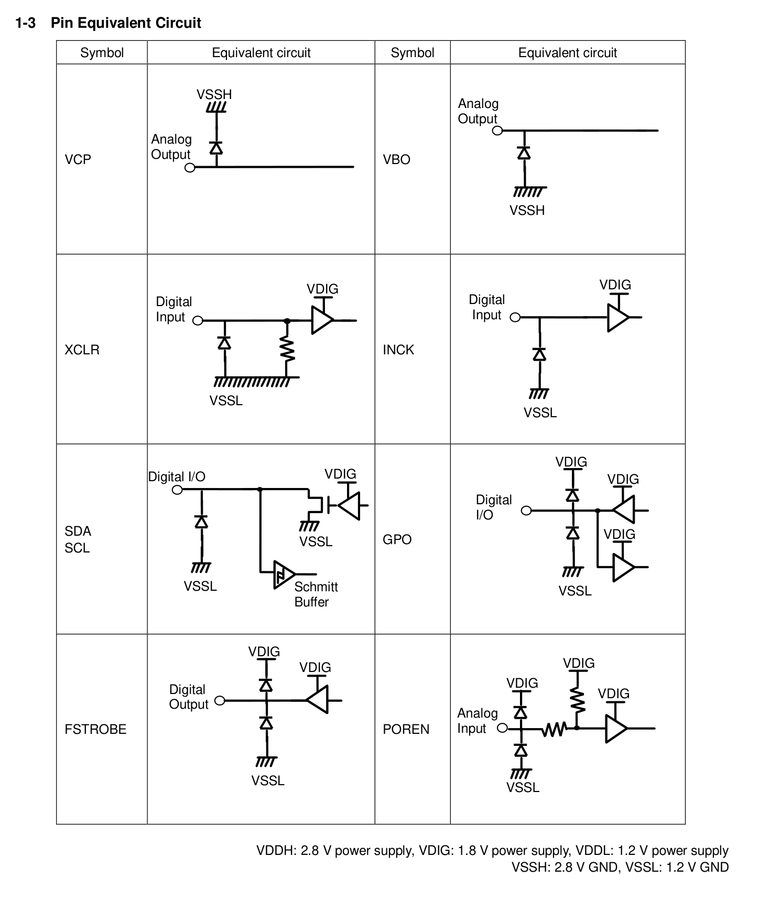

---

## Page 14 — 1-4 Chip Center, Optical Center and Pin Assignment

#### 1-4  Chip Center, Optical Center and Pin Assignment

(Unit: µm)

*Fig. 3 Chip Center and Optical Center*

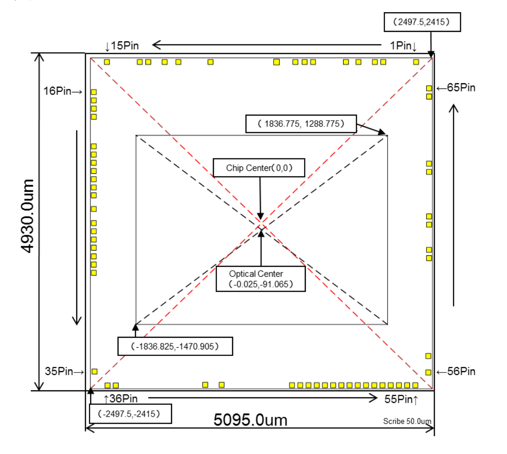

---

## Page 15 — 1-5 Pin Coordinates

#### 1-5  Pin Coordinates

**Table 2 Pin Coordinates**

| Pin No. | Symbol | X (pad center) | Y (pad center) |
| --- | --- | --- | --- |
| 1 | VDDLSC1 | 2247.50 | 2355.00 |
| 2 | VSSLSC1 | 1767.50 | 2355.00 |
| 3 | VDDHCM1 | 1647.50 | 2355.00 |
| 4 | VSSHCM1 | 1407.50 | 2355.00 |
| 5 | VSSLCN1 | 1167.50 | 2355.00 |
| 6 | VDDLCN1 | 687.50 | 2355.00 |
| 7 | VSSLDM1 | 567.50 | 2355.00 |
| 8 | VSSLSC2 | 447.50 | 2355.00 |
| 9 | VDDHFIL1 | 167.50 | 2356.00 |
| 10 | VDDLCN2 | -727.50 | 2355.00 |
| 11 | VSSLCN2 | -1207.50 | 2355.00 |
| 12 | VSSHCM2 | -1407.50 | 2355.00 |
| 13 | VDDHCM2 | -1647.50 | 2355.00 |
| 14 | VSSLSC3 | -1767.50 | 2355.00 |
| 15 | VDDLSC3 | -2247.50 | 2355.00 |
| 16 | VCP | -2447.50 | 1915.00 |
| 17 | VBO | -2447.50 | 1795.00 |
| 18 | VSSHSN1 | -2447.50 | 1675.00 |
| 19 | VDDHSN1 | -2447.50 | 1555.00 |
| 20 | VSSLSC4 | -2447.50 | 1125.00 |
| 21 | POREN | -2447.50 | 1005.00 |
| 22 | XCLR | -2447.50 | 885.00 |
| 23 | TENABLE | -2447.50 | 765.00 |
| 24 | GPO | -2447.50 | 645.00 |
| 25 | FSTROBE | -2447.50 | 525.00 |
| 26 | SDA | -2447.50 | 405.00 |
| 27 | SCL | -2447.50 | 205.00 |
| 28 | TEST1 | -2447.50 | 5.00 |
| 29 | SWTCK | -2447.50 | -115.00 |
| 30 | INCK | -2447.50 | -235.00 |
| 31 | VDDMCO | -2447.50 | -355.00 |
| 32 | VSSLSC5 | -2447.50 | -480.00 |
| 33 | VDDLSC5 | -2447.50 | -600.00 |
| 34 | VDDHFIL2 | -2447.50 | -726.00 |

| Pin No. | Symbol | X (pad center) | Y (pad center) |
| --- | --- | --- | --- |
| 35 | VDDLSC6 | -2447.50 | -2165.00 |
| 36 | VSSLSC6 | -2247.50 | -2365.00 |
| 37 | VSSLDM2 | -2127.50 | -2365.00 |
| 38 | VDDLSC7 | -807.50 | -2365.00 |
| 39 | VSSLSC7 | -567.50 | -2365.00 |
| 40 | VDDLIO1 | 447.50 | -2365.00 |
| 41 | VSSLIO1 | 567.50 | -2365.00 |
| 42 | DMO1N | 687.50 | -2365.00 |
| 43 | DMO1P | 807.50 | -2365.00 |
| 44 | DMO2N | 927.50 | -2365.00 |
| 45 | DMO2P | 1047.50 | -2365.00 |
| 46 | VSSLIO2 | 1167.50 | -2365.00 |
| 47 | DCKN | 1287.50 | -2365.00 |
| 48 | DCKP | 1407.50 | -2365.00 |
| 49 | VSSLIO3 | 1527.50 | -2365.00 |
| 50 | DMO3N | 1647.50 | -2365.00 |
| 51 | DMO3P | 1767.50 | -2365.00 |
| 52 | DMO4N | 1887.50 | -2365.00 |
| 53 | DMO4P | 2007.50 | -2365.00 |
| 54 | VSSLIO4 | 2127.50 | -2365.00 |
| 55 | VDDLIO2 | 2247.50 | -2365.00 |
| 56 | VSSLSC8 | 2447.50 | -2165.00 |
| 57 | VDDLSC8 | 2447.50 | -1925.00 |
| 58 | VSSHPL | 2447.50 | -507.00 |
| 59 | VDDHPL | 2447.50 | -387.00 |
| 60 | TVCDSIN | 2447.50 | -20.00 |
| 61 | TVMON | 2447.50 | 100.00 |
| 62 | VSSHAN | 2447.50 | 750.00 |
| 63 | VDDHAN | 2447.50 | 870.00 |
| 64 | VDDHSN2 | 2447.50 | 1850.00 |
| 65 | VSSHSN2 | 2447.50 | 1970.00 |

---

## Page 16 — 2. Pixel Signal Output Specifications; 2-1 CSI-2 Signalling Mode

### 2.  Pixel Signal Output Specifications

IMX219PQH5-C has CSI-2 interface and the options are 4 lanes or 2lanes.

#### 2-1  CSI-2 Signalling Mode

##### 2-1-1  MIPI Transmitter

Output pin of CSI-2 are shown below

*Fig. 4 Relationship between Output pin name and MIPI output Lane*

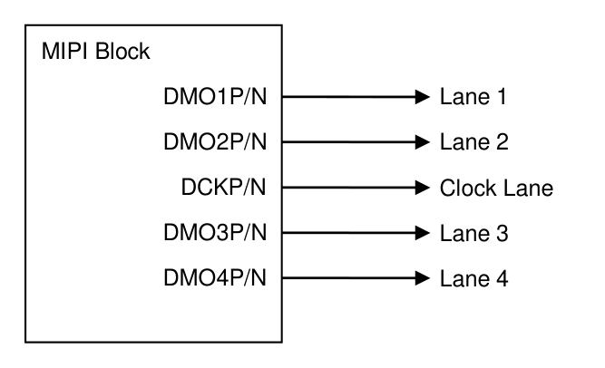

Data and clock signals are transmitted using CSI-2 interface (high speed serial interface). Detailed explanation of CSI-2 interface is in following two documents, “MIPI Alliance Standard for Camera Serial Interface2 (CSI-2) Version 1.01” and “MIPI Alliance Specification for D-PHY Version 1.10.00”. In CSI-2 interface, one bit of data is transmitted by a pair of differential signals. In the transmitter of CSI-2 interface, differential digital signals of data or clock are converted to differential current signals. At the receiver of CSI-2 interface, inserting output resistance, which is serial to a pair of differential outputs (data or clock), or connecting the receiver block, which includes internal resistance for a pair of differential outputs (data or clock), is required. In the case of using output resistance, output resistance is placed close to the receiver. Additionally, it is recommended that each space between differential output lines such as DMO1P/DMO1N, DMO2P/DMO2N, DMO3P/DMO3N, DMO4P/DMO4N, or DCKP/DCKN is identical, the length of all differential output lines is same, and output line length between the transmitter and the receiver is minimum.

##### 2-1-2  Output Lane

Two or Four data output Lanes are applied from MIPI Alliance Standard for Camera Serial Interface2 (CSI-2) Version 1.01.

###### 2-1-2-1  2Lane Output

Outputs of data and clock come from CSI-2 output pins (DMO1P/DMO1N, DMO2P/DMO2N, DCKP/DCKN). A pair of DMO1P/DMO1N is called Lane1 data and a pair of DMO2P/DMO2N is called Lane2 data. Also, clock signals come from CSI-2 output pins, DCKP/DCKN. Maximum output data rate is 912 Mbps/lane. (1lane output is not supported).

---

## Page 17 — 3. Control Registers; 3-1 2-wire Serial Communication Operation Specifications

### 3.  Control Registers

The IMX219PQH5-C can use the 2-wire serial communication method for sensor control. These specifications are described for sensor control using the 2-wire serial communication as follows.

#### 3-1  2-wire Serial Communication Operation Specifications

The 2-wire serial communication method conforms to the Camera Control Instance (CCI). CCI is an I2C fast-mode plus ( INCK[fSCK] = 11.4 to 27 MHz) compatible interface, and the data transfer protocol is I2C standard. This 2-wire serial communication circuit can be used to access the control-registers and status-registers of IMX219PQH5-C.

*Fig. 5 2-wire Serial Communication*

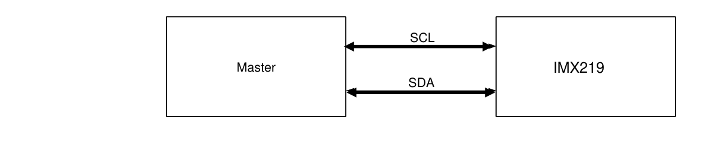

**Table 3 Description of 2-wire Serial Communication Pins**

| Symbol | Description |
| --- | --- |
| SDA | Serial data communication |
| SCL | Serial clock input |

##### 3-1-1  Communication Protocol

2-wire serial communication supports a 16-bit register address and 8-bit data message type. From Master to Slave Direction Dependent on Operation From Slave to Master S=Start Condition P=Stop Condition (Sr=Repeated Start Condition) A=Acknowledge A=Negative Acknowledge

*Fig. 6 2-wire Serial Communication Protocol*

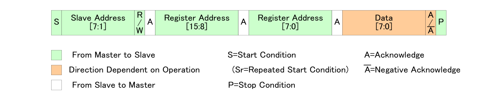

Data is transferred serially, MSB first in 8-bit units. After each data byte is transferred, A (Acknowledge)/Ā (Acknowledge) is transferred. Data (SDA) is transferred at the clock (SCL) cycle. SDA can change only while SCL is Low, so the SDA value must be held while SCL is High. The Start condition is defined by SDA changing from High to Low while SCL is High. When the Stop condition is not generated in the previous communication phase and Start condition for the next communication is generated, that Start condition is recognized as a Repeated Start condition.

| S | Slave Address [7:1] | R / W | A | Register Address [15:8] | A | Register Address [7:0] | A | Data [7:0] | A / | P |
| --- | --- | --- | --- | --- | --- | --- | --- | --- | --- | --- |
|  |  |  |  |  |  |  |  |  | A |  |

---

## Page 18

*Fig. 7 Start Condition*

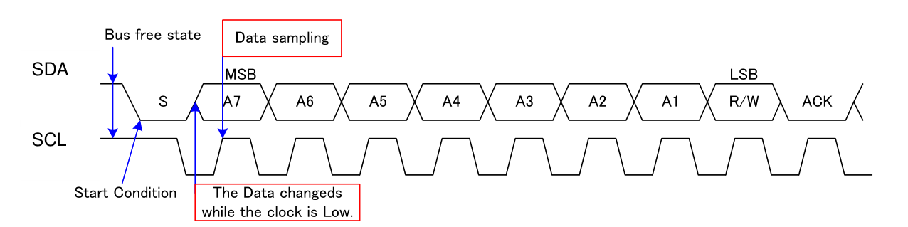

*Fig. 8 Repeated Start Condition*

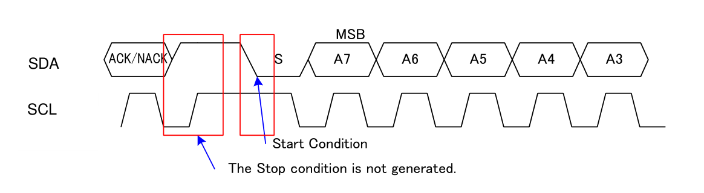

The Stop condition is defined by SDA changing from Low to High while SCL is High.

*Fig. 9 Stop Condition*

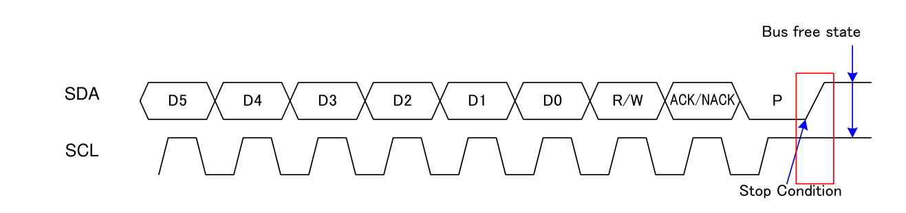

*Fig. 10 Slave Address*

The R/W bit indicates the data transfer direction.

**Table 4 R/W Bit**

After transfer of each data byte, the Master or the sensor transmits an Acknowledge / Negative Acknowledge and releases (does not drive) SDA. When Negative Acknowledge is generated, the Master must immediately generate the Stop condition and end the communication. A7 A6 A5 A4 A3 A2 A1 R/W S MSB LSB Bus free state Start Condition The Data changeds while the clock is Low. Data sampling SDA SCL ACK A7 A6 A5 A4 A3 MSB ACK/NACK The Stop condition is not generated. D5 D4 D3 D2 D1 D0 R/W P Bus free state Stop Condition ACK/NACK Slave Address [7:1] R/W SDA SCL

| R/W bit | Transfer direction |
| --- | --- |
| 0 | Write (Master →Sensor) |
| 1 | Read (Sensor → Master) |

---

## Page 19

*Fig. 11 Acknowledge and Negative Acknowledge*

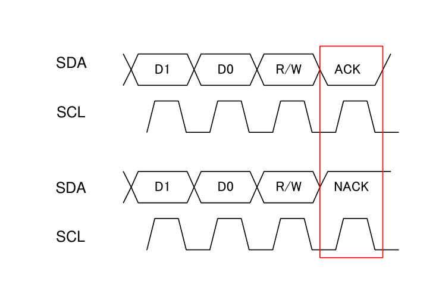

The registers have a 16-bit address space, and are assigned as follows.

**Table 5 2-wire Serial Communication Address Space**

| Address area | Description |
| --- | --- |
| 0x0000 - 0x0FFF | Configuration register |
| 0x1000 - 0x1FFF | Parameter limit register Read Only and Static register |
| 0x3000 - 0xFFFF | Manufacture specific register |

##### 3-1-2  2-wire serial communication read/write operation supported

The IMX219PQH5-C supports the following four read operations and two write operations that conform to the SMIA standard.

**Table 6 Operations Supported by 2-wire Serial Communication**

| 1 | CCI Single read from random location (Single read from an optional address) |
| --- | --- |
| 2 | CCI Single read from current location (Single read from the held address) |
| 3 | CCI sequential read starting from random location (Sequential read starting from an optional address) |
| 4 | CCI sequential read starting from current location (Sequential read starting from the held address) |
| 5 | CCI single write to random location (Single write to an optional address) |
| 6 | CCI sequential write starting from random location (Sequential write starting from an optional address) |

---

## Page 20

###### 3-1-2-1  CCI single read from random location

The sensor has an index function that indicates which address it is focusing on. In reading the data at an optional single address, the Master must set the index value to the address to be read. For this purpose it performs dummy write operation up to the register address. The upper level of the figure below shows the sensor internal index value, and the lower level of the figure shows the SDA I/O data flow. The Master sets the sensor index value to M by designating the sensor slave address with a write request, then designating the address (M). Then, the Master generates the start condition. The Start condition is generated without generating the Stop condition, so it becomes the Repeated Start condition. Next, when the Master sends the slave address with a read request, the sensor outputs an Acknowledge immediately followed by the index address data on SDA . After the Master receives the data, it generates a Negative Acknowledge and the Stop condition to end the communication.

*Fig. 12 CCI single read from random location*

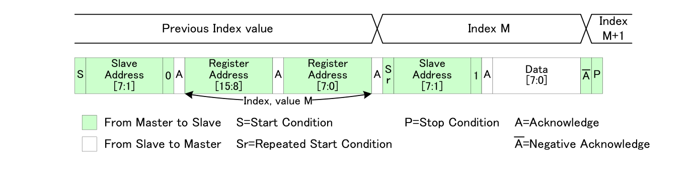

###### 3-1-2-2  CCI single read from current location

After the slave address is transmitted by a write request, that address is designated by the next communication and the index holds that value. In addition, when data read/write is performed, the index is incremented by the subsequent Acknowledge/Negative Acknowledge timing. When the index value is known to indicate the address to be read, sending the slave address with a read request allows the data to be read immediately after Acknowledge. After receiving the data, the Master generates a Negative Acknowledge and the Stop condition to end the communication, but the index value is incremented, so the data at the next address can be read by sending the slave address with a read request.

*Fig. 13 CCI single read from current location*

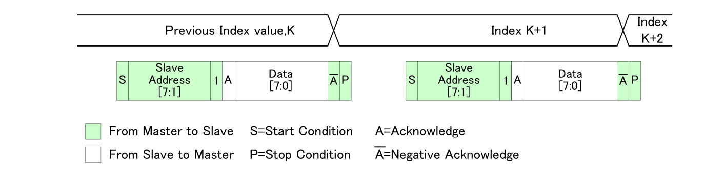

From Master to Slave From Slave to Master S=Start Condition P=Stop Condition Sr=Repeated Start Condition A=Acknowledge A=Negative Acknowledge Previous Index value Index M Index M+1 From Master to Slave From Slave to Master S=Start Condition P=Stop Condition A=Acknowledge A=Negative Acknowledge Previous Index value,K Index K+1 Index K+2

| S | Slave Address [7:1] | 1 | A | Data [7:0] |   | P |
| --- | --- | --- | --- | --- | --- | --- |
|  |  |  |  |  | A |  |

| S | Slave Address [7:1] | 1 | A | Data [7:0] |   | P |
| --- | --- | --- | --- | --- | --- | --- |
|  |  |  |  |  | A |  |

---

## Page 21

###### 3-1-2-3  CCI sequential read starting from random location

In reading data sequentially, which is starting from an optional address, the Master must set the index value to the start of the addresses to be read. For this purpose, dummy write operation includes the register address setting. The Master sets the sensor index value to M by designating the sensor slave address with a read request, then designating the address (M). Then, the Master generates the Repeated Start condition. Next, when the Master sends the slave address with a read request, the sensor outputs an Acknowledge followed immediately by the index address data on SDA. When the Master outputs an Acknowledge after it receives the data, the index value inside the sensor is incremented and the data at the next address is output on SDA. This allows the Master to read data sequentially. After reading the necessary data, the Master generates a Negative Acknowledge and the Stop condition to end the communication.

*Fig. 14 CCI sequential read starting from random location*

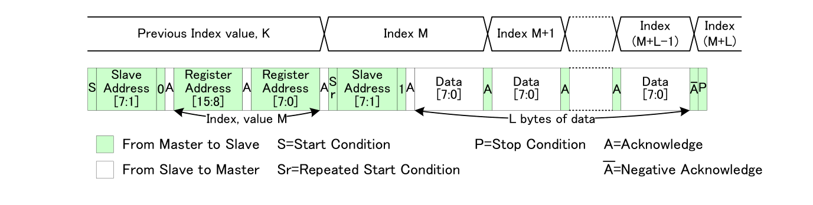

###### 3-1-2-4  CCI sequential read starting from current location

When the index value is known to indicate the address to be read, sending the slave address with a read request allows the data to be read immediately after the Acknowledge. When the Master outputs an Acknowledge after it receives the data, the index value inside the sensor is incremented and the data at the next address is output on SDA. This allows the Master to read data sequentially. After reading the necessary data, the Master generates a Negative Acknowledge and the Stop condition to end the communication.

*Fig. 15 CCI sequential read starting from current location*

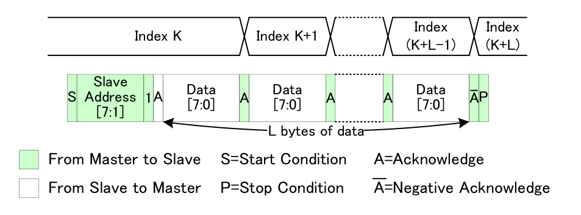

From Master to Slave From Slave to Master S=Start Condition P=Stop Condition Sr=Repeated Start Condition A=Acknowledge A=Negative Acknowledge Previous Index value, K Index M Index (M+L) Index M+1 Index (M+L-1) From Master to Slave From Slave to Master S=Start Condition P=Stop Condition A=Acknowledge A=Negative Acknowledge Index K Index (K+L) Index K+1 Index (K+L-1)

---

## Page 22

###### 3-1-2-5  CCI single write to random location

The Master sets the sensor index value to M by designating the sensor slave address with a write request, and designating the address (M). After that the Master can write the value in the designated register by transmitting the data to be written. After writing the necessary data, the Master generates the Stop condition to end the communication.

*Fig. 16 CCI single write to random location*

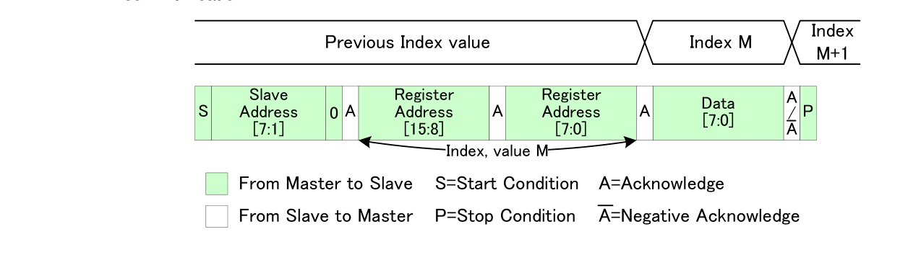

###### 3-1-2-6  CCI sequential write starting from random location

The Master can write a value to register address M by designating the sensor slave address with a write request, designating the address (M), and then transmitting the data to be written. After the sensor receives the write data, it outputs an Acknowledge and at the same time increments the register address, so the Master can write to the next address simply by continuing to transmit data. After the Master writes the necessary number of bytes, it generates the Stop condition to end the communication.

*Fig. 17 CCI sequential write starting from random location*

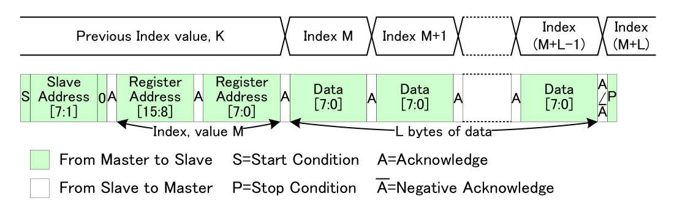

From Master to Slave From Slave to Master S=Start Condition P=Stop Condition A=Acknowledge A=Negative Acknowledge Previous Index value Index M Index M+1 From Master to Slave From Slave to Master S=Start Condition P=Stop Condition A=Acknowledge A=Negative Acknowledge Previous Index value, K Index M Index (M+L) Index M+1 Index (M+L-1)

| S | Slave Address [7:1] | 0 | A | Register Address [15:8] | A | Register Address [7:0] | A | Data [7:0] | A / | P |
| --- | --- | --- | --- | --- | --- | --- | --- | --- | --- | --- |
|  |  |  |  |  |  |  |  |  | A |  |

---

## Page 23

##### 3-1-3  2-wire serial communication block characteristics

The block operation specifications for 2-wire serial communication are show below.

*Fig. 18 2-wire Serial Communication Specifications*

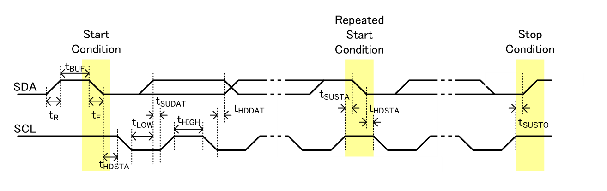

**Table 7 2-wire Serial Communication Operation Specifications**

| Item | Symbol | Conditions | Min. | Max. | Unit |
| --- | --- | --- | --- | --- | --- |
| Low level input voltage | VIL |  | -0.5 | 0.3VDIG | V |
| High level input voltage | VIH |  | 0.7VDIG | VDIG+0.5 | V |
| Low level output voltage | VOL | VDIG < 2 V,Sink 2 mA |  | 0.25VDIG | V |
| High level output voltage | VOH | VDIG < 2 V,Sink 2 mA | 0.75VDIG |  | V |
| Output fall time | tof | Load 10 pF – 400 pF,0.7VDIG – 0.3VDIG |  | 120 | ns |
| Input current | II | 0.1VDIG -0.9VDIG | -10 | 10 | µA |
| SDA I/O capacitance | CI/O |  |  | 8 | pF |
| SCL Input capacitance | CI |  |  | 6 | pF |

**Table 8 2-wire Serial Communication AC Timing (Fast mode plus (INCK[fSCK] = 11.4 to 27 MHz))**

| Item | Symbol | Min. | Max. | Unit |
| --- | --- | --- | --- | --- |
| SCL clock frequency ( INCK[fSCK] = 11.4 to 27 MHz) | f SCL | 0 | 1000 | kHz |
| Rise time (SDA and SCL) | t R | ― | 120 | ns |
| Fall time (SDA and SCL) | t F | ― | 120 | ns |
| Hold time (start condition) | t HDSTA | 0.26 | ― | µs |
| Setup time (rep.-start condition) | t SUSTA | 0.26 | ― | µs |
| Setup time (stop condition) | t SUSTO | 0.26 | ― | µs |
| Data setup time | t SUDAT | 50 | ― | ns |
| Data hold time | t HDDAT | 0 | ― | µs |
| Bus free time between Stop and Start condition | t BUF | 0.5 |  | µs |
| Low period of the SCL clock | t LOW | 0.5 |  | µs |
| High period of the SCL clock | t HIGH | 0.26 |  | µs |

---

## Page 24

**Table 9 2-wire Serial Communication AC Timing (Fast mode)**

| Item | Symbol | Min. | Max. | Unit |
| --- | --- | --- | --- | --- |
| SCL clock frequency ( INCK[fSCK] = 6 to 27 MHz) | f SCL | 0 | 400 | kHz |
| Rise time (SDA and SCL) | t R | ― | 300 | ns |
| Fall time (SDA and SCL) | t F | ― | 300 | ns |
| Hold time (start condition) | t HDSTA | 0.6 | ― | µs |
| Setup time (rep.-start condition) | t SUSTA | 0.6 | ― | µs |
| Setup time (stop condition) | t SUSTO | 0.6 | ― | µs |
| Data setup time | t SUDAT | 100 | ― | ns |
| Data hold time | t HDDAT | 0 | 0.9 | µs |
| Bus free time between Stop and Start condition | t BUF | 1.3 |  | µs |
| Low period of the SCL clock | t LOW | 1.3 |  | µs |
| High period of the SCL clock | t HIGH | 0.6 |  | µs |

##### 3-1-4  2-wire serial communication register map

###### 3-1-4-1  Description of 2-wire communication register map

In 2-wire serial communication, there is a 16-bit address space as follows. In IMX219PQH5-C, there are partially unreadable registers, which is described in Register map. If reading unreadable registers, the value to be read is 00h.

**Table 10 2-wire Serial Communication Register Map Address Areas**

| Address Area | Description |
| --- | --- |
| 0x0000 - 0x0fff | Configuration register |
| 0x1000 - 0x1fff | Parameter limit register Read Only and Static resister |
| 0x3000 - 0xffff | Manufacture specific register |

---

## Page 25

##### 3-1-5  Register Synchronization (Frame Bank)

Sequence for control of frame bank is explained in this section: 1. All registers on frame bank are latched by vertical synchronization (V-sync) signal. 2. Any change for registers on frame bank are reflected to functions in next frame (or following next frame) if the corresponding registers are updated. Figures for sequences of frame bank are shown in following statements. In case that user changes analog/digital gain and integration time only, we see no “no-data” term. In case that user changes following registers, we may see a term in which we do not see any output from the sensor in addition to vertical blanking interval. From ISP's standing point, it seems that sensor has a bit longer vertical blanking interval. Additional “no-data term” will be equal to coarse_integration_time + 20[H] if fast tracking mode register is activated. List of registers is: - Binning related registers (especially for analog binning) - Sub-sampling registers (for vertical direction) - Vertical image_orientation registers - Vertical ROI

*Fig. 19 Function Example for Frame Bank*

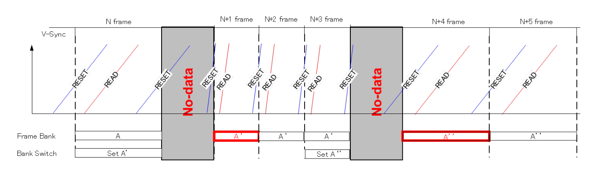

---

## Page 26 — 3-2 2-wire Serial Communication Register Map (Configuration register, Parameter limit register)

#### 3-2  2-wire Serial Communication Register Map

#### (Configuration register, Parameter limit register)

##### 3-2-1  Configuration Registers – [0x0000-0x0FFF]

###### 3-2-1-1  Status Registers – [0x0000-0x001B] (Read Only Dynamic Registers)

|   |   |   |   |   |   |   |   |   |   | Re- |   | Default |   | Embd |
| --- | --- | --- | --- | --- | --- | --- | --- | --- | --- | --- | --- | --- | --- | --- |
|  | Index |  | Byte |  | Register Name |  | RW |  | Comment |  |  |  |  |  |
|  |  |  |  |  |  |  |  |  |  | Time |  | (HEX) |  | DL |
|  |  |  |  |  |  |  |  |  |  |  |  |  |  |  |
| 0000 |  | [7:0] |  | MODEL_ID[15:8]|  | RO |  | model id |  |  | 02 |  |  |  |
| 0001 |  | [7:0] |  | MODEL_ID[7:0]|  | RO |  |  |  |  | 19 |  |  |  |
| 0004 |  | [7:0] |  | Lot_ID[23:16]|  | RO-D |  | Lot_ID of the sensor Copied from NVM |  |  | XX |  | ○ |  |
| 0005 |  | [7:0] |  | Lot_ID[15:8]|  | RO-D |  |  |  |  | XX |  | ○ |  |
| 0006 |  | [7:0] |  | Lot_ID[7:0]|  | RO-D |  |  |  |  | XX |  | ○ |  |
| 0007 |  | [7:0] |  | Wafer_Num|  | RO-D |  | Wafer_Number of the Sensor in the Lot. Value 0x01-0x19 is available. |  |  | XX |  | ○ |  |
| 000D |  | [7:0] |  | Chip_Number[15:8]|  | RO-D |  | Chip ID in the wafer |  |  | XX |  | ○ |  |
| 000E |  | [7:0] |  | Chip_Number[7:0]|  | RO-D |  |  |  |  | XX |  | ○ |  |
| 0018 |  | [7:0] |  | FRM_CNT[7:0]|  | RO-D |  |  |  |  | FF |  | ○ |  |
| 0019 |  | [7:0] |  | PX_ORDER|  | RO-D |  |  |  |  | 01 |  | ○ |  |
| 001A |  | [1:0] |  | DT_PEDESTAL[9:8]|  | RO-D |  |  |  |  | 0 |  | ○ |  |
| 001B |  | [7:0] |  | DT_PEDESTAL[7:0]|  | RO-D |  |  |  |  | 40 |  | ○ |  |

---

## Page 27

###### 3-2-1-2  Frame Format Description – [0x0040-0x0047]

###### 3-2-1-3  Analogue Gain Description Registers – [0x0080-0x0093]

|   |   |   |   |   |   |   |   |   |   | Re- |   | Default |   | Embd |
| --- | --- | --- | --- | --- | --- | --- | --- | --- | --- | --- | --- | --- | --- | --- |
|  | Index |  | Byte |  | Register Name |  | RW |  | Comment |  |  |  |  |  |
|  |  |  |  |  |  |  |  |  |  | Time |  | (HEX) |  | DL |
|  |  |  |  |  |  |  |  |  |  |  |  |  |  |  |
| 0x0040 |  | [7:0] |  | FRM_FMT TYPE[7:0] |  | RO |  | frame format model type_  |  |  | 01 |  | ○ |  |
| 0x0041 |  | [7:0] |  | FRM_FMT SUBTYPE[7:0] |  | RO |  | frame format model subtype_  |  |  | 12 |  | ○ |  |
| 0x0042 |  | [7:0] |  | FRM_FMT DESC0[15:8] |  | RO-D |  | frame format descriptor 0_  |  |  | 5C |  | ○ |  |
| 0x0043 |  | [7:0] |  | FRM_FMT DESC0[7:0] |  |  |  |  |  |  | D0 |  | ○ |  |
| 0x0044 |  | [7:0] |  | FRM_FMT DESC1[15:8] |  | RO |  | frame format descriptor 1_  |  |  | 10 |  | ○ |  |
| 0x0045 |  | [7:0] |  | FRM_FMT DESC1[7:0] |  |  |  |  |  |  | 02 |  | ○ |  |
| 0x0046 |  | [7:0] |  | FRM_FMT DESC2[15:8] |  | RO-D |  | frame format descriptor 2_  |  |  | 59 |  | ○ |  |
| 0x0047 |  | [7:0] |  | FRM_FMT DESC2[7:0] |  |  |  |  |  |  | A0 |  | ○ |  |

|   |   |   |   |   | Re- |   | Default | Embd |
| --- | --- | --- | --- | --- | --- | --- | --- | --- |
|  |  |  |  |  |  |  |  |  |
|  |  |  |  |  | Time |  | (HEX) | DL |
|  |  |  |  |  |  |  |  |  |
| 0x0080 | ― | ― | ― |  |  | 00 |  |  |
| 0x0081 | [7:0] | analogue gain capability_ | RO | Analogue Gain Description Registers |  | 0 |  |  |
| 0x0082 | ― | Reserved | RO | Reserved |  | 00 |  |  |
| 0x0083 | ― | ― | ― |  |  | 00 |  |  |
| 0x0084 | ― | ― | ― |  |  | 00 |  |  |
| 0x0085 | [7:0] | analogue gain code min_  | RO-D | Analogue Gain Description Registers |  | 00 |  |  |
| 0x0086 | [7:0] | analogue gain code max_  | RO | Analogue Gain Description Registers possible to setup up to E8 (HEX) |  | 00 |  |  |
| 0x0087 | [7:0] |  |  |  |  | E0 |  |  |
| 0x0088 | [7:0] | analogue gain code step_  | RO | Analogue Gain Description Registers |  | 00 |  |  |
| 0x0089 | [7:0] |  |  |  |  | 01 |  |  |
| 0x008A | [7:0] | analogue gain type_ | RO | Analogue Gain Description Registers |  | 00 |  |  |
| 0x008B | [7:0] |  |  |  |  | 00 |  |  |
| 0x008C | [7:0] | analogue gain m0_ | RO | Analogue Gain Description Registers |  | 00 |  |  |
| 0x008D | [7:0] |  |  |  |  | 00 |  |  |
| 0x008E | [7:0] | analogue gain c0_ | RO | Analogue Gain Description Registers |  | 01 |  |  |
| 0x008F | [7:0] |  |  |  |  | 00 |  |  |
| 0x0090 | [7:0] | analogue gain m1_ | RO | Analogue Gain Description Registers |  | FF |  |  |
| 0x0091 | [7:0] |  |  |  |  | FF |  |  |
| 0x0092 | [7:0] | analogue gain c1_ | RO | Analogue Gain Description Registers |  | 01 |  |  |
| 0x0093 | [7:0] |  |  |  |  | 00 |  |  |

---

## Page 28

###### 3-2-1-4  Data Format Description – [0x00C0-0x00D1]

##### 3-2-2  Set-up Registers – [0x0100-0x0147]

###### 3-2-2-1  General Set-up Registers – [0x0100-0x0106]

|   |   |   |   |   |   |   |   |   |   | Re- |   | Default |   | Embd |
| --- | --- | --- | --- | --- | --- | --- | --- | --- | --- | --- | --- | --- | --- | --- |
|  | Index |  | Byte |  | Register Name |  | RW |  | Comment |  |  |  |  |  |
|  |  |  |  |  |  |  |  |  |  | Time |  | (HEX) |  | DL |
|  |  |  |  |  |  |  |  |  |  |  |  |  |  |  |
| 0x00C0 |  | [7:0] |  | DT_FMT TYPE[7:0] |  | RO |  | data format model type_  |  |  | 01 |  | ○ |  |
| 0x00C1 |  | [7:0] |  | DT_FMT SUBTYPE[7:0] |  | RO |  | data format model subtype_  |  |  | 01 |  | ○ |  |
| 0x00C2 |  | [7:0] |  | DT_FMT DESC0[15:8] |  | RO |  | data format descriptor 0_  |  |  | 0A |  | ○ |  |
| 0x00C3 |  | [7:0] |  | DT_FMT DESC0[7:0] |  |  |  |  |  |  | 08 |  | ○ |  |
| 0x00C4 |  | [7:0] |  | DT_FMT DESC1[15:8] |  | RO |  | data format descriptor 1_  |  |  | 0A |  | ○ |  |
| 0x00C5 |  | [7:0] |  | DT_FMT DESC1[7:0] |  |  |  |  |  |  | 0A |  | ○ |  |

|   |   |   |   |   |   |   |   |   |   | Re- |   | Default |   | Embd |
| --- | --- | --- | --- | --- | --- | --- | --- | --- | --- | --- | --- | --- | --- | --- |
|  | Index |  | Byte |  | Register Name |  | RW |  | Comment |  |  |  |  |  |
|  |  |  |  |  |  |  |  |  |  | Time |  | (HEX) |  | DL |
|  |  |  |  |  |  |  |  |  |  |  |  |  |  |  |
| 0x0100 |  | [4:0] |  | mode_select [4:0]|  | RW |  | Mode Select: 0: SW standby, 1: Streaming |  |  | 00 |  | ○ |  |
| 0x0101 |  | ― |  | Reserved |  |  |  |  |  |  |  |  |  |  |
| 0x0102 |  | ― |  | Reserved |  |  |  |  |  |  |  |  |  |  |
| 0x0103 |  | [0] |  | software_reset|  | RW |  | Software reset |  |  | 00 |  | ○ |  |
| 0x0104 |  | [0] |  | corrupted frame status |  | RO-D |  | corrupted frame status |  |  | 00 |  | ○ |  |
| 0x0105 |  | [0] |  | mask corrupted frames_ |  | RW |  | mask corrupted frames_ |  |  | 01 |  | ○ |  |
| 0x0106 |  | [0] |  | fast standby enable |  | RW |  | fast standby from streaming |  |  | 00 |  | ○ |  |

---

## Page 29

###### 3-2-2-2  Output Set-up Registers – [0x0110-0x0147]

| c1 | c2 | c3 | c4 | c5 | c6 | c7 |
| --- | --- | --- | --- | --- | --- | --- |
|  |  |  |  |  |  |  |
|  |  |  |  |  |  |  |
| 0x0110 | [1:0] | CSI_CH_ID_ | RW | CSI-2 channel ID | 0 | ○ |
| 0x0111 | [1:0] | CSI_SIG_MODE_ | RO | CSI-2 signalling mode | 0 | ○ |
| 0x0114 | [1:0] | CSI_LANE_MODE_ | RW | CSI lane mode_ 0: Reserved, 1: 2-Lane, 2: Reserved, 3: 4-Lane | 3 | ○ |
| 0x0118 | [0] | TCLK POST[8]| RW | Global Timing Parameters | 0 |  |
| 0x0119 | [7:0] | TCLK POST[7:0]| RW | Global Timing Parameters | 6F |  |
| 0x011A | [0] | THS PREPARE[8]| RW | Global Timing Parameters | 0 |  |
| 0x011B | [7:0] | THS PREPARE[7:0]| RW | Global Timing Parameters | 2F |  |
| 0x011C | [0] | THS ZERO MIN[8] | RW | Global Timing Parameters | 0 |  |
| 0x011D | [7:0] | THS ZERO MIN[7:0] | RW | Global Timing Parameters | 57 |  |
| 0x011E | [0] | THS TRAIL[8]| RW | Global Timing Parameters | 0 |  |
| 0x011F | [7:0] | THS TRAIL[7:0]| RW | Global Timing Parameters | 2F |  |
| 0x0120 | [0] | TCLK TRAIL MIN[8] | RW | Global Timing Parameters | 0 |  |
| 0x0121 | [7:0] | TCLK TRAIL MIN[7:0] | RW | Global Timing Parameters | 2F |  |
| 0x0122 | [0] | TCLK PREPARE[8]| RW | Global Timing Parameters | 0 |  |
| 0x0123 | [7:0] | TCLK PREPARE[7:0]| RW | Global Timing Parameters | 2F |  |
| 0x0124 | [0] | TCLK ZERO[8]| RW | Global Timing Parameters | 0 |  |
| 0x0125 | [7:0] | TCLK ZERO[7:0]| RW | Global Timing Parameters | BF |  |
| 0x0126 | [0] | TLPX[8] | RW | Global Timing Parameters | 0 |  |
| 0x0127 | [7:0] | TLPX[7:0] | RW | Global Timing Parameters | 27 |  |
| 0x0128 | [0] | DPHY CTRL| RW | MIPI Global timing setting 0: auto mode, 1: manual mode | 1 |  |
| 0x012A | [7:0] | EXCK_FREQ[15:8]| RW | INCK frequency [MHz] | 0C |  |
| 0x012B | [7:0] | EXCK_FREQ[7:0]| RW | INCK frequency [MHz] | 00 |  |
| 0x0140 | [7] | TEMPERATURE_EN| RW | start register to measure sensor temperature | 0 | ○ |
|  | [6:0] | TEMPERATURE_VAL| RO-D | result of measurement of sensor temperature | XX | ○ |
| 0x0142 | [7:0] | READOUT V CNT_ [15:8] | RO-D | indicates current V-counter value for read-out | XX | ○ |
| 0x0143 | [7:0] | READOUT V CNT[7:0] |  |  | XX | ○ |
| 0x0144 | [0] | VSYNC POL| RW | defines polarity of V-sync signal. 0: Lo-active, 1: Hi-active | 0 |  |
| 0x0145 | ― | Reserved |  |  |  |  |
| 0x0146 | [0] | FLASH POL| RW | defines polarity of flash strobe signal. 0: Hi-active, 1: Lo-active | 0 |  |
| 0x0147 | [0] | VSYNC TYPE| RW | Vsync type control 0: Vsync, 1: Reserved | 0 |  |

---

## Page 30

##### 3-2-3  Frame Bank Control and Group “A” – [0x0150-0x018D]

###### 3-2-3-1  Frame Bank Control Registers - [0x0150-0x0153]

###### 3-2-3-2  Frame Bank Registers Group “A”- [0x0154-0x018D]

| c1 | c2 | c3 | c4 | c5 | Re- | Default (HEX) | Embd DL |
| --- | --- | --- | --- | --- | --- | --- | --- |
| Index | Byte | Register Name | RW | Comment |  |  |  |
|  |  |  |  |  | Time |  |  |
|  |  |  |  |  |  |  |  |
|  |  |  |  |  |  |  |  |
| 0x0150 | [1] | FRAME_BANK STATUS_ | RO-D | indicates frame bank applied in current frame |  | X | ○ |
|  | [0] | FRAME_BANK ENABLE_ | RW | defines Frame Bank to be applied in next frame (manual switching) |  | 0 | ○ |
| 0x0151 | [7:0] | FRAME_BANK FRM_CNT_  | RO-D | frame counter value for frame bank switching. |  | XX | ○ |
| 0x0152 | [0] | FRAME_BANK FAST TRACKING_ | RW | When host changes frame bank enable_ register under ERS mode, sensor immediately stops current V-blanking and start new exposure. |  | 0 | ○ |
| 0x0153 | ― | ― | ― |  |  |  |  |

|   |   |   |   |   |   | Default (HEX) | Embd DL |
| --- | --- | --- | --- | --- | --- | --- | --- |
| Index | Byte | Register Name | RW | Comment |  |  |  |
|  |  |  |  |  |  |  |  |
| 0x0154 | [7:0] | FRAME_DURATION A_ | RW | defines number of frames to apply Frame Bank-A to actual function. | frame bank | 00 | ○ |
| 0x0155 | [0] | COMP_ENABLE A_ | RW | compression 10 to 8 mode 0: Disable, 1: Enable | frame bank | 0 | ○ |
| 0x0156 | ― | ― | ― |  |  |  |  |
| 0x0157 | [7:0] | ANA_GAIN_GLOBAL A_  | RW | analogue gain code global_  | frame bank | 00 | ○ |
| 0x0158 | [3:0] | DIG_GAIN_GLOBAL A [11:8]  | RW | digital gain global | frame bank | 1 | ○ |
| 0x0159 | [7:0] | DIG_GAIN_GLOBAL A [7:0]  |  |  |  | 00 | ○ |
| 0x015A | [7:0] | COARSE_INTEGRATION_ TIME A[15:8]| RW | coarse_integration_time_ | frame bank | 03 | ○ |
| 0x015B | [7:0] | COARSE_INTEGRATION_ TIME A[7:0]|  |  |  | E8 |  |
| 0x015C | ― | Reserved |  |  |  |  |  |
| 0x015D | [0] | SENSOR_MODE A_ | RO | shutter mode register. 0: ERS, 1: reserved | frame bank | X | ○ |
| 0x015E | ― | Reserved |  |  |  |  |  |
| 0x015F | ― | Reserved |  |  |  |  |  |
| 0x0160 | [7:0] | FRM_LENGTH A[15:8] | RW | frame length lines_ BINNING_MODE = 0,1,2 Unit: 1Lines BINNING_MODE = 3 Units: 2Lines | frame bank | 0A | ○ |
| 0x0161 | [7:0] | FRM_LENGTH A[7:0] |  |  |  | A8 | ○ |
| 0x0162 | [7:0] | LINE_LENGTH A[15:8] | RW | line length pck_ Units: Pixels | frame bank | 0D | ○ |
| 0x0163 | [7:0] | LINE_LENGTH A[7:0] |  |  |  | 78 | ○ |
| 0x0164 | [3:0] | X_ADD_STA A[11:8]  | RW | x addr start_ X-address of the top left corner of the visible pixel data Units: Pixels | frame bank | 0 | ○ |
| 0x0165 | [7:0] | X_ADD_STA A[7:0]  |  |  |  | 00 | ○ |
| 0x0166 | [3:0] | X_ADD_END A[11:8]  | RW | x addr end_ X-address of the bottom right corner of the visible pixel data Units: Pixels | frame bank | C | ○ |
| 0x0167 | [7:0] | X_ADD_END A[7:0]  |  |  |  | CF | ○ |
| 0x0168 | [3:0] | Y_ADD_STA A[11:8]  | RW | y addr start_ Y-address of the top left corner of the visible pixel data Units: Lines | frame bank | 0 | ○ |
| 0x0169 | [7:0] | Y_ADD_STA A[7:0]  |  |  |  | 00 | ○ |
| 0x016A | [3:0] | Y_ADD_END A[11:8]  | RW | y addr end_ X-address of the bottom right corner of the visible pixel data Units: Pixels | frame bank | 9 | ○ |
| 0x016B | [7:0] | Y_ADD_END A[7:0]  |  |  |  | 9F | ○ |
| 0x016C | [3:0] | x output size[11:8] | RW | output image size (X-direction) Width of image data output from the sensor module Units: Pixels | frame bank | C | ○ |
| 0x016D | [7:0] | x output size[7:0] |  |  |  | D0 | ○ |
| 0x016E | [3:0] | y output size[11:8] | RW | output image size (Y-direction) Height of image data output from the sensor module Units: Lines | frame bank | 9 | ○ |
| 0x016F | [7:0] | y output size[7:0] |  |  |  | A0 | ○ |

---

## Page 31

|   |   |   |   |   |   |   | Default |   | Embd |
| --- | --- | --- | --- | --- | --- | --- | --- | --- | --- |
|  |  |  |  |  |  |  |  |  |  |
|  |  |  |  |  |  |  | (HEX) |  | DL |
|  |  |  |  |  |  |  |  |  |  |
| 0x0170 | [2:0] | X_ODD_INC A_  | RW | x odd inc_ Increment for odd pixels 1, 3 | frame bank | 1 |  | ○ |  |
| 0x0171 | [2:0] | Y_ODD_INC A_  |  | y odd inc_ Increment for odd pixels 1, 3 | frame bank | 1 |  | ○ |  |
| 0x0172 | [0] | IMG_ORIENTATION A[0] | RW | image_orientation (for both direction) bit[0]: hori. direction bit[1]: vert. direction | frame bank | 0 |  | ○ |  |
|  | [1] | IMG_ORIENTATION A[1] | RW |  |  | 0 |  | ○ |  |
| 0x0173 | ― | Reserved |  |  |  |  |  |  |  |
| 0x0174 | [1:0] | BINNING_MODE H A_  | RW | defines binning mode (H-direction). 0: no-binning, 1: x2-binning, 2: x4-binning, 3: x2-analog (special) binning | frame bank | 0 |  | ○ |  |
| 0x0175 | [1:0] | BINNING_MODE V A_  | RW | defines binning mode (V-direction). 0: no-binning, 1: x2-binning, 2: x4-binning, 3: x2-analog (special) binning | frame bank | 0 |  | ○ |  |
| 0x0176 | [0] | BINNING_CAL_MODE H A_   | RW | defines binning mode (H-direction). 0 :average, 1: sum | frame bank | 0 |  | ○ |  |
| 0x0177 | [0] | BINNING_CAL_MODE V A_   | RW | defines binning mode (V-direction). 0: average, 1: sum | frame bank | 0 |  | ○ |  |
| 0x0189 | [7:0] | ANA_GAIN_GLOBAL SHORT_  A| RW | Analog gain (short exposure) | frame bank | 00 |  | ○ |  |
| 0x018A | [7:0] | COARSE_INTEG_TIME SHO_  RT A [15:8]| RW | Coarse integ time (short exposure) | frame bank | 01 |  | ○ |  |
| 0x018B | [7:0] | COARSE_INTEG_TIME SHO_  RT A [7:0]|  |  |  | F4 |  | ○ |  |
| 0x018C | [7:0] | CSI_DATA_FORMAT A [15:8]  | RW | CSI-2 data format | frame bank | 0A |  | ○ |  |
| 0x018D | [7:0] | CSI_DATA_FORMAT A [7:0]  |  |  |  | 0A |  | ○ |  |

---

## Page 32

##### 3-2-4  Frame Bank Control Group “B” – [0x0254-0x028D]

###### 3-2-4-1  Frame Bank Registers Group “B”- [0x0254-0x028D]

| c1 | c2 | c3 | c4 | c5 | c6 | c7 | c8 |
| --- | --- | --- | --- | --- | --- | --- | --- |
|  |  |  |  |  |  |  |  |
|  |  |  |  |  |  |  |  |
| 0x0254 | [7:0] | FRAME_DURATION B_ | RW | defines number of frames to apply FrameBank-A to actual function. | frame bank | 00 | ○ |
| 0x0255 | [0] | COMP_ENABLE B_ | RW | compression 10 to 8 mode 0: Disable, 1: Enable | frame bank | 0 | ○ |
| 0x0256 | ― | ― | ― |  |  |  |  |
| 0x0257 | [7:0] | ANA_GAIN_GLOBAL B_  | RW | analogue gain code global_  | frame bank | 00 | ○ |
| 0x0258 | [3:0] | DIG_GAIN_GLOBAL B[11:8]  | RW | digital gain global | frame bank | 1 | ○ |
| 0x0259 | [7:0] | DIG_GAIN_GLOBAL B[7:0]  |  |  |  | 00 | ○ |
| 0x025A | [7:0] | COARSE_INTEGRATION_ TIME B[15:8]| RW | coarse_integration_time_ | frame bank | 03 | ○ |
| 0x025B | [7:0] | COARSE_INTEGRATION_ TIME B[7:0]| RW |  |  | E8 | ○ |
| 0x025C | ― | Reserved |  |  |  |  | ○ |
| 0x025D | [0] | SENSOR_MODE B_ | RO | shutter mode register. 0: ERS, 1: reserved | frame bank | 0 | ○ |
| 0x025E | ― | Reserved |  |  |  |  |  |
| 0x025F | ― | Reserved |  |  |  |  |  |
| 0x0260 | [7:0] | FRM_LENGTH B[15:8] | RW | frame length lines_ BINNING_MODE = 0,1,2 Unit:1Lines BINNING_MODE = 3 Units:2Lines| frame bank | 0A | ○ |
| 0x0261 | [7:0] | FRM_LENGTH B[7:0] |  |  |  | A8 | ○ |
| 0x0262 | [7:0] | LINE_LENGTH B[15:8] | RW | line length pck_ Units: Pixels | frame bank | 0D | ○ |
| 0x0263 | [7:0] | LINE_LENGTH B[7:0] |  |  |  | 78 | ○ |
| 0x0264 | [3:0] | X_ADD_STA B[11:8]  | RW | x addr start_ X-address of the top left corner of the visible pixel data Units: Pixels | frame bank | 0 | ○ |
| 0x0265 | [7:0] | X_ADD_STA B[7:0]  |  |  |  | 00 | ○ |
| 0x0266 | [3:0] | X_ADD_END B[11:8]  | RW | x addr end_ X-address of the bottom right corner of the visible pixel data Units: Pixels | frame bank | C | ○ |
| 0x0267 | [7:0] | X_ADD_END B[7:0]  |  |  |  | CF | ○ |
| 0x0268 | [3:0] | Y_ADD_STA B[11:8]  | RW | y addr start_ Y-address of the top left corner of the visible pixel data Units: Lines | frame bank | 0 | ○ |
| 0x0269 | [7:0] | Y_ADD_STA B[7:0]  |  |  |  | 00 | ○ |
| 0x026A | [3:0] | Y_ADD_END B[11:8]  | RW | y addr end_ X-address of the bottom right corner of the visible pixel data Units: Pixels | frame bank | 9 | ○ |
| 0x026B | [7:0] | Y_ADD_END B[7:0]  |  |  |  | 9F | ○ |
| 0x026C | [3:0] | x output size[11:8] | RW | output image size (Y-direction) Height of image data output from the sensor module Units: Lines | frame bank | C | ○ |
| 0x026D | [7:0] | x output size[7:0] |  |  |  | D0 | ○ |
| 0x026E | [3:0] | y output size[11:8] | RW | output image size (Y-direction) Height of image data output from the sensor module Units: Lines | frame bank | 9 | ○ |
| 0x026F | [7:0] | y output size[7:0] |  |  |  | A0 | ○ |
| 0x0270 | [2:0] | X_ODD_INC B_  | RW | x odd inc_ Increment for odd pixels 1, 3 | frame bank | 1 | ○ |
| 0x0271 | [2:0] | Y_ODD_INC B_  | RW | y odd inc_ Increment for odd pixels 1, 3 | frame bank | 1 | ○ |
| 0x0272 | [0] | IMG_ORIENTATION B[0] | RW | image_orientation bit[0]: hori. direction, bit[1]: vert. direction | frame bank | 0 | ○ |
|  | [1] | IMG_ORIENTATION B[1] | RW |  |  | 0 | ○ |
| 0x0273 | ― | Reserved |  |  |  |  |  |
| 0x0274 | [1:0] | BINNING_MODE H B_  | RW | defines binning mode (H-direction). 0: no-binning, 1: x2-binning, 2: x4-binning, 3: x2-analog (special) binning | frame bank | 0 | ○ |
| 0x0275 | [1:0] | BINNING_MODE V B_  | RW | defines binning mode (V-direction). 0: no-binning, 1: x2-binning, 2: x4-binning, 3: x2-analog (special) binning | frame bank | 0 | ○ |
| 0x0276 | [0] | BINNING_CAL_MODE H B_   | RW | defines binning mode (H-direction). 0: average, 1: sum | frame bank | 0 | ○ |
| 0x0277 | [0] | BINNING_CAL_MODE V B_   | RW | defines binning mode (V-direction). 0: average, 1: sum | frame bank | 0 | ○ |
| 0x0289 | [7:0] | ANA_GAIN_GLOBAL SHORT B_   | RW | Analog gain (short exposure) | frame bank | 00 | ○ |
| 0x028A | [7:0] | COARSE_INTEG_TIME SHO_  RT B [15:8]| RW | Coarse integ time (short exposure) | frame bank | 01 | ○ |

---

## Page 33

##### 3-2-5  Set-up Registers – [0x0300-0x0627]

###### 3-2-5-1  Clock Set-up Registers – [0x0300-0x0313]

|   |   |   |   |   |   |   |   |   |   |   | Default |   | Embd |
| --- | --- | --- | --- | --- | --- | --- | --- | --- | --- | --- | --- | --- | --- |
|  | Index | Byte |  | Register Name |  | RW | Comment |  | Re-Time |  |  |  |  |
|  |  |  |  |  |  |  |  |  |  |  | (HEX) |  | DL |
|  |  |  |  |  |  |  |  |  |  |  |  |  |  |
| 0x028B |  | [7:0] | COARSE_INTEG_TIME SHO_  RT B [7:0]|  |  |  |  |  |  | F4 |  | ○ |  |
| 0x028C |  | [7:0] | CSI_DATA_FORMAT B [15:8]  |  | RW |  | CSI-2 data format | frame bank |  | 0A |  | ○ |  |
| 0x028D |  | [7:0] | CSI_DATA_FORMAT B [7:0]  |  |  |  |  |  |  | 0A |  | ○ |  |

|   |   |   |   |   |   |   | Default | Embd |
| --- | --- | --- | --- | --- | --- | --- | --- | --- |
|  | Byte |  | RW | Comment |  |  |  |  |
|  |  |  |  |  |  |  | (HEX) | DL |
|  |  |  |  |  |  |  |  |  |
| 0x0300 | ― | ― | RW |  |  |  |  |  |
| 0x0301 | [4:0] | VTPXCK DIV| RW | vt pix clk div_  Video Timing Pixel Clock Divider Value |  | 05 |  | ○ |
| 0x0302 | ― | ― | RW |  |  |  |  |  |
| 0x0303 | [1:0] | VTSYCK DIV| RW | vt sys clk div_  Video Timing System Clock Divider Value |  | 1 |  | ○ |
| 0x0304 | [7:0] | PREPLLCK VT DIV_ | RW | pre pll clk vt div_   Pre PLL clock Video Timing System Divider Value values: Integer-N mode : prepllck vt div = 1, 2, 3_ For example 1: EXCK_FREQ 6 MHz to 12 MHz 2: EXCK_FREQ 12 MHz to 24 MHz 3: EXCK_FREQ 24 MHz to 27 MHz| V-sync | 2 |  | ○ |
| 0x0305 | [7:0] | PREPLLCK OP DIV_ | RW | pre pll clk op div_   Pre PLL clock Output System Divider Value values: Integer-N mode : prepllck vt div = 1, 2, 3_ For example 1: EXCK_FREQ 6 MHz to 12 MHz 2: EXCK_FREQ 12 MHz to 24 MHz 3: EXCK_FREQ 24 MHz to 27 MHz| V-sync | 2 |  | ○ |
| 0x0306 | [2:0] | PLL VT MPY[10:8] | RW | pll vt multiplier_ PLL Video Timing System multiplier Value | V-sync | 0 |  | ○ |
| 0x0307 | [7:0] | PLL VT MPY[7:0] |  |  |  | 75 |  | ○ |
| 0x0308 | ― | ― | ― |  |  |  |  |  |
| 0x0309 | [4:0] | OPPXCK DIV| RW | op pix clk div_  Output Pixel Clock Divider Value |  | 0A |  | ○ |
| 0x030A | ― | ― | RW |  |  |  |  |  |
| 0x030B | [1:0] | OPSYCK DIV| RW | op sys clk div_  Output System Clock Divider Value |  | 1 |  | ○ |
| 0x030C | [2:0] | PLL OP MPY[10:8] | RW | pll op multiplier_ PLL Output System multiplier Value | V-sync | 0 |  | ○ |
| 0x030D | [7:0] | PLL OP MPY[7:0] |  |  |  | 75 |  | ○ |

---

## Page 34

###### 3-2-5-2  Flash Control (ERS) Registers – [0x0320-0x0338]

###### 3-2-5-3  Even increment Registers – [0x0381-0x0383]

###### 3-2-5-4  Integration Time Registers – [0x0388-0x0389]

|   |   |   |   |   | Default (HEX) | Embd |
| --- | --- | --- | --- | --- | --- | --- |
|  | Byte | Register Name |  |  |  |  |
|  |  |  |  |  |  | DL |
|  |  |  |  |  |  |  |
| 0x0320 | [0] | FLASH START TRIG_ | RW | Flash strobe start trigger for ERS mode. | 0 |  |
| 0x0321 | [0] | FLASH STATUS| RO-D | Flash status signal | 0 |  |
| 0x0322 | [7:0] | FLASH STROBE DIV[7:0] | RW | Internal divider for checking timing of flash strobe. | 01 |  |
| 0x0324 | [1:0] | FLASH STROBE_ OUTPUT ENABLE| RW | Flash strobe output enable. [0] ERS mode [1] reserved | 0 |  |
| 0x032E | [1:0] | FLASH MODE| RW | Flash strobe mode setting for ERS mode. 0: shutter sync (single), 1: shutter sync (continuous mode), 2: vcnt sync (single) | 0 |  |
| 0x032F | [0] | FLASH REF MODE_ | RW | Flash strobe reference point setting for ERS mode. exposure (0) or read-out (1) | 0 |  |
| 0x0330 | [7:0] | FLASH STROBE_ REF[15:8] | RW | Start point of flash strobe control. | 00 |  |
| 0x0331 | [7:0] | FLASH STROBE_ REF[7:0] |  |  | 00 |  |
| 0x0332 | [7:0] | FLASH STROBE_ LATENCY RS[15:8]| RW | Latency control of flash strobe in ERS mode | 00 |  |
| 0x0333 | [7:0] | FLASH STROBE_ LATENCY RS[7:0]|  |  | 00 |  |
| 0x0334 | [7:0] | FLASH STROBE_ HI PERIOD RS[15:8] | RW | active period of flash strobe in ERS mode | 00 |  |
| 0x0335 | [7:0] | FLASH STROBE_ HI PERIOD RS[7:0] |  |  | 01 |  |
| 0x0336 | [7:0] | FLASH STROBE_ LO PERIOD RS[15:8] | RW | interval between active period of flash strobe in ERS mode | 00 |  |
| 0x0337 | [7:0] | FLASH STROBE_ LO PERIOD RS[7:0] |  |  | 01 |  |
| 0x0338 | [7:0] | FLASH STROBE_ COUNT RS| RW | Number of events in which flash strobe is asserted. | 01 |  |

|   |   |   |   |   |   |   |   |   | Default (HEX) | Embd |
| --- | --- | --- | --- | --- | --- | --- | --- | --- | --- | --- |
|  | Index | Byte | Register Name |  | RW |  | Comment | Re-Time |  |  |
|  |  |  |  |  |  |  |  |  |  | DL |
|  |  |  |  |  |  |  |  |  |  |  |
| 0x0381 |  | [2:0] | X EVN INC_ | RO |  | x even inc_ Increment for even pixels |  |  | 01 |  |
| 0x0382 |  | ― | ― | ― |  |  |  |  |  |  |
| 0x0383 |  | [2:0] | Y EVN INC_ | RO |  | y even inc_ Increment for even pixels |  |  | 01 |  |

|   |   |   |   |   |   |   |   |   | Default (HEX) | Embd |
| --- | --- | --- | --- | --- | --- | --- | --- | --- | --- | --- |
|  | Index | Byte | Register Name |  | RW |  | Comment | Re-Time |  |  |
|  |  |  |  |  |  |  |  |  |  | DL |
|  |  |  |  |  |  |  |  |  |  |  |
| 0x0388 |  | [7:0] | FINE INTEG TIME[15:8] | RO-D |  | fine_integration_time_ |  |  | 01 |  |
| 0x0389 |  | [7:0] | FINE INTEG TIME[7:0] |  |  |  |  |  | F4 |  |

---

## Page 35

###### 3-2-5-5  Test Pattern Registers – [0x0600-0x0627]

| c1 | c2 | c3 | c4 | c5 | c6 |
| --- | --- | --- | --- | --- | --- |
|  |  |  |  |  |  |
|  |  |  |  |  |  |
| 0x0600 | [0] | test pattern mode_ | RW | test pattern mode_ | 0 |
| 0x0601 | [7:0] |  |  |  | 00 |
| 0x0602 | [1:0] | TD R[9:8]| RW | test data red_ | 0 |
| 0x0603 | [7:0] | TD R[7:0]|  |  | 00 |
| 0x0604 | [1:0] | TD GR[9:8]| RW | test data greenR_ | 0 |
| 0x0605 | [7:0] | TD GR[7:0]|  |  | 00 |
| 0x0606 | [1:0] | TD B[9:8]| RW | test data blue_ | 0 |
| 0x0607 | [7:0] | TD B[7:0]|  |  | 00 |
| 0x0608 | [1:0] | TD GB[9:8]| RW | test data greenB_ | 0 |
| 0x0609 | [7:0] | TD GB[7:0]|  |  | 00 |
| 0x060A | [7:0] | H CUR WIDTH[15:8] | RW | horizontal cursor width_ | 0 |
| 0x060B | [7:0] | H CUR WIDTH[7:0] |  |  | 00 |
| 0x060C | [7:0] | H CUR POS[15:8] | RW | horizontal cursor position_ | 0 |
| 0x060D | [7:0] | H CUR POS[7:0] |  |  | 00 |
| 0x060E | [7:0] | V CUR WIDTH[15:8] | RW | vertical cursor width_ | 0 |
| 0x060F | [7:0] | V CUR WIDTH[7:0] |  |  | 00 |
| 0x0610 | [7:0] | V CUR POS[15:8] | RW | vertical cursor position_ | 0 |
| 0x0611 | [7:0] | V CUR POS[7:0] |  |  | 00 |
| 0x0612 | ― | ― | ― |  |  |
| 0x0620 | [3:0] | TP WINDOW X OFFSET[11:8]  | RW | test pattern window x offset_   | 0 |
| 0x 0621 | [7:0] | TP WINDOW X OFFSET[7:0]  |  |  | 00 |
| 0x 0622 | [3:0] | TP WINDOW Y OFFSET[11:8]  | RW | test pattern window y offset_   | 0 |
| 0x 0623 | [7:0] | TP WINDOW Y OFFSET[7:0]  |  |  | 00 |
| 0x 0624 | [3:0] | TP WINDOW WIDTH[11:8] | RW | test pattern window width_  | 0 |
| 0x 0625 | [7:0] | TP WINDOW WIDTH[7:0] |  |  | 00 |
| 0x 0626 | [3:0] | TP WINDOW HEIGHT[11:8] | RW | test pattern window height_  | 0 |
| 0x 0627 | [7:0] | TP WINDOW HEIGHT[7:0] |  |  | 00 |

---

## Page 36 — 3-3 Parameter Limit Registers – [0x1000-0x1FFF] (Read Only and Static)

#### 3-3  Parameter Limit Registers – [0x1000-0x1FFF] (Read Only and Static)

##### 3-3-1  Integration Time and Gain Parameter Limit Registers – [0x1000-0x1301]

###### 3-3-1-1  Integration Time Parameter Limit Registers – [0x1000-0x1007]

###### 3-3-1-2  Digital Gain Parameter Limit Registers – [0x1080-0x1089]

* Only a setup common to channel

|   |   |   |   |   |   |   |   |   |   |   | Default | Embd |
| --- | --- | --- | --- | --- | --- | --- | --- | --- | --- | --- | --- | --- |
|  | Index | Byte |  | Register Name |  | RW |  | Comment | Re-Time |  |  |  |
|  |  |  |  |  |  |  |  |  |  |  | (HEX) | DL |
|  |  |  |  |  |  |  |  |  |  |  |  |  |
| 0x1000 |  | ― | integration time capability_ |  | RO |  |  |  |  |  |  |  |
| 0x1001 |  | [0] |  |  |  |  | 0 – coarse integration but NO fine integration |  |  | 0 |  |  |
| 0x1002 |  | ― | Reserved |  | RO |  |  |  |  |  |  |  |
| 0x1003 |  | ― |  |  |  |  |  |  |  |  |  |  |
| 0x1004 |  | [7:0] | coarse_integration_time min_  |  | RO |  | Format: 16-bits unsigned integer |  |  | 00 |  |  |
| 0x1005 |  | [7:0] |  |  |  |  |  |  |  | 01 |  |  |
| 0x1006 |  | [7:0] | coarse_integration_time max_   margin |  | RO |  | (Current frame length – current max coarse exp) Format: 16-bits unsigned integer |  |  | 00 |  |  |
| 0x1007 |  | [7:0] |  |  |  |  |  |  |  | 04 |  |  |

|   |   |   |   |   |   |   |   |   |   |   | Default | Embd DL |
| --- | --- | --- | --- | --- | --- | --- | --- | --- | --- | --- | --- | --- |
|  | Index | Byte |  | Register Name |  | RW |  | Comment | Re-Time |  |  |  |
|  |  |  |  |  |  |  |  |  |  |  | (HEX) |  |
|  |  |  |  |  |  |  |  |  |  |  |  |  |
| 0x1080 |  | ― | ― |  | RO |  |  |  |  |  |  |  |
| 0x1081 |  | [0] | digital gain capability_ |  |  |  | 1 – per channel digital gain * |  |  | 1 |  |  |
| 0x1082 |  | ― | Reserved |  | RO |  |  |  |  | 00 |  |  |
| 0x1083 |  | ― |  |  |  |  |  |  |  | 00 |  |  |
| 0x1084 |  | [7:0] | digital gain min_ |  | RO |  | Minimum recommended digital gain value Format: 16-bit unsigned 8.8 fixed point number |  |  | 01 |  |  |
| 0x1085 |  | [7:0] |  |  |  |  |  |  |  | 00 |  |  |
| 0x1086 |  | [7:0] | digital gain max_ |  | RO |  | Maximum recommended digital gain value Format: 16-bit unsigned 8.8 fixed point number |  |  | 0F |  |  |
| 0x1087 |  | [7:0] |  |  |  |  |  |  |  | FF |  |  |
| 0x1088 |  | [7:0] | digital gain step size_  |  | RO |  | Digital gain step size Format: 16-bit unsigned 8.8 fixed point number |  |  | 00 |  |  |
| 0x1089 |  | [7:0] |  |  |  |  |  |  |  | 01 |  |  |

---

## Page 37

###### 3-3-1-3  Pre-PLL and PLL Clock Set-up Capability Registers – [0x1100-0x111F]

| c1 | c2 | c3 | c4 | c5 | c6 |
| --- | --- | --- | --- | --- | --- |
|  |  |  |  |  |  |
|  |  |  |  |  |  |
| 0x1100 | [7:0] | min ext clk freq mhz_   | RO | Minimum external clock frequency Format: IEEE 32-bit float Units: MHz 6 MHz ( = min ext clk freq mhz)   | 40 |
| 0x1101 | [7:0] |  |  |  | C0 |
| 0x1102 | [7:0] |  |  |  | 00 |
| 0x1103 | [7:0] |  |  |  | 00 |
| 0x1104 | [7:0] | max ext clk freq mhz_   | RO | Maximum external clock frequency Format: IEEE 32-bit float Units: MHz 27 MHz ( = max ext clk freq mhz)   | 41 |
| 0x1105 | [7:0] |  |  |  | D8 |
| 0x1106 | [7:0] |  |  |  | 00 |
| 0x1107 | [7:0] |  |  |  | 00 |
| 0x1108 | [7:0] | min pre pll clk div_   | RO | Minimum Pre PLL divider value Format: 16-bit unsigned integer | 00 |
| 0x1109 | [7:0] |  |  |  | 01 |
| 0x110A | [7:0] | max pre pll clk div_   | RO | Maximum Pre PLL divider value Format: 16-bit unsigned integer | 00 |
| 0x110B | [7:0] |  |  |  | 0D |
| 0x110C | [7:0] | min pll ip freq mhz_   | RO | Minimum PLL input clock frequency Format: IEEE 32-bit float Units: MHz 6 MHz | 40 |
| 0x110D | [7:0] |  |  |  | C0 |
| 0x110E | [7:0] |  |  |  | 00 |
| 0x110F | [7:0] |  |  |  | 00 |
| 0x1110 | [7:0] | max pll ip freq mhz_   | RO | Maximum PLL input clock frequency Format: IEEE 32-bit float Units: MHz 27 MHz ( = max ext clk freq mhz)   | 41 |
| 0x1111 | [7:0] |  |  |  | D8 |
| 0x1112 | [7:0] |  |  |  | 00 |
| 0x1113 | [7:0] |  |  |  | 00 |
| 0x1114 | [7:0] | min pll multiplier_ | RO | Minimum PLL multiplier Format: 16-bit unsigned integer | 00 |
| 0x1115 | [7:0] |  |  |  | 08 |
| 0x1116 | [7:0] | max pll multiplier_ | RO | Maximum PLL Multiplier Format: 16-bit unsigned integer | 07 |
| 0x1117 | [7:0] |  |  |  | FF |
| 0x1118 | [7:0] | min pll op freq mhz_   | RO | Minimum PLL output clock frequency Format: IEEE 32-bit float Units: MHz 432 MHz | 43 |
| 0x1119 | [7:0] |  |  |  | D8 |
| 0x111A | [7:0] |  |  |  | 00 |
| 0x111B | [7:0] |  |  |  | 00 |
| 0x111C | [7:0] | max pll op freq mhz_   | RO | Maximum PLL output clock frequency Format: IEEE 32-bit float Units: MHz 916 MHz | 44 |
| 0x111D | [7:0] |  |  |  | 65 |
| 0x111E | [7:0] |  |  |  | 00 |
| 0x111F | [7:0] |  |  |  | 00 |

---

## Page 38

###### 3-3-1-4  Read Domain Clock Set-up Capability Registers – [0x1120-0x1137]

| c1 | c2 | c3 | c4 | c5 | c6 |
| --- | --- | --- | --- | --- | --- |
|  |  |  |  |  |  |
|  |  |  |  |  |  |
| 0x1120 | [7:0] | min vt sys clk div_   | RO | Minimum video timing system clock divider value Format: 16-bit unsigned integer | 00 |
| 0x1121 | [7:0] |  |  |  | 01 |
| 0x1122 | [7:0] | max vt sys clk div_   | RO | Maximum video timing system clock divider value Format: 16-bit unsigned integer | 00 |
| 0x1123 | [7:0] |  |  |  | 02 |
| 0x1124 | [7:0] | min vt sys clk freq mhz_    | RO | Minimum video timing system clock frequency Format: IEEE 32-bit float Units: MHz 200 MHz | 43 |
| 0x1125 | [7:0] |  |  |  | 48 |
| 0x1126 | [7:0] |  |  |  | 00 |
| 0x1127 | [7:0] |  |  |  | 00 |
| 0x1128 | [7:0] | max vt sys clk freq mhz_    | RO | Maximum video timing system clock frequency Format: IEEE 32-bit float Units: MHz 700 MHz | 44 |
| 0x1129 | [7:0] |  |  |  | 2F |
| 0x112A | [7:0] |  |  |  | 00 |
| 0x112B | [7:0] |  |  |  | 00 |
| 0x112C | [7:0] | min vt pix clk freq mhz_    | RO | Minimum video timing pixel clock frequency Format: IEEE 32-bit float Units: MHz 80 MHz | 42 |
| 0x112D | [7:0] |  |  |  | A0 |
| 0x112E | [7:0] |  |  |  | 00 |
| 0x112F | [7:0] |  |  |  | 00 |
| 0x1130 | [7:0] | max vt pix clk freq mhz_    | RO | Maximum video timing pixel clock frequency Format: IEEE 32-bit float Units: MHz 140 MHz | 43 |
| 0x1131 | [7:0] |  |  |  | 0C |
| 0x1132 | [7:0] |  |  |  | 00 |
| 0x1133 | [7:0] |  |  |  | 00 |
| 0x1134 | [7:0] | min vt pix clk div_   | RO | Minimum video timing pixel clock divider value Format: 16-bit unsigned integer | 00 |
| 0x1135 | [7:0] |  |  |  | 05 |
| 0x1136 | [7:0] | max vt pix clk div_   | RO | Maximum video timing pixel clock divider value Format: 16-bit unsigned integer | 00 |
| 0x1137 | [7:0] |  |  |  | 05 |

---

## Page 39

###### 3-3-1-5  Frame Timing Parameter Limit Registers – [0x1140-0x114B]

###### 3-3-1-6  Output Clock Set-up Capability Registers – [0x1160-0x1177]

| c1 | c2 | c3 | c4 | c5 | c6 | Default | Embd |
| --- | --- | --- | --- | --- | --- | --- | --- |
|  |  |  |  |  |  |  |  |
|  |  |  |  |  |  | (HEX) | DL |
|  |  |  |  |  |  |  |  |
|  |  |  |  |  |  |  |  |
| 0x1140 | [7:0] | min frame length_  lines | RO | Minimum Frame Length allowed. Value both sensor dependent Format: 16-bit unsigned integer Units: Lines | 01 |  |  |
| 0x1141 | [7:0] |  |  |  | 00 |  |  |
| 0x1142 | [7:0] | max frame length_  lines | RO | Maximum possible number of lines per Frame. Value sensor dependent Format: 16-bit unsigned integer Units: Lines | FF |  |  |
| 0x1143 | [7:0] |  |  |  | FE |  |  |
| 0x1144 | [7:0] | min line length pck_  | RO | Minimum Line Length allowed. Value sensor dependent. But setup is possible at a smaller value * Format: 16-bit unsigned integer Units: Pixel Clock | 0D |  |  |
| 0x1145 | [7:0] |  |  |  | 78 |  |  |
| 0x1146 | [7:0] | max line length pck_  | RO | Maximum possible number of pixel clocks per line. Value sensor dependent Format: 16-bit unsigned integer Units: Pixel Clock | 7F |  |  |
| 0x1147 | [7:0] |  |  |  | F0 |  |  |
| 0x1148 | [7:0] | min line blanking pck_  | RO | Minimum line blanking time in pixel clocks Format: 16-bit unsigned integer Units: Pixel Clock | 00 |  |  |
| 0x1149 | [7:0] |  |  |  | A8 |  |  |
| 0x114A | [7:0] | min frame blanking lines_  | RO | Minimum frame blanking in video timing lines Format: 16-bit unsigned integer Units: Pixel Clock | 00 |  |  |
| 0x114B | [7:0] |  |  |  | 20 |  |  |

| c1 | c2 | c3 | c4 | c5 | c6 |
| --- | --- | --- | --- | --- | --- |
|  |  |  |  |  |  |
|  |  |  |  |  |  |
|  |  |  |  |  |  |
|  |  |  |  |  |  |
| 0x1160 | [7:0] | min op sys clk div_   | RO | Minimum output system clock divider value Format: 16-bit unsigned integer | 00 |
| 0x1161 | [7:0] |  |  |  | 01 |
| 0x1162 | [7:0] | max op sys clk div_   | RO | Maximum output system clock divider value Format: 16-bit unsigned integer | 00 |
| 0x1163 | [7:0] |  |  |  | 02 |
| 0x1164 | [7:0] | min op sys clk freq mhz_    | RO | Minimum output system clock frequency Format: IEEE 32-bit float Units: MHz 200 MHz | 43 |
| 0x1165 | [7:0] |  |  |  | 48 |
| 0x1166 | [7:0] |  |  |  | 00 |
| 0x1167 | [7:0] |  |  |  | 00 |
| 0x1168 | [7:0] | max op sys clk freq mhz_    | RO | Maximum output system clock frequency Format: IEEE 32-bit float Units: MHz 916 MHz | 44 |
| 0x1169 | [7:0] |  |  |  | 65 |
| 0x116A | [7:0] |  |  |  | 20 |
| 0x116B | [7:0] |  |  |  | 00 |
| 0x116C | [7:0] | min op pix clk freq mhz_    | RO | Minimum output pixel clock frequency Format: IEEE 32-bit float Units: MHz 20 MHz | 41 |
| 0x116D | [7:0] |  |  |  | A0 |
| 0x116E | [7:0] |  |  |  | 00 |
| 0x116F | [7:0] |  |  |  | 00 |
| 0x1170 | [7:0] | max op pix clk freq mhz_    | RO | Maximum output pixel clock frequency Format: IEEE 32-bit float Units: MHz 114.5 MHz | 42 |
| 0x1171 | [7:0] |  |  |  | E5 |
| 0x1172 | [7:0] |  |  |  | 00 |
| 0x1173 | [7:0] |  |  |  | 00 |
| 0x1174 | [7:0] | min op pix clk div_   | RO | Minimum output pixel clock divider value Format: 16-bit unsigned integer | 00 |
| 0x1175 | [7:0] |  |  |  | 08 |
| 0x1176 | [7:0] | max op pix clk div_   | RO | Maximum output pixel clock divider value Format: 16-bit unsigned integer | 00 |
| 0x1177 | [7:0] |  |  |  | 0A |

---

## Page 40

###### 3-3-1-7  Image Size Parameter Limit Registers – [0x1180-0x118F]

###### 3-3-1-8  Sub-Sampling Parameter Limit Registers – [0x11C0-0x11C7]

###### 3-3-1-9  Image Compression Capability Registers – [0x1300-0x1301]

|   |   |   |   |   |   | Default | Embd |
| --- | --- | --- | --- | --- | --- | --- | --- |
|  | Byte |  |  |  |  |  |  |
|  |  |  |  |  |  | (HEX) | DL |
|  |  |  |  |  |  |  |  |
| 0x1180 | [7:0] | x addr min_ | RO | Minimum X-address of the addressable pixel array Format: 16-bit unsigned integer Value: Always 0 | 00 |  |  |
| 0x1181 | [7:0] |  |  |  | 00 |  |  |
| 0x1182 | [7:0] | y addr min_ | RO | Minimum Y-address of the addressable pixel array Format: 16-bit unsigned integer Value: Always 0 | 00 |  |  |
| 0x1183 | [7:0] |  |  |  | 00 |  |  |
| 0x1184 | [7:0] | x addr max_ | RO | Maximum X-address of the addressable pixel array Format: 16-bit unsigned integer | 0C |  |  |
| 0x1185 | [7:0] |  |  |  | CF |  |  |
| 0x1186 | [7:0] | y addr max_ | RO | Maximum Y-address of the addressable pixel array Format: 16-bit unsigned integer | 09 |  |  |
| 0x1187 | [7:0] |  |  |  | 9F |  |  |
| 0x1188 | [7:0] | min x output size_  | RO | Minimum x output size in pixels Format: 16-bit unsigned integer | 01 |  |  |
| 0x1189 | [7:0] |  |  |  | 00 |  |  |
| 0x118A | [7:0] | min y output size_  | RO | Minimum y output size in pixels Format: 16-bit unsigned integer | 01 |  |  |
| 0x118B | [7:0] |  |  |  | 00 |  |  |
| 0x118C | [7:0] | max x output size_  | RO | Maximum x output size in pixels Format: 16-bit unsigned integer | 0C |  |  |
| 0x118D | [7:0] |  |  |  | D0 |  |  |
| 0x118E | [7:0] | max y output size_  | RO | Maximum y output size in pixels | 09 |  |  |
| 0x118F | [7:0] |  |  | Format: 16-bit unsigned integer | A0 |  |  |

|   |   |   |   |   |   |   |   |   |   |   | Default | Embd |
| --- | --- | --- | --- | --- | --- | --- | --- | --- | --- | --- | --- | --- |
|  | Index | Byte |  | Register Name |  | RW |  | Comment | Re-Time |  |  |  |
|  |  |  |  |  |  |  |  |  |  |  | (HEX) | DL |
|  |  |  |  |  |  |  |  |  |  |  |  |  |
| 0x11C0 |  | [7:0] | min even inc_ |  | RO |  | Minimum Increment for even pixels Format: 16-bit unsigned integer (static) |  |  | 00 |  |  |
| 0x11C1 |  | [7:0] |  |  |  |  |  |  |  | 01 |  |  |
| 0x11C2 |  | [7:0] | max even inc_ |  | RO |  | Maximum increment for even pixels Format: 16-bit unsigned integer (static) |  |  | 00 |  |  |
| 0x11C3 |  | [7:0] |  |  |  |  |  |  |  | 01 |  |  |
| 0x11C4 |  | [7:0] | min odd inc_ |  | RO |  | Minimum Increment for odd pixels Format: 16-bit unsigned integer (static) |  |  | 00 |  |  |
| 0x11C5 |  | [7:0] |  |  |  |  |  |  |  | 01 |  |  |
| 0x11C6 |  | [7:0] | max odd inc_ |  | RO |  | Maximum Increment for odd pixels Format: 16-bit unsigned integer (static) |  |  | 00 |  |  |
| 0x11C7 |  | [7:0] |  |  |  |  |  |  |  | 03 |  |  |

| c1 | c2 | c3 | c4 | c5 | c6 | c7 | c8 | c9 | c10 | c11 | Default | Embd |
| --- | --- | --- | --- | --- | --- | --- | --- | --- | --- | --- | --- | --- |
|  | Index | Byte |  | Register Name |  | RW |  | Comment | Re-Time |  |  |  |
|  |  |  |  |  |  |  |  |  |  |  | (HEX) | DL |
|  |  |  |  |  |  |  |  |  |  |  |  |  |
|  |  |  |  |  |  |  |  |  |  |  |  |  |
| 0x1300 |  | ― | ― |  | ― |  |  |  |  |  |  |  |
| 0x1301 |  | [0] | compression capability|  | RO |  | compression capability (support comp10to8)|  |  | 1 |  |  |

---

## Page 41 — 3-4 Manufacturer Specific Registers – [0x3000-0x5FFF ]

#### 3-4  Manufacturer Specific Registers – [0x3000-0x5FFF]

To access this address area, it is necessary to send command sequence as below.

**Table 11 Access command sequence**

Register [0x3200-0x3243]

| c1 | c2 | c3 | c4 | c5 | c6 |
| --- | --- | --- | --- | --- | --- |
|  |  |  |  |  |  |
|  |  |  |  |  |  |
| 3200 | [2:0] | OTPIF CTRL| RW | OTP I/F control register [0] enable [1]R/W [2]error clear | 0 |
| 3201 | [1:0] | OTPIF STATUS| RO-D | OTP I/F status; [0] read ready [1] write ready | 0 |
| 3202 | [7:0] | OTPIF PAGE SELECT_ | RW | otpif page select_ | 0 |
| 3204 | [7:0] | OTPIF DT 0_ | RW | otpif data 0_ | 00 |
| 3205 | [7:0] | OTPIF DT 1_ | RW | otpif data 1_ | 00 |
| 3206 | [7:0] | OTPIF DT 2_ | RW | otpif data 2_ | 00 |
| 3207 | [7:0] | OTPIF DT 3_ | RW | otpif data 3_ | 00 |
| 3208 | [7:0] | OTPIF DT 4_ | RW | otpif data 4_ | 00 |
| 3209 | [7:0] | OTPIF DT 5_ | RW | otpif data 5_ | 00 |
| 320A | [7:0] | OTPIF DT 6_ | RW | otpif data 6_ | 00 |
| 320B | [7:0] | OTPIF DT 7_ | RW | otpif data 7_ | 00 |
| 320C | [7:0] | OTPIF DT 8_ | RW | otpif data 8_ | 00 |
| 320D | [7:0] | OTPIF DT 9_ | RW | otpif data 9_ | 00 |
| 320E | [7:0] | OTPIF DT 10_ | RW | otpif data 10_ | 00 |
| 320F | [7:0] | OTPIF DT 11_ | RW | otpif data 11_ | 00 |
| 3210 | [7:0] | OTPIF DT 12_ | RW | otpif data 12_ | 00 |
| 3211 | [7:0] | OTPIF DT 13_ | RW | otpif data 13_ | 00 |
| 3212 | [7:0] | OTPIF DT 14_ | RW | otpif data 14_ | 00 |
| 3213 | [7:0] | OTPIF DT 15_ | RW | otpif data 15_ | 00 |
| 3214 | [7:0] | OTPIF DT 16_ | RW | otpif data 16_ | 00 |
| 3215 | [7:0] | OTPIF DT 17_ | RW | otpif data 17_ | 00 |
| 3216 | [7:0] | OTPIF DT 18_ | RW | otpif data 18_ | 00 |
| 3217 | [7:0] | OTPIF DT 19_ | RW | otpif data 19_ | 00 |
| 3218 | [7:0] | OTPIF DT 20_ | RW | otpif data 20_ | 00 |
| 3219 | [7:0] | OTPIF DT 21_ | RW | otpif data 21_ | 00 |
| 321A | [7:0] | OTPIF DT 22_ | RW | otpif data 22_ | 00 |
| 321B | [7:0] | OTPIF DT 23_ | RW | otpif data 23_ | 00 |
| 321C | [7:0] | OTPIF DT 24_ | RW | otpif data 24_ | 00 |
| 321D | [7:0] | OTPIF DT 25_ | RW | otpif data 25_ | 00 |
| 321E | [7:0] | OTPIF DT 26_ | RW | otpif data 26_ | 00 |
| 321F | [7:0] | OTPIF DT 27_ | RW | otpif data 27_ | 00 |
| 3220 | [7:0] | OTPIF DT 28_ | RW | otpif data 28_ | 00 |

---

## Page 42

| c1 | c2 | c3 | c4 | c5 | c6 |
| --- | --- | --- | --- | --- | --- |
|  |  |  |  |  |  |
|  |  |  |  |  |  |
| 3221 | [7:0] | OTPIF DT 29_ | RW | otpif data 29_ | 00 |
| 3222 | [7:0] | OTPIF DT 30_ | RW | otpif data 30_ | 00 |
| 3223 | [7:0] | OTPIF DT 31_ | RW | otpif data 31_ | 00 |
| 3224 | [7:0] | OTPIF DT 32_ | RW | otpif data 32_ | 00 |
| 3225 | [7:0] | OTPIF DT 33_ | RW | otpif data 33_ | 00 |
| 3226 | [7:0] | OTPIF DT 34_ | RW | otpif data 34_ | 00 |
| 3227 | [7:0] | OTPIF DT 35_ | RW | otpif data 35_ | 00 |
| 3228 | [7:0] | OTPIF DT 36_ | RW | otpif data 36_ | 00 |
| 3229 | [7:0] | OTPIF DT 37_ | RW | otpif data 37_ | 00 |
| 322A | [7:0] | OTPIF DT 38_ | RW | otpif data 38_ | 00 |
| 322B | [7:0] | OTPIF DT 39_ | RW | otpif data 39_ | 00 |
| 322C | [7:0] | OTPIF DT 40_ | RW | otpif data 40_ | 00 |
| 322D | [7:0] | OTPIF DT 41_ | RW | otpif data 41_ | 00 |
| 322E | [7:0] | OTPIF DT 42_ | RW | otpif data 42_ | 00 |
| 322F | [7:0] | OTPIF DT 43_ | RW | otpif data 43_ | 00 |
| 3230 | [7:0] | OTPIF DT 44_ | RW | otpif data 44_ | 00 |
| 3231 | [7:0] | OTPIF DT 45_ | RW | otpif data 45_ | 00 |
| 3232 | [7:0] | OTPIF DT 46_ | RW | otpif data 46_ | 00 |
| 3233 | [7:0] | OTPIF DT 47_ | RW | otpif data 47_ | 00 |
| 3234 | [7:0] | OTPIF DT 48_ | RW | otpif data 48_ | 00 |
| 3235 | [7:0] | OTPIF DT 49_ | RW | otpif data 49_ | 00 |
| 3236 | [7:0] | OTPIF DT 50_ | RW | otpif data 50_ | 00 |
| 3237 | [7:0] | OTPIF DT 51_ | RW | otpif data 51_ | 00 |
| 3238 | [7:0] | OTPIF DT 52_ | RW | otpif data 52_ | 00 |
| 3239 | [7:0] | OTPIF DT 53_ | RW | otpif data 53_ | 00 |
| 323A | [7:0] | OTPIF DT 54_ | RW | otpif data 54_ | 00 |
| 323B | [7:0] | OTPIF DT 55_ | RW | otpif data 55_ | 00 |
| 323C | [7:0] | OTPIF DT 56_ | RW | otpif data 56_ | 00 |
| 323D | [7:0] | OTPIF DT 57_ | RW | otpif data 57_ | 00 |
| 323E | [7:0] | OTPIF DT 58_ | RW | otpif data 58_ | 00 |
| 323F | [7:0] | OTPIF DT 59_ | RW | otpif data 59_ | 00 |
| 3240 | [7:0] | OTPIF DT 60_ | RW | otpif data 60_ | 00 |
| 3241 | [7:0] | OTPIF DT 61_ | RW | otpif data 61_ | 00 |
| 3242 | [7:0] | OTPIF DT 62_ | RW | otpif data 62_ | 00 |
| 3243 | [7:0] | OTPIF DT 63_ | RW | otpif data 63_ | 00 |

---

## Page 43 — 3-5 Frame Bank A and Bank B specific output samples

#### 3-5  Frame Bank A and Bank B specific output samples

Specific output examples are shown on the following pages. Frame Bank A mode Frame Bank B mode

| c1 | c2 | c3 |
| --- | --- | --- |
|  |  |  |
|  |  |  |
|  |  |  |
|  |  |  |
| Line1 (Embedded Data Line) |  |  |
| 0x0000 | MODEL_ID[15:8]| X2 |
| 0x0001 | MODEL_ID[7:0]| 19 |
| 0x0002 | FABRICATION TOP| XX |
| 0x0004 | LOT ID TOP[23:16] | XX |
| 0x0005 | LOT ID TOP[15:8] | XX |
| 0x0006 | LOT ID TOP[7:0] | XX |
| 0x0007 | WAFER NUM TOP_ | XX |
| 0x000D | CHIP NUMBER[15:8]| XX |
| 0x000E | CHIP NUMBER[7:0]| XX |
| 0x000F | PROCESS VERSION| XX |
| 0x0011 | ROM ID| XX |
| 0x0018 | FRM_CNT[7:0]| XX |
| 0x0019 | PX_ORDER| XX |
| 0x001A | DT_PEDESTAL[9:8]| XX |
| 0x001B | DT_PEDESTAL[7:0]| XX |
| 0x0040 | FRM_FMT TYPE[7:0] | XX |
| 0x0041 | FRM_FMT SUBTYPE[7:0] | 12 |
| 0x0042 | FRM_FMT DESC0[15:8] | XX |
| 0x0043 | FRM_FMT DESC0[7:0] | XX |
| 0x0044 | FRM_FMT DESC1[15:8] | XX |
| 0x0045 | FRM_FMT DESC1[7:0] | XX |
| 0x0046 | FRM_FMT DESC2[15:8] | XX |
| 0x0047 | FRM_FMT DESC2[7:0] | XX |
| 0x0100 | MODE SEL| XX |
| 0x0103 | SW RESET| XX |
| 0x0104 | corrupted frame status | XX |
| 0x0105 | mask corrupted frames_ | XX |
| 0x0106 | fast standby enable | XX |
| 0x0110 | CSI_CH_ID_ | XX |
| 0x0111 | CSI_SIG_MODE_ | 00 |
| 0x0114 | CSI_LANE_MODE_ | XX |
| 0x0140 | Temperature EN, Temperature VAL_ | XX |
| 0x0142 | READOUT V CNT [15:8] | XX |

| c1 | c2 | c3 |
| --- | --- | --- |
|  |  |  |
|  |  |  |
|  |  |  |
|  |  |  |
| Line1 (Embedded Data Line) |  |  |
| 0x0000 | MODEL_ID[15:8]| X2 |
| 0x0001 | MODEL_ID[7:0]| 19 |
| 0x0002 | FABRICATION TOP| XX |
| 0x0004 | LOT ID TOP[23:16] | XX |
| 0x0005 | LOT ID TOP[15:8] | XX |
| 0x0006 | LOT ID TOP[7:0] | XX |
| 0x0007 | WAFER NUM TOP_ | XX |
| 0x000D | CHIP NUMBER[15:8]| XX |
| 0x000E | CHIP NUMBER[7:0]| XX |
| 0x000F | PROCESS VERSION| XX |
| 0x0011 | ROM ID| XX |
| 0x0018 | FRM_CNT[7:0]| XX |
| 0x0019 | PX_ORDER| XX |
| 0x001A | DT_PEDESTAL[9:8]| XX |
| 0x001B | DT_PEDESTAL[7:0]| XX |
| 0x0040 | FRM_FMT TYPE[7:0] | XX |
| 0x0041 | FRM_FMT SUBTYPE[7:0] | 12 |
| 0x0042 | FRM_FMT DESC0[15:8] | XX |
| 0x0043 | FRM_FMT DESC0[7:0] | XX |
| 0x0044 | FRM_FMT DESC1[15:8] | XX |
| 0x0045 | FRM_FMT DESC1[7:0] | XX |
| 0x0046 | FRM_FMT DESC2[15:8] | XX |
| 0x0047 | FRM_FMT DESC2[7:0] | XX |
| 0x0100 | MODE SEL| XX |
| 0x0103 | SW RESET| XX |
| 0x0104 | corrupted frame status | XX |
| 0x0105 | mask corrupted frames_ | XX |
| 0x0106 | fast standby enable | XX |
| 0x0110 | CSI_CH_ID_ | XX |
| 0x0111 | CSI_SIG_MODE_ | 00 |
| 0x0114 | CSI_LANE_MODE_ | XX |
| 0x0140 | Temperature EN, Temperature VAL_ | XX |
| 0x0142 | READOUT V CNT [15:8] | XX |

---

## Page 44

| c1 | c2 | c3 |
| --- | --- | --- |
|  |  |  |
|  |  |  |
|  |  |  |
|  |  |  |
| 0x0143 | READOUT V CNT[7:0] | XX |
| 0x0150 | [0]: FRAME_BANK ENABLE_ | XX |
| 0x0151 | FRAME_BANK FRM_CNT_  | XX |
| 0x0152 | FRAME_BANK FAST TRACKING_  | XX |
| Line2 (Embedded Data Line) |  |  |
| 0x0154 | FRAME_DURATION A_ | XX |
| 0x0155 | COMP_ENABLE A_ | XX |
| 0x0157 | ANA_GAIN_GLOBAL A_  | XX |
| 0x0158 | DIG_GAIN_GLOBAL A [11:8]  | XX |
| 0x0159 | DIG_GAIN_GLOBAL A [7:0]  | XX |
| 0x015A | COARSE_INTEGRATION_ TIME A[15:8]| XX |
| 0x015B | COARSE_INTEGRATION_ TIME A[7:0]| XX |
| 0x015D | SENSOR_MODE A_ | XX |
| 0x0160 | FRM_LENGTH A[15:8] | XX |
| 0x0161 | FRM_LENGTH A[7:0] | XX |
| 0x0162 | LINE_LENGTH A[15:8] | XX |
| 0x0163 | LINE_LENGTH A[7:0] | XX |
| 0x0164 | X_ADD_STA A[11:8]  | XX |
| 0x0165 | X_ADD_STA A[7:0]  | XX |
| 0x0166 | X_ADD_END A[11:8]  | XX |
| 0x0167 | X_ADD_END A[7:0]  | XX |
| 0x0168 | Y_ADD_STA A[11:8]  | XX |
| 0x0169 | Y_ADD_STA A[7:0]  | XX |
| 0x016A | Y_ADD_END A[11:8]  | XX |
| 0x016B | Y_ADD_END A[7:0]  | XX |
| 0x016C | x output size[11:8] | XX |
| 0x016D | x output size[7:0] | XX |
| 0x016E | y output size[11:8] | XX |
| 0x016F | y output size[7:0] | XX |
| 0x0170 | X_ODD_INC A_  | XX |
| 0x0171 | Y_ODD_INC A_  | XX |
| 0x0172 | IMG_ORIENTATION A_ | XX |
| 0x0174 | BINNING_MODE H A_  | XX |
| 0x0175 | BINNING_MODE V A_  | XX |
| 0x0176 | BINNING_CAL_MODE H A_   | XX |

| c1 | c2 | c3 |
| --- | --- | --- |
|  |  |  |
|  |  |  |
|  |  |  |
|  |  |  |
| 0x0143 | READOUT V CNT[7:0] | XX |
| 0x0150 | [0]: FRAME_BANK ENABLE_ | XX |
| 0x0151 | FRAME_BANK FRM_CNT_  | XX |
| 0x0152 | FRAME_BANK FAST TRACKING_  | XX |
| Line2 (Embedded Data Line) |  |  |
| 0x0254 | FRAME_DURATION B_ | XX |
| 0x0255 | COMP_ENABLE B_ | XX |
| 0x0257 | ANA_GAIN_GLOBAL B_  | XX |
| 0x0258 | DIG_GAIN_GLOBAL B[11:8]  | XX |
| 0x0259 | DIG_GAIN_GLOBAL B[7:0]  | XX |
| 0x025A | COARSE_INTEGRATION_ TIME B[15:8]| XX |
| 0x025B | COARSE_INTEGRATION_ TIME B[7:0]| XX |
| 0x025D | SENSOR_MODE B_ | XX |
| 0x0260 | FRM_LENGTH B[15:8] | XX |
| 0x0261 | FRM_LENGTH B[7:0] | XX |
| 0x0262 | LINE_LENGTH B[15:8] | XX |
| 0x0263 | LINE_LENGTH B[7:0] | XX |
| 0x0264 | X_ADD_STA B[11:8]  | XX |
| 0x0265 | X_ADD_STA B[7:0]  | XX |
| 0x0266 | X_ADD_END B[11:8]  | XX |
| 0x0267 | X_ADD_END B[7:0]  | XX |
| 0x0268 | Y_ADD_STA B[11:8]  | XX |
| 0x0269 | Y_ADD_STA B[7:0]  | XX |
| 0x026A | Y_ADD_END B[11:8]  | XX |
| 0x026B | Y_ADD_END B[7:0]  | XX |
| 0x026C | x output size[11:8] | XX |
| 0x026D | x output size[7:0] | XX |
| 0x026E | y output size[11:8] | XX |
| 0x026F | y output size[7:0] | XX |
| 0x0270 | X_ODD_INC B_  | XX |
| 0x0271 | Y_ODD_INC B_  | XX |
| 0x0272 | IMG_ORIENTATION B_ | XX |
| 0x0274 | BINNING_MODE H B_  | XX |
| 0x0275 | BINNING_MODE V B_  | XX |
| 0x0276 | BINNING_CAL_MODE H B_   | XX |

---

## Page 45

| c1 | c2 | c3 |
| --- | --- | --- |
|  |  |  |
|  |  |  |
|  |  |  |
|  |  |  |
| 0x0177 | BINNING_CAL_MODE V A_   | XX |
| 0x0188 | RESERVE | XX |
| 0x0189 | ANA_GAIN_GLOBAL SHORT A_   | XX |
| 0x018A | COARSE_INTEG_TIME SHORT A [15:8]   | XX |
| 0x018B | COARSE_INTEG_TIME SHORT A [7:0]   | XX |
| 0x018C | CSI_DATA_FORMAT A [15:8]  | XX |
| 0x018D | CSI_DATA_FORMAT A [7:0]  | XX |
| 0x0190 | LSC ENABLE A_ | XX |
| 0x0191 | LSC COLOR MODE A_  | XX |
| 0x0192 | LSC SELECT TABLE A_  | XX |
| 0x0193 | LSC TUNING ENABLE A_  | XX |
| 0x0194 | LSC WHITE BALANCE RG A[15:8]   | XX |
| 0x0195 | LSC WHITE BALANCE RG A[7:0]   | XX |
| 0x0196 | RESERVE | XX |
| 0x0197 | RESERVE | XX |
| 0x0198 | LSC TUNING COEF R A_   | XX |
| 0x0199 | LSC TUNING COEF GR A_   | XX |
| 0x019A | LSC TUNING COEF GB A_   | XX |
| 0x019B | LSC TUNING COEF B A_   | XX |
| 0x019C | LSC TUNING R A[12:8]  | XX |
| 0x019D | LSC TUNING R A[7:0]  | XX |
| 0x019E | LSC TUNING GR A[12:8]  | XX |
| 0x019F | LSC TUNING GR A[7:0]  | XX |
| 0x01A0 | LSC TUNING GB A[12:8]  | XX |
| 0x01A1 | LSC TUNING GB A[7:0]  | XX |
| 0x01A2 | LSC TUNING B A[12:8]  | XX |
| 0x01A3 | LSC TUNING B A[7:0]  | XX |
| 0x01A4 | LSC KNOT POINT FORMAT A_   | XX |
| 0x0301 | VTPXCK DIV| XX |
| 0x0303 | VTSYCK DIV| XX |
| 0x0304 | PREPLLCK VT DIV_ | XX |
| 0x0305 | PREPLLCK OP DIV_ | XX |
| 0x0306 | PLL VT MPY[10:8] | XX |
| 0x0307 | PLL VT MPY[7:0] | XX |
| 0x0309 | OPPXCK DIV| XX |

| c1 | c2 | c3 |
| --- | --- | --- |
|  |  |  |
|  |  |  |
|  |  |  |
|  |  |  |
| 0x0277 | BINNING_CAL_MODE V B_   | XX |
| 0x0288 | RESERVE | XX |
| 0x0289 | ANA_GAIN_GLOBAL SHORT B_   | XX |
| 0x028A | COARSE_INTEG_TIME SHORT B [15:8]   | XX |
| 0x028B | COARSE_INTEG_TIME SHORT B [7:0]   | XX |
| 0x028C | CSI_DATA_FORMAT B [15:8]  | XX |
| 0x028D | CSI_DATA_FORMAT B [7:0]  | XX |
| 0x0290 | LSC ENABLE B_ | XX |
| 0x0291 | LSC COLOR MODE B_  | XX |
| 0x0292 | LSC SELECT TABLE B_  | XX |
| 0x0293 | LSC TUNING ENABLE B_  | XX |
| 0x0294 | LSC WHITE BALANCE RG B[15:8]   | XX |
| 0x0295 | LSC WHITE BALANCE RG B[7:0]   | XX |
| 0x0296 | RESERVE | XX |
| 0x0297 | RESERVE | XX |
| 0x0298 | LSC TUNING COEF R B_   | XX |
| 0x0299 | LSC TUNING COEF GR B_   | XX |
| 0x029A | LSC TUNING COEF GB B_   | XX |
| 0x029B | LSC TUNING COEF B B_   | XX |
| 0x029C | LSC TUNING R B[12:8]  | XX |
| 0x029D | LSC TUNING R B[7:0]  | XX |
| 0x029E | LSC TUNING GR B[12:8]  | XX |
| 0x029F | LSC TUNING GR B[7:0]  | XX |
| 0x02A0 | LSC TUNING GB B[12:8]  | XX |
| 0x01A1 | LSC TUNING GB B[7:0]  | XX |
| 0x01A2 | LSC TUNING B B[12:8]  | XX |
| 0x01A3 | LSC TUNING B B[7:0]  | XX |
| 0x01A4 | LSC KNOT POINT FORMAT B_   | XX |
| 0x0301 | VTPXCK DIV| XX |
| 0x0303 | VTSYCK DIV| XX |
| 0x0304 | PREPLLCK VT DIV_ | XX |
| 0x0305 | PREPLLCK OP DIV_ | XX |
| 0x0306 | PLL VT MPY[10:8] | XX |
| 0x0307 | PLL VT MPY[7:0] | XX |
| 0x0309 | OPPXCK DIV| XX |

---

## Page 46

| c1 | Addr | c3 | c4 | in Byte |
| --- | --- | --- | --- | --- |
|  |  |  |  |  |
|  | (Hex) |  |  | (Hex) |
|  |  |  |  |  |
|  |  |  |  |  |
| 0x030B |  | OPSYCK DIV| XX |  |
| 0x030C |  | PLL OP MPY[10:8] | XX |  |
| 0x030D |  | PLL OP MPY[7:0] | XX |  |
| 0x030E |  | RESERVE | XX |  |
| 0x0318 |  | RESERVE | XX |  |
| 0x0319 |  | RESERVE | XX |  |
| 0x031A |  | RESERVE | XX |  |
| 0x031B |  | RESERVE | XX |  |
| 0x031C |  | RESERVE | XX |  |
| 0x031D |  | RESERVE | XX |  |
| 0x031E |  | RESERVE | XX |  |
| 0x031F |  | RESERVE | XX |  |
| 0x0321 |  | FLASH STATUS| XX |  |

---

## Page 47 — 4. Output Data Format; 4-1 CSI-2 Output Data Format

### 4.  Output Data Format

#### 4-1  CSI-2 Output Data Format

##### 4-1-1  CSI-2 Output Data Channels

The IMX219PQH5-C can select the CSI-2 2 lanes or CSI-2 4 lanes serial signal output method that uses all pairs of differential signals for image data output.

**Table 12 Number of CSI lane Setting Registers**

| Index | Byte | Register Name | RW | Comment | Default (HEX) | Remark |
| --- | --- | --- | --- | --- | --- | --- |
| 0x0114 | [1:0] | CSI_LANE_MODE | RW | 03: 4Lane 01: 2Lane | 03 | Setting before “standby cancel” |

##### 4-1-2  CSI-2 Frame Structure

The image frame structure is shown below.

*Fig. 20 Frame Structure for Serial signal output*

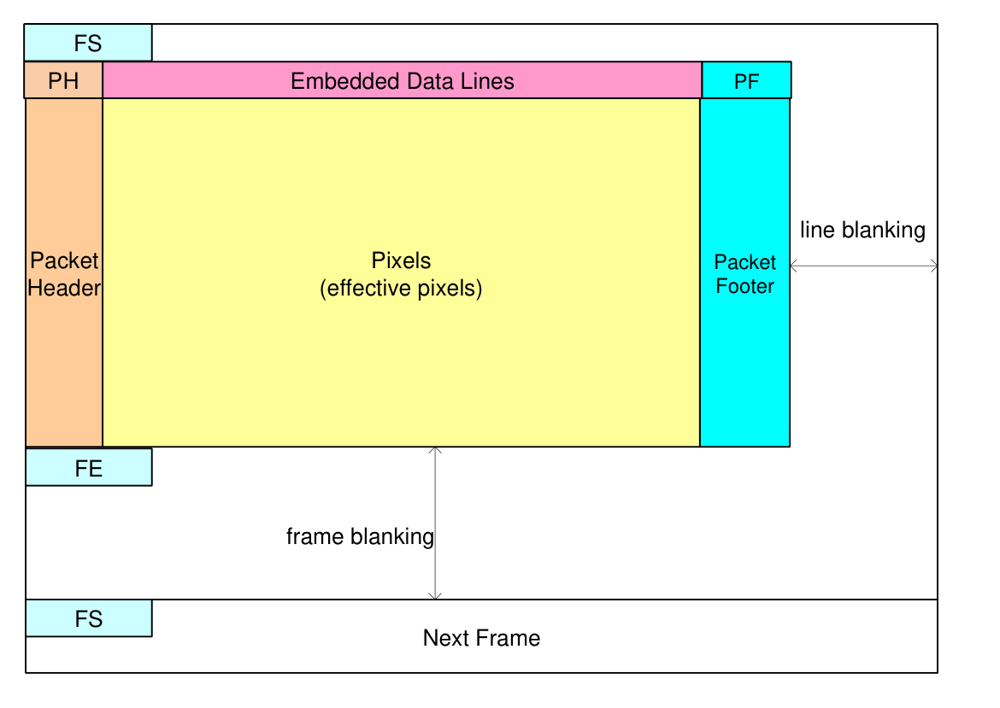

---

## Page 48

*Fig. 21 Signaling Waveform during Line Blanking Period (CSI-2)*

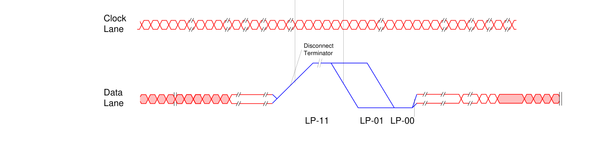

*Fig. 22 Signaling Waveform during Frame Blanking Period (CSI-2)*

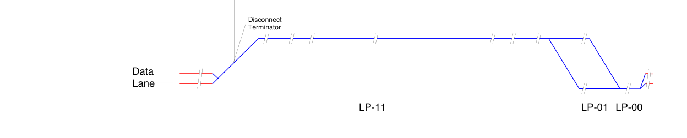

##### 4-1-3  Short Packet & Long Packet

*Fig. 23 Short Packet & Long Packet*

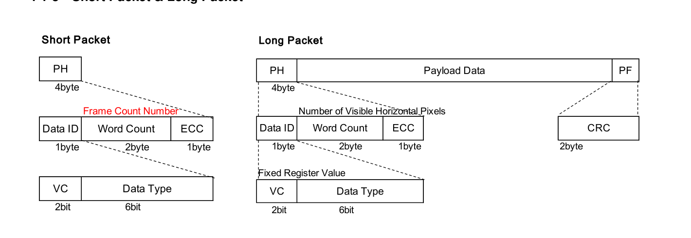

(Waveforms and packet diagrams are on the page image.)

---

## Page 49

##### 4-1-4  Data type

Data types of each line are shown as below.

**Table 13 Image pixel area and data type**

| image pixel area | Data Type |
| --- | --- |
| Embedded Data Lines | Embedded Data |
| OBside ineffective area | Null |
| OB area for internal use | Null |
| effective OB | OPB Data |
| Effective area side ineffective area | Null |
| effective pixel | RAW10 or RAW8 or COMP8 |

##### 4-1-5  CSI-2 Frame Format

The data format of each line is based on CSI-2 General Frame Format. The period from a line end sync code to the line start sync code for the next line is called the line blanking period. Likewise, the period from a frame end sync code to the next frame start sync code is called the frame blanking period. Packet header consists of the following data.

**Table 14 Sync Code Settings**

| Header [7:0] | Description | Setting register | Remarks |
| --- | --- | --- | --- |
| [7:6] | Virtual Channel Identifier | Addr: 0x0110 / CSI_channel_identifier | See Register Section |
| [5:0] | Synch Short Packet Data types | NA | |
| 6'h00 | Frame Start Code | NA | |
| 6'h01 | Frame End Code | NA | |
| 6'h12 | Embedded Data | NA | Written data in the sensor |
| 6'h2A | RAW8 | CSI_data_format | 16'h0808 |
| 6'h2B | RAW10 | CSI_data_format | 16'h0A0A |

---

## Page 50

##### 4-1-6  CSI-2 Embedded Data Line

The value of the 2-wire serial communication configuration register can be output at the start of the frame. The output register is indicated in the “Embd DL” column of the 2-wire serial communication Register Map. The Embedded data line is output in the two lines following the sync code FS.

*Fig. 24 Frame Format during Embedded Data Line Output*

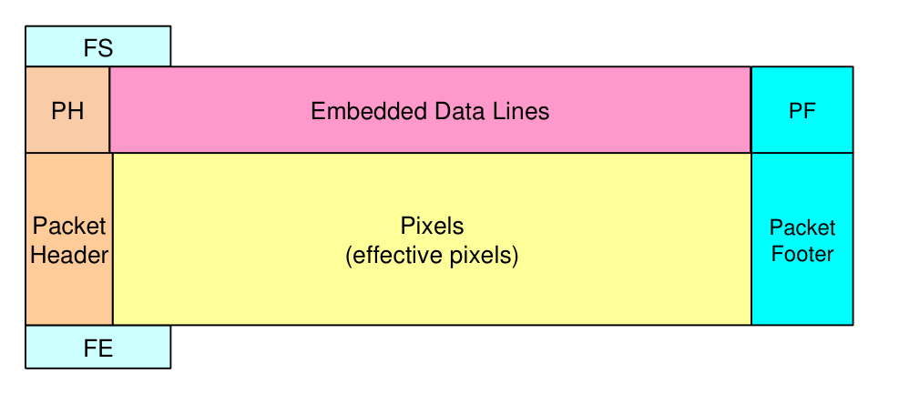

The output method differs according to the data format. In RAW10 mode, dummy bytes are inserted after outputting 4 bytes of data and tags.

*Fig. 25 Embedded data lines alignment in RAW8 mode*

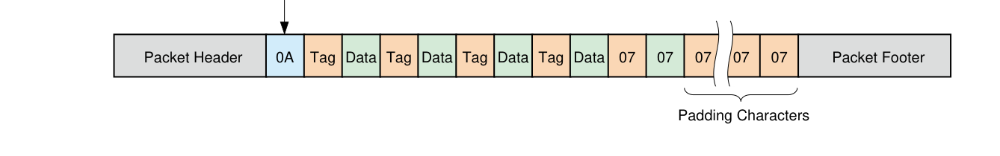

*Fig. 26 Detailed Embedded Data Line Output in RAW10 Output Mode*

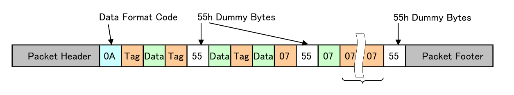

---

## Page 51

The end of the address and register value is determined according to the tags embedded in the data.

**Table 15 Embedded Data Line Tag**

| Tag | Data Byte Description |
| --- | --- |
| 00h | Illegal Tag. If found treat as end of Data |
| 07h | End of Data (Data Byte Value = 07H) |
| aah | CCI Register Index MSB [15:8] |
| a5h | CCI Register Index LSB [7:0] |
| 5ah | Auto increment the CCI index after the data byte - valid data Data byte contains valid CCI register data |
| 55h | Auto increment the CCI index after the data byte - null data A CCI register does NOT exist for the current CCI index. The data byte value is the 07H |
| ffh | Illegal Tag. If found treat as end of Data |

---

## Page 52 — 5-1 Pixel Array Physical Image

5.  Setting Required for Imaging

#### 5-1  Pixel Array Physical Image

Pixel array physical image is shown below. It is the pixel array when upper right corner of the physical image is Pin 1. The IMX219PQH5-C has vertical OB area, which cannot read out. Readout position is explained by Readout Position session.

From Fig. 27: Effective Area 3296 (H) × 2480 (V); Active Area 3280 (H) × 2464 (V); Invalid Active area 8 px on each side; OPB Invalid Area 16 + 8; Effective OPB 16.

*Fig. 27 Pixel Array Physical Image*

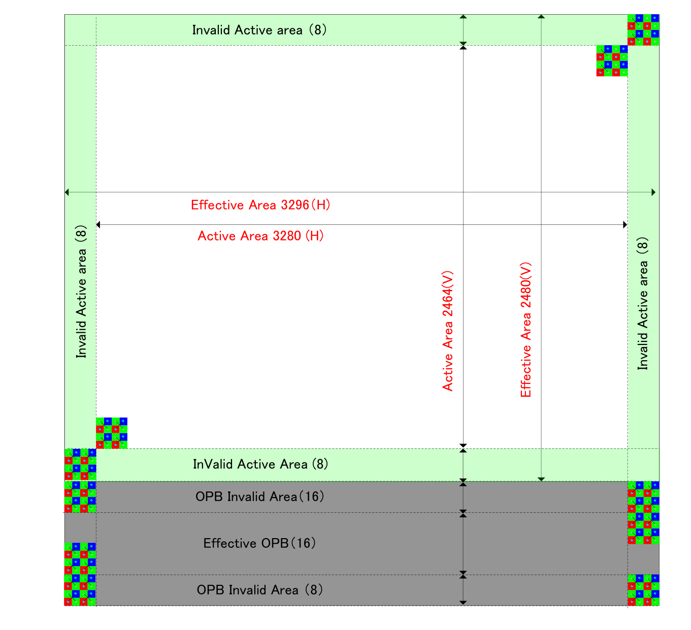

---

## Page 53 — 5-2 Pixel Binning Mode

#### 5-2  Pixel Binning Mode

Binning read-out can be used to obtain an image of lower resolution for full field of view. It has advantage on frame rate than using digital scaling, and on signal-to-noise ratio than using sub-sampling. See Binning Capability Registers, for detail of available configurations.
The following diagram describes on 2x2 averaged binning operations. Pixels of two adjacent rows and columns are averaged, and read out as one output pixel.

*Fig. 28 Image of 2x2 averaged Binning Mode*

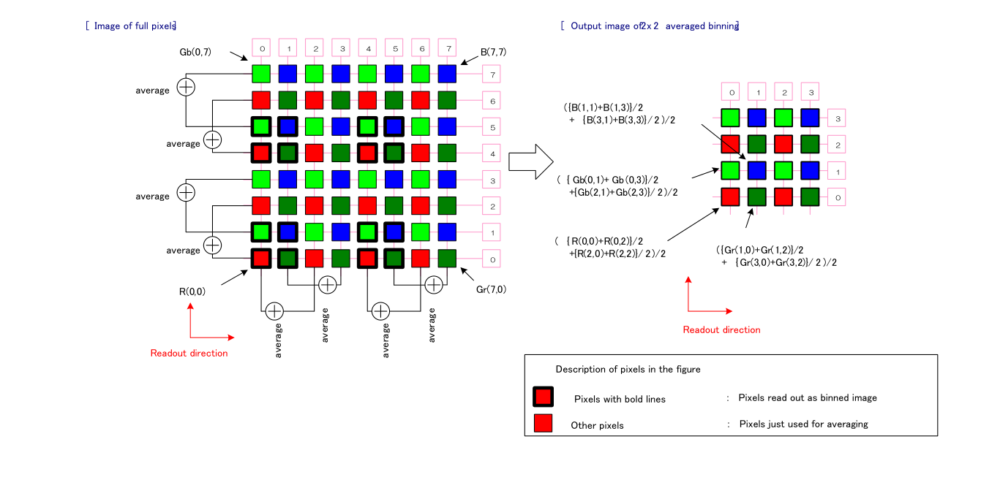

For explanation, represent individual pixels with it's addresses in the format “color (x, y) ” - for example, The Red pixel in the lower left corner is expressed as R (0, 0).
By performing 2x2 binning, R (0, 0) after binning is obtained by the following equation.

`R (0, 0) after binning = ( {R (0, 0) + R (0, 2)} /2 + {R (2,0) + R (2,2)} /2 ) / 2`

And, the total number of output pixels is reduced to 1/4 of the original pixel array.

**Table 16 Mode example**

| Mode | Full | x2binning | x4binning |
| --- | --- | --- | --- |
| Frame rate | 30 frame/s | 120 frame/s | 120 frame/s |
| H binning | — | Analog | Digital |
| H | x1 | x2 | X4 |
| V | x1 | x2 | x4 |

---

## Page 54 — 5-3 image size

#### 5-3  image size

The relation of image output size and the register is shown below.

*Fig. 29 Image size*

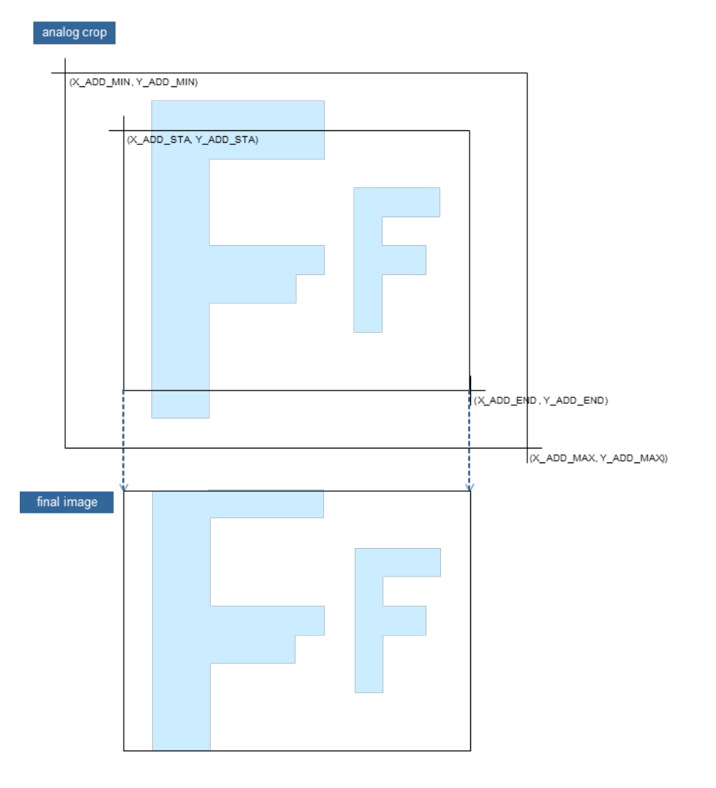

---

## Page 55 — 5-4 Readout Position

#### 5-4  Readout Position

The IMX219PQH5-C default status is readout from the lower left corner when Pin 1 is located in the upper right corner. The image is inverted vertically and horizontally by the lens, so proper image output results when Pin 1 is located in the upper right corner.

*Fig. 30 Readout Position*

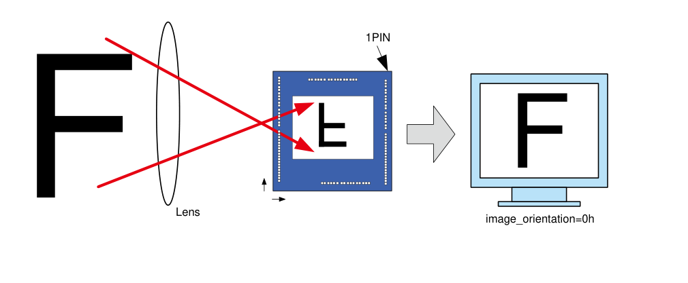 (`image_orientation=0h`)

Readout direction can be set by the registers.

**Table 17 Image Orientation Register**

| CCI register | Field | Mode |
| --- | --- | --- |
| image_orientation [0] | 0 | no mirror (Readout from the left with Pin 1 in the upper right corner) |
| image_orientation [0] | 1 | Horizontal Mirror (Readout from the right with Pin 1 in the upper right corner) |
| image_orientation [1] | 0 | no flip (Readout from the bottom with Pin 1 in the upper right corner) |
| image_orientation [1] | 1 | Vertical Flip (Readout from the top with Pin 1 in the upper right corner) |

*Fig. 31 Output Image Diagrams for Vertical Flip and Horizontal Mirror*

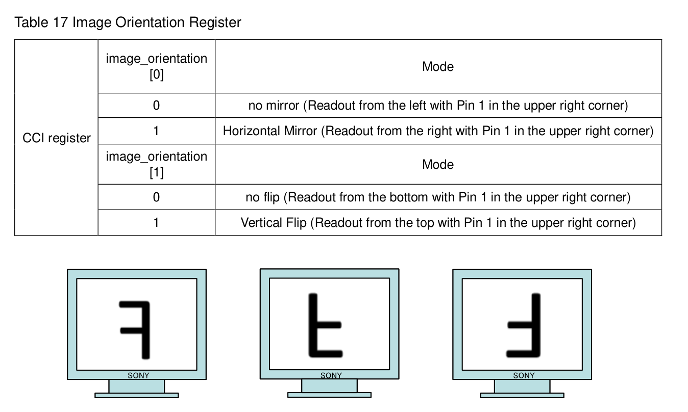

(`image_orientation=1h` / `2h` / `3h` on the page image)

---

## Page 56 — 5-5 Frame Rate Calculation Formula; 5-6 Black Level Control; 5-7 Storage Time (Electronic Shutter) Settings

#### 5-5  Frame Rate Calculation Formula

Frame rate in all-pixel scan mode is calculated by the followings.

\[
\mathrm{Frame\_Rate[frame/s]} = \frac{1}{\mathrm{Time\_per\_Line[sec]} \times (\mathrm{Frame\_Length})}
\]

\[
\mathrm{Time\_Per\_Line\_[sec]} = \frac{\mathrm{Line\_Length\_pck[pix]}}{2 \times \mathrm{Pix\_Clock\_Freq[MHz]}}
\]

- If `(frame_length_lines - 4 > coarse_integration_time)`: `Frame_Length = frame_length_lines`
- If `(frame_length_lines - 4 < coarse_integration_time)`: `Frame_Length = coarse_integration_time + 4`

#### 5-6  Black Level Control

The IMX219PQH5-C has a stable black level clamp function. The average value of the black level is adjusted to 64d. When selecting output format RAW8, Black level in the table below is divided by 4.

**Table 18 Gain Setting Variables**

| CCI | Black Level (dec) |
| --- | --- |
| | 64 (Fixed) RAW10, COMP8 |
| | 16 (Fixed) RAW8 |

#### 5-7  Storage Time (Electronic Shutter) Settings

##### 5-7-1  Storage Time (Electronic Shutter) Setting Registers

The storage time setting registers are shown below. The value of the register, `coarse_integration_time`, indicates the number of lines for the storage time. The maximum storage time value in normal frame rate mode is obtained by subtracting “4” from the number of lines per frame (set by `frame_length_lines`) including the blanking period.

**Table 19 Storage Time Setting Register**

| CCI registers | Register name | Address | Setting value (dec) | Remarks |
| --- | --- | --- | --- | --- |
| | coarse_integration_time | 0x015A / 0x015B / 0x025A / 0x025B | 1 to frame_length_lines−4 | 0x015A = A[15:8], 0x015B = A[7:0], 0x025A = B[15:8], 0x025B = B[7:0] |

The value of the register, `fine_integration_time`, indicates the number of pixels for the storage time. The register, `fine_integration_time`, is a fixed value, read only register.

**Table 20 Storage Time Offset Register**

| CCI registers | Register name | Address | Setting value (dec) | Remarks |
| --- | --- | --- | --- | --- |
| | fine_integration_time | 0x0388 / 0x0389 | 500 | RO register |

---

## Page 57

##### 5-7-2  Storage Time Calculation Method

The storage time (TSH) can be obtained from the following equation. TSH = ( Coarse_Integration_Time ×  ime Per Line ) + (α   pix clk period ) pix_clk_period = 1/Pix_Clock_Freq [MHz] Where α = offset time = readdable from fine_integration_time register and obtained from the following equation. α = fine_integration_time / 2

**Table 21 Storage Time Setting (in case of Line_Length_pck = 3448)**

|   | Number of total lines | frame length| coarse_integration_time_ [15:0] | Storage time (T ) SH |
| --- | --- | --- | --- | --- |
|  | Dec | Dec | Dec | All-pixel scan[s] |
| Normal frame rate mode (4:3 Full-Pel Raw10) | 2728 | 2728 (determined by frame length lines_ [15:0]) | 1 | (1 x 3448/2 + α) x pix clk period |
|  |  |  | N | (N x 3448/2 + α) x pix clk period |
|  |  |  | : | : |
|  |  |  | 2724 | (2724 x 3448/2 + α) x pix clk period |
| Low frame rate mode Long-time exposure | 2729 | 2729 | 2725 | (2725 x 3448/2 + α) x pix clk period |
|  | 2730 | 2730 | 2726 | (2726 x 3448/2 + α) x pix clk period |
|  | : | : | : | : |
|  | 2M+3 | 2M+3 | 2M-1 | ((2M-1) x 3448/2 + α) x pix clk period |
|  | 2M+4 | 2M+4 | 2M | (2M x 3448/2 + α) x pix clk period |
|  | : | : | : | : |
|  | 65534 | 65534 | 65530 | (65530 x 3448/2 + α) x pix clk period |

---

## Page 58 — 5-8 Gain Settings

#### 5-8  Gain Settings

Analogue gain and digital gain can be set independently.

##### 5-8-1  Analogue Gain Settings

Only global analogue gain is supported. The analogue gain is set by the following equation. Gain analogue (m0   X + c0) (m1   X + c1) The variables are shown in the table below.

**Table 22 Gain Setting Variables**

Therefore, the analogue gain is as follows. Gain analogue (256) (256 - X) The relationship between the setting value X (analogue_gain_code_global) and the gain is shown on the following page.

| CCI registers |   | Register name | Address | Remarks |
| --- | --- | --- | --- | --- |
|  | m0 | analogue gain m0_ | 0x008C/0x008D | Fixed to 0 |
|  | m1 | analogue gain m1_ | 0x0090/0x0091 | Fixed to -1 |
|  | c0 | analogue gain c0_ | 0x008E/0x008F | Fixed to 256 |
|  | c1 | analogue gain c1_ | 0x0092/0x0093 | Fixed to 256 |
|  | X | ANA_GAIN_GLOBAL A_  | 0x0157, | 0 to 232 |
|  | X | ANA_GAIN_GLOBAL B_  | 0x0257 | 0 to 232 |

---

## Page 59

**Table 23 Analogue Gain Setting**

| ANA_GAIN_GLOBAL | Gain(times) | Gain(dB) | ANA_GAIN_GLOBAL | Gain(times) | Gain(dB) | ANA_GAIN_GLOBAL | Gain(times) | Gain(dB) | ANA_GAIN_GLOBAL | Gain(times) | Gain(dB) |
| --- | --- | --- | --- | --- | --- | --- | --- | --- | --- | --- | --- |
| 0 | 1.00 | 0.00 | 64 | 1.33 | 2.50 | 128 | 2.00 | 6.02 | 192 | 4.00 | 12.04 |
| 1 | 1.00 | 0.03 | 65 | 1.34 | 2.54 | 129 | 2.02 | 6.09 | 193 | 4.06 | 12.18 |
| 2 | 1.01 | 0.07 | 66 | 1.34 | 2.59 | 130 | 2.03 | 6.16 | 194 | 4.13 | 12.32 |
| 3 | 1.01 | 0.10 | 67 | 1.35 | 2.64 | 131 | 2.05 | 6.23 | 195 | 4.20 | 12.46 |
| 4 | 1.02 | 0.14 | 68 | 1.36 | 2.68 | 132 | 2.06 | 6.30 | 196 | 4.27 | 12.60 |
| 5 | 1.02 | 0.17 | 69 | 1.37 | 2.73 | 133 | 2.08 | 6.37 | 197 | 4.34 | 12.75 |
| 6 | 1.02 | 0.21 | 70 | 1.38 | 2.77 | 134 | 2.10 | 6.44 | 198 | 4.41 | 12.90 |
| 7 | 1.03 | 0.24 | 71 | 1.38 | 2.82 | 135 | 2.11 | 6.51 | 199 | 4.49 | 13.05 |
| 8 | 1.03 | 0.28 | 72 | 1.39 | 2.87 | 136 | 2.13 | 6.58 | 200 | 4.57 | 13.20 |
| 9 | 1.04 | 0.31 | 73 | 1.40 | 2.92 | 137 | 2.15 | 6.65 | 201 | 4.65 | 13.36 |
| 10 | 1.04 | 0.35 | 74 | 1.41 | 2.96 | 138 | 2.17 | 6.73 | 202 | 4.74 | 13.52 |
| 11 | 1.04 | 0.38 | 75 | 1.41 | 3.01 | 139 | 2.19 | 6.80 | 203 | 4.83 | 13.68 |
| 12 | 1.05 | 0.42 | 76 | 1.42 | 3.06 | 140 | 2.20 | 6.88 | 204 | 4.92 | 13.84 |
| 13 | 1.05 | 0.45 | 77 | 1.43 | 3.11 | 141 | 2.22 | 6.95 | 205 | 5.02 | 14.01 |
| 14 | 1.05 | 0.49 | 78 | 1.44 | 3.16 | 142 | 2.24 | 7.03 | 206 | 5.12 | 14.19 |
| 15 | 1.06 | 0.52 | 79 | 1.45 | 3.21 | 143 | 2.26 | 7.10 | 207 | 5.22 | 14.36 |
| 16 | 1.07 | 0.56 | 80 | 1.45 | 3.25 | 144 | 2.29 | 7.18 | 208 | 5.33 | 14.54 |
| 17 | 1.07 | 0.60 | 81 | 1.46 | 3.30 | 145 | 2.30 | 7.26 | 209 | 5.45 | 14.72 |
| 18 | 1.07 | 0.63 | 82 | 1.47 | 3.35 | 146 | 2.32 | 7.34 | 210 | 5.56 | 14.91 |
| 19 | 1.08 | 0.67 | 83 | 1.48 | 3.40 | 147 | 2.35 | 7.42 | 211 | 5.69 | 15.10 |
| 20 | 1.08 | 0.71 | 84 | 1.49 | 3.45 | 148 | 2.37 | 7.50 | 212 | 5.82 | 15.30 |
| 21 | 1.09 | 0.74 | 85 | 1.50 | 3.50 | 149 | 2.39 | 7.58 | 213 | 5.95 | 15.50 |
| 22 | 1.09 | 0.78 | 86 | 1.50 | 3.56 | 150 | 2.41 | 7.66 | 214 | 6.09 | 15.70 |
| 23 | 1.10 | 0.82 | 87 | 1.51 | 3.61 | 151 | 2.44 | 7.74 | 215 | 6.24 | 15.91 |
| 24 | 1.10 | 0.86 | 88 | 1.52 | 3.66 | 152 | 2.46 | 7.82 | 216 | 6.40 | 16.12 |
| 25 | 1.11 | 0.89 | 89 | 1.53 | 3.71 | 153 | 2.48 | 7.91 | 217 | 6.56 | 16.34 |
| 26 | 1.11 | 0.93 | 90 | 1.54 | 3.76 | 154 | 2.51 | 7.99 | 218 | 6.73 | 16.57 |
| 27 | 1.12 | 0.97 | 91 | 1.55 | 3.82 | 155 | 2.53 | 8.08 | 219 | 6.92 | 16.80 |
| 28 | 1.12 | 1.01 | 92 | 1.56 | 3.87 | 156 | 2.56 | 8.16 | 220 | 7.11 | 17.04 |
| 29 | 1.13 | 1.04 | 93 | 1.57 | 3.92 | 157 | 2.58 | 8.25 | 221 | 7.31 | 17.28 |
| 30 | 1.13 | 1.08 | 94 | 1.58 | 3.97 | 158 | 2.61 | 8.34 | 222 | 7.53 | 17.54 |
| 31 | 1.14 | 1.12 | 95 | 1.59 | 4.03 | 159 | 2.64 | 8.43 | 223 | 7.75 | 17.79 |
| 32 | 1.14 | 1.16 | 96 | 1.60 | 4.08 | 160 | 2.66 | 8.52 | 224 | 8.00 | 18.06 |
| 33 | 1.14 | 1.20 | 97 | 1.61 | 4.14 | 161 | 2.69 | 8.61 | 225 | 8.26 | 18.34 |
| 34 | 1.15 | 1.24 | 98 | 1.62 | 4.19 | 162 | 2.72 | 8.70 | 226 | 8.53 | 18.62 |
| 35 | 1.16 | 1.28 | 99 | 1.63 | 4.25 | 163 | 2.75 | 8.80 | 227 | 8.82 | 18.92 |
| 36 | 1.16 | 1.32 | 100 | 1.64 | 4.30 | 164 | 2.78 | 8.89 | 228 | 9.14 | 19.22 |
| 37 | 1.17 | 1.36 | 101 | 1.65 | 4.36 | 165 | 2.81 | 8.98 | 229 | 9.48 | 19.54 |
| 38 | 1.17 | 1.40 | 102 | 1.66 | 4.41 | 166 | 2.84 | 9.08 | 230 | 9.84 | 19.87 |
| 39 | 1.18 | 1.44 | 103 | 1.67 | 4.47 | 167 | 2.88 | 9.18 | 231 | 10.24 | 20.21 |
| 40 | 1.18 | 1.48 | 104 | 1.68 | 4.53 | 168 | 2.91 | 9.28 | 232 | 10.66 | 20.56 |
| 41 | 1.19 | 1.52 | 105 | 1.70 | 4.59 | 169 | 2.94 | 9.37 |  |  |  |
| 42 | 1.20 | 1.56 | 106 | 1.70 | 4.64 | 170 | 2.98 | 9.47 |  |  |  |
| 43 | 1.20 | 1.60 | 107 | 1.71 | 4.70 | 171 | 3.01 | 9.58 |  |  |  |
| 44 | 1.21 | 1.64 | 108 | 1.73 | 4.76 | 172 | 3.05 | 9.68 |  |  |  |
| 45 | 1.21 | 1.68 | 109 | 1.74 | 4.82 | 173 | 3.08 | 9.78 |  |  |  |
| 46 | 1.22 | 1.72 | 110 | 1.75 | 4.88 | 174 | 3.12 | 9.89 |  |  |  |
| 47 | 1.22 | 1.76 | 111 | 1.76 | 4.94 | 175 | 3.16 | 10.00 |  |  |  |
| 48 | 1.23 | 1.80 | 112 | 1.78 | 5.00 | 176 | 3.20 | 10.10 |  |  |  |
| 49 | 1.23 | 1.85 | 113 | 1.79 | 5.06 | 177 | 3.24 | 10.21 |  |  |  |
| 50 | 1.24 | 1.89 | 114 | 1.80 | 5.12 | 178 | 3.28 | 10.32 |  |  |  |
| 51 | 1.25 | 1.93 | 115 | 1.81 | 5.18 | 179 | 3.32 | 10.43 |  |  |  |
| 52 | 1.25 | 1.97 | 116 | 1.83 | 5.24 | 180 | 3.37 | 10.55 |  |  |  |
| 53 | 1.26 | 2.01 | 117 | 1.84 | 5.30 | 181 | 3.41 | 10.66 |  |  |  |
| 54 | 1.27 | 2.06 | 118 | 1.85 | 5.37 | 182 | 3.46 | 10.78 |  |  |  |
| 55 | 1.27 | 2.10 | 119 | 1.87 | 5.43 | 183 | 3.50 | 10.90 |  |  |  |
| 56 | 1.28 | 2.14 | 120 | 1.88 | 5.49 | 184 | 3.55 | 11.02 |  |  |  |
| 57 | 1.29 | 2.19 | 121 | 1.89 | 5.56 | 185 | 3.61 | 11.14 |  |  |  |
| 58 | 1.29 | 2.23 | 122 | 1.91 | 5.62 | 186 | 3.66 | 11.26 |  |  |  |
| 59 | 1.30 | 2.28 | 123 | 1.92 | 5.69 | 187 | 3.71 | 11.39 |  |  |  |
| 60 | 1.30 | 2.32 | 124 | 1.94 | 5.75 | 188 | 3.76 | 11.51 |  |  |  |
| 61 | 1.31 | 2.36 | 125 | 1.95 | 5.82 | 189 | 3.82 | 11.64 |  |  |  |
| 62 | 1.32 | 2.41 | 126 | 1.97 | 5.89 | 190 | 3.88 | 11.77 |  |  |  |
| 63 | 1.32 | 2.45 | 127 | 1.98 | 5.95 | 191 | 3.94 | 11.91 |  |  |  |

---

## Page 60

##### 5-8-2  Digital gain settings

The IMX219PQH5-C can set the digital gain for global. The registers required to set the digital gain are as follows.

**Table 24 Digital Gain Settings**

Each register is comprised of 2 bytes, with the upper byte [15:8] setting the integer portion and the lower byte [7:0] setting the fractional portion of the gain. The gain for global is obtained by the following equation. Gain digital   Upperbyte + Lowerbyte 256 The upper byte can be set to a value between 1 and 15, and the lower byte to a value between 0 and 255. Therefore, the digital gain setting range for global is as follows. 1 + 0 256 [times](0 dB) ≤ Gain digital ≤ 15 + 255 256 [times](24 dB) When gain is considered in log linear scale, the adjustment steps are large at low gain and extremely small at high gain. The register values are shown on the following page in case of the gain in log linear manner in 0.1 dB steps.

| CCI register name | Upper byte address (Setting range:1 to15) | Lower byte address (Setting range:0 to 255) |
| --- | --- | --- |
| DIG_GAIN_GLOBAL A_  | 0x0158 | 0x0159 |
| DIG_GAIN_GLOBAL B_  | 0x0258 | 0x0259 |

---

## Page 61

**Table 25 Example of Digital Gain Setting**

| Upper byte |   | Lower byte |   | Gain(times) | Gain(dB) |
| --- | --- | --- | --- | --- | --- |
| dec | hex | dec | hex |  |  |
| 1 | 1 | 0 | 0 | 1.00 | 0.00 |
| 1 | 1 | 3 | 3 | 1.01 | 0.10 |
| 1 | 1 | 6 | 6 | 1.02 | 0.20 |
| 1 | 1 | 9 | 9 | 1.04 | 0.30 |
| 1 | 1 | 12 | C | 1.05 | 0.40 |
| 1 | 1 | 15 | F | 1.06 | 0.49 |
| 1 | 1 | 18 | 12 | 1.07 | 0.59 |
| 1 | 1 | 21 | 15 | 1.08 | 0.68 |
| 1 | 1 | 25 | 19 | 1.10 | 0.81 |
| 1 | 1 | 28 | 1C | 1.11 | 0.90 |
| 1 | 1 | 31 | 1F | 1.12 | 0.99 |
| 1 | 1 | 35 | 23 | 1.14 | 1.11 |
| 1 | 1 | 38 | 26 | 1.15 | 1.20 |
| 1 | 1 | 41 | 29 | 1.16 | 1.29 |
| 1 | 1 | 45 | 2D | 1.18 | 1.41 |
| 1 | 1 | 48 | 30 | 1.19 | 1.49 |
| 1 | 1 | 52 | 34 | 1.20 | 1.61 |
| 1 | 1 | 55 | 37 | 1.21 | 1.69 |
| 1 | 1 | 59 | 3B | 1.23 | 1.80 |
| 1 | 1 | 63 | 3F | 1.25 | 1.91 |
| 1 | 1 | 66 | 42 | 1.26 | 1.99 |
| 1 | 1 | 70 | 46 | 1.27 | 2.10 |
| 1 | 1 | 74 | 4A | 1.29 | 2.21 |
| 1 | 1 | 78 | 4E | 1.30 | 2.31 |
| 1 | 1 | 81 | 51 | 1.32 | 2.39 |
| 1 | 1 | 85 | 55 | 1.33 | 2.49 |
| 1 | 1 | 89 | 59 | 1.35 | 2.59 |
| 1 | 1 | 93 | 5D | 1.36 | 2.69 |
| 1 | 1 | 97 | 61 | 1.38 | 2.79 |
| 1 | 1 | 101 | 65 | 1.39 | 2.89 |
| 1 | 1 | 106 | 6A | 1.41 | 3.01 |
| 1 | 1 | 110 | 6E | 1.43 | 3.10 |
| 1 | 1 | 114 | 72 | 1.45 | 3.20 |
| 1 | 1 | 118 | 76 | 1.46 | 3.29 |
| 1 | 1 | 123 | 7B | 1.48 | 3.41 |
| 1 | 1 | 127 | 7F | 1.50 | 3.50 |
| 1 | 1 | 131 | 83 | 1.51 | 3.59 |
| 1 | 1 | 136 | 88 | 1.53 | 3.70 |
| 1 | 1 | 140 | 8C | 1.55 | 3.79 |
| 1 | 1 | 145 | 91 | 1.57 | 3.90 |
| 1 | 1 | 150 | 96 | 1.59 | 4.01 |
| 1 | 1 | 154 | 9A | 1.60 | 4.09 |
| 1 | 1 | 159 | 9F | 1.62 | 4.20 |
| 1 | 1 | 164 | A4 | 1.64 | 4.30 |
| 1 | 1 | 169 | A9 | 1.66 | 4.40 |
| 1 | 1 | 174 | AE | 1.68 | 4.50 |
| 1 | 1 | 179 | B3 | 1.70 | 4.60 |
| 1 | 1 | 184 | B8 | 1.72 | 4.70 |
| 1 | 1 | 189 | BD | 1.74 | 4.80 |
| 1 | 1 | 194 | C2 | 1.76 | 4.90 |
| 1 | 1 | 199 | C7 | 1.78 | 5.00 |
| 1 | 1 | 205 | CD | 1.80 | 5.11 |
| 1 | 1 | 210 | D2 | 1.82 | 5.20 |
| 1 | 1 | 215 | D7 | 1.84 | 5.30 |
| 1 | 1 | 221 | DD | 1.86 | 5.41 |
| 1 | 1 | 226 | E2 | 1.88 | 5.50 |
| 1 | 1 | 232 | E8 | 1.91 | 5.60 |
| 1 | 1 | 237 | ED | 1.93 | 5.69 |
| 1 | 1 | 243 | F3 | 1.95 | 5.80 |
| 1 | 1 | 249 | F9 | 1.97 | 5.90 |

| Upper byte |   | Lower byte |   | Gain(times) | Gain(dB) |
| --- | --- | --- | --- | --- | --- |
| dec | hex | dec | hex |  |  |
| 1 | 1 | 255 | FF | 2.00 | 6.00 |
| 2 | 2 | 5 | 5 | 2.02 | 6.11 |
| 2 | 2 | 11 | B | 2.04 | 6.21 |
| 2 | 2 | 17 | 11 | 2.07 | 6.30 |
| 2 | 2 | 23 | 17 | 2.09 | 6.40 |
| 2 | 2 | 29 | 1D | 2.11 | 6.50 |
| 2 | 2 | 35 | 23 | 2.14 | 6.59 |
| 2 | 2 | 42 | 2A | 2.16 | 6.71 |
| 2 | 2 | 48 | 30 | 2.19 | 6.80 |
| 2 | 2 | 55 | 37 | 2.21 | 6.91 |
| 2 | 2 | 61 | 3D | 2.24 | 7.00 |
| 2 | 2 | 68 | 44 | 2.27 | 7.10 |
| 2 | 2 | 74 | 4A | 2.29 | 7.19 |
| 2 | 2 | 81 | 51 | 2.32 | 7.30 |
| 2 | 2 | 88 | 58 | 2.34 | 7.40 |
| 2 | 2 | 95 | 5F | 2.37 | 7.50 |
| 2 | 2 | 102 | 66 | 2.40 | 7.60 |
| 2 | 2 | 109 | 6D | 2.43 | 7.70 |
| 2 | 2 | 116 | 74 | 2.45 | 7.79 |
| 2 | 2 | 124 | 7C | 2.48 | 7.90 |
| 2 | 2 | 131 | 83 | 2.51 | 8.00 |
| 2 | 2 | 138 | 8A | 2.54 | 8.09 |
| 2 | 2 | 146 | 92 | 2.57 | 8.20 |
| 2 | 2 | 154 | 9A | 2.60 | 8.30 |
| 2 | 2 | 161 | A1 | 2.63 | 8.40 |
| 2 | 2 | 169 | A9 | 2.66 | 8.50 |
| 2 | 2 | 177 | B1 | 2.69 | 8.60 |
| 2 | 2 | 185 | B9 | 2.72 | 8.70 |
| 2 | 2 | 193 | C1 | 2.75 | 8.80 |
| 2 | 2 | 201 | C9 | 2.79 | 8.90 |
| 2 | 2 | 210 | D2 | 2.82 | 9.01 |
| 2 | 2 | 218 | DA | 2.85 | 9.10 |
| 2 | 2 | 226 | E2 | 2.88 | 9.20 |
| 2 | 2 | 235 | EB | 2.92 | 9.30 |
| 2 | 2 | 244 | F4 | 2.95 | 9.41 |
| 2 | 2 | 252 | FC | 2.98 | 9.50 |
| 3 | 3 | 5 | 5 | 3.02 | 9.60 |
| 3 | 3 | 14 | E | 3.05 | 9.70 |
| 3 | 3 | 23 | 17 | 3.09 | 9.80 |
| 3 | 3 | 32 | 20 | 3.13 | 9.90 |
| 3 | 3 | 42 | 2A | 3.16 | 10.00 |
| 3 | 3 | 51 | 33 | 3.20 | 10.10 |
| 3 | 3 | 60 | 3C | 3.23 | 10.20 |
| 3 | 3 | 70 | 46 | 3.27 | 10.30 |
| 3 | 3 | 80 | 50 | 3.31 | 10.40 |
| 3 | 3 | 90 | 5A | 3.35 | 10.50 |
| 3 | 3 | 99 | 63 | 3.39 | 10.60 |
| 3 | 3 | 109 | 6D | 3.43 | 10.70 |
| 3 | 3 | 120 | 78 | 3.47 | 10.80 |
| 3 | 3 | 130 | 82 | 3.51 | 10.90 |
| 3 | 3 | 140 | 8C | 3.55 | 11.00 |
| 3 | 3 | 151 | 97 | 3.59 | 11.10 |
| 3 | 3 | 161 | A1 | 3.63 | 11.20 |
| 3 | 3 | 172 | AC | 3.67 | 11.30 |
| 3 | 3 | 183 | B7 | 3.71 | 11.40 |
| 3 | 3 | 194 | C2 | 3.76 | 11.50 |
| 3 | 3 | 205 | CD | 3.80 | 11.60 |
| 3 | 3 | 217 | D9 | 3.85 | 11.70 |
| 3 | 3 | 228 | E4 | 3.89 | 11.80 |
| 3 | 3 | 239 | EF | 3.93 | 11.90 |

| Upper byte |   | Lower byte |   | Gain(times) | Gain(dB) |
| --- | --- | --- | --- | --- | --- |
| dec | hex | dec | hex |  |  |
| 3 | 3 | 251 | FB | 3.98 | 12.00 |
| 4 | 4 | 7 | 7 | 4.03 | 12.10 |
| 4 | 4 | 19 | 13 | 4.07 | 12.20 |
| 4 | 4 | 31 | 1F | 4.12 | 12.30 |
| 4 | 4 | 43 | 2B | 4.17 | 12.40 |
| 4 | 4 | 56 | 38 | 4.22 | 12.50 |
| 4 | 4 | 68 | 44 | 4.27 | 12.60 |
| 4 | 4 | 81 | 51 | 4.32 | 12.70 |
| 4 | 4 | 93 | 5D | 4.36 | 12.80 |
| 4 | 4 | 106 | 6A | 4.41 | 12.90 |
| 4 | 4 | 120 | 78 | 4.47 | 13.00 |
| 4 | 4 | 133 | 85 | 4.52 | 13.10 |
| 4 | 4 | 146 | 92 | 4.57 | 13.20 |
| 4 | 4 | 160 | A0 | 4.63 | 13.30 |
| 4 | 4 | 173 | AD | 4.68 | 13.40 |
| 4 | 4 | 187 | BB | 4.73 | 13.50 |
| 4 | 4 | 201 | C9 | 4.79 | 13.60 |
| 4 | 4 | 215 | D7 | 4.84 | 13.70 |
| 4 | 4 | 230 | E6 | 4.90 | 13.80 |
| 4 | 4 | 244 | F4 | 4.95 | 13.90 |
| 5 | 5 | 3 | 3 | 5.01 | 14.00 |
| 5 | 5 | 18 | 12 | 5.07 | 14.10 |
| 5 | 5 | 33 | 21 | 5.13 | 14.20 |
| 5 | 5 | 48 | 30 | 5.19 | 14.30 |
| 5 | 5 | 64 | 40 | 5.25 | 14.40 |
| 5 | 5 | 79 | 4F | 5.31 | 14.50 |
| 5 | 5 | 95 | 5F | 5.37 | 14.60 |
| 5 | 5 | 111 | 6F | 5.43 | 14.70 |
| 5 | 5 | 127 | 7F | 5.50 | 14.80 |
| 5 | 5 | 143 | 8F | 5.56 | 14.90 |
| 5 | 5 | 160 | A0 | 5.63 | 15.00 |
| 5 | 5 | 176 | B0 | 5.69 | 15.10 |
| 5 | 5 | 193 | C1 | 5.75 | 15.20 |
| 5 | 5 | 210 | D2 | 5.82 | 15.30 |
| 5 | 5 | 227 | E3 | 5.89 | 15.40 |
| 5 | 5 | 245 | F5 | 5.96 | 15.50 |
| 6 | 6 | 7 | 7 | 6.03 | 15.60 |
| 6 | 6 | 24 | 18 | 6.09 | 15.70 |
| 6 | 6 | 42 | 2A | 6.16 | 15.80 |
| 6 | 6 | 61 | 3D | 6.24 | 15.90 |
| 6 | 6 | 79 | 4F | 6.31 | 16.00 |
| 6 | 6 | 98 | 62 | 6.38 | 16.10 |
| 6 | 6 | 117 | 75 | 6.46 | 16.20 |
| 6 | 6 | 136 | 88 | 6.53 | 16.30 |
| 6 | 6 | 155 | 9B | 6.61 | 16.40 |
| 6 | 6 | 175 | AF | 6.68 | 16.50 |
| 6 | 6 | 195 | C3 | 6.76 | 16.60 |
| 6 | 6 | 215 | D7 | 6.84 | 16.70 |
| 6 | 6 | 235 | EB | 6.92 | 16.80 |
| 7 | 7 | 0 | 0 | 7.00 | 16.90 |
| 7 | 7 | 20 | 14 | 7.08 | 17.00 |
| 7 | 7 | 41 | 29 | 7.16 | 17.10 |
| 7 | 7 | 63 | 3F | 7.25 | 17.20 |
| 7 | 7 | 84 | 54 | 7.33 | 17.30 |
| 7 | 7 | 106 | 6A | 7.41 | 17.40 |
| 7 | 7 | 128 | 80 | 7.50 | 17.50 |
| 7 | 7 | 150 | 96 | 7.59 | 17.60 |
| 7 | 7 | 172 | AC | 7.67 | 17.70 |
| 7 | 7 | 195 | C3 | 7.76 | 17.80 |
| 7 | 7 | 218 | DA | 7.85 | 17.90 |

| Upper byte |   | Lower byte |   | Gain(times) | Gain(dB) |
| --- | --- | --- | --- | --- | --- |
| dec | hex | dec | hex |  |  |
| 7 | 7 | 241 | F1 | 7.94 | 18.00 |
| 8 | 8 | 9 | 9 | 8.04 | 18.10 |
| 8 | 8 | 33 | 21 | 8.13 | 18.20 |
| 8 | 8 | 57 | 39 | 8.22 | 18.30 |
| 8 | 8 | 81 | 51 | 8.32 | 18.40 |
| 8 | 8 | 106 | 6A | 8.41 | 18.50 |
| 8 | 8 | 131 | 83 | 8.51 | 18.60 |
| 8 | 8 | 156 | 9C | 8.61 | 18.70 |
| 8 | 8 | 182 | B6 | 8.71 | 18.80 |
| 8 | 8 | 207 | CF | 8.81 | 18.90 |
| 8 | 8 | 234 | EA | 8.91 | 19.00 |
| 9 | 9 | 4 | 4 | 9.02 | 19.10 |
| 9 | 9 | 31 | 1F | 9.12 | 19.20 |
| 9 | 9 | 58 | 3A | 9.23 | 19.30 |
| 9 | 9 | 85 | 55 | 9.33 | 19.40 |
| 9 | 9 | 113 | 71 | 9.44 | 19.50 |
| 9 | 9 | 141 | 8D | 9.55 | 19.60 |
| 9 | 9 | 169 | A9 | 9.66 | 19.70 |
| 9 | 9 | 198 | C6 | 9.77 | 19.80 |
| 9 | 9 | 227 | E3 | 9.89 | 19.90 |
| 10 | A | 0 | 0 | 10.00 | 20.00 |
| 10 | A | 30 | 1E | 10.12 | 20.10 |
| 10 | A | 60 | 3C | 10.23 | 20.20 |
| 10 | A | 90 | 5A | 10.35 | 20.30 |
| 10 | A | 121 | 79 | 10.47 | 20.40 |
| 10 | A | 152 | 98 | 10.59 | 20.50 |
| 10 | A | 183 | B7 | 10.71 | 20.60 |
| 10 | A | 215 | D7 | 10.84 | 20.70 |
| 10 | A | 247 | F7 | 10.96 | 20.80 |
| 11 | B | 23 | 17 | 11.09 | 20.90 |
| 11 | B | 56 | 38 | 11.22 | 21.00 |
| 11 | B | 90 | 5A | 11.35 | 21.10 |
| 11 | B | 123 | 7B | 11.48 | 21.20 |
| 11 | B | 157 | 9D | 11.61 | 21.30 |
| 11 | B | 192 | C0 | 11.75 | 21.40 |
| 11 | B | 227 | E3 | 11.89 | 21.50 |
| 12 | C | 6 | 6 | 12.02 | 21.60 |
| 12 | C | 41 | 29 | 12.16 | 21.70 |
| 12 | C | 77 | 4D | 12.30 | 21.80 |
| 12 | C | 114 | 72 | 12.45 | 21.90 |
| 12 | C | 151 | 97 | 12.59 | 22.00 |
| 12 | C | 188 | BC | 12.73 | 22.10 |
| 12 | C | 226 | E2 | 12.88 | 22.20 |
| 13 | D | 8 | 8 | 13.03 | 22.30 |
| 13 | D | 47 | 2F | 13.18 | 22.40 |
| 13 | D | 86 | 56 | 13.34 | 22.50 |
| 13 | D | 125 | 7D | 13.49 | 22.60 |
| 13 | D | 165 | A5 | 13.64 | 22.70 |
| 13 | D | 206 | CE | 13.80 | 22.80 |
| 13 | D | 247 | F7 | 13.96 | 22.90 |
| 14 | E | 32 | 20 | 14.13 | 23.00 |
| 14 | E | 74 | 4A | 14.29 | 23.10 |
| 14 | E | 116 | 74 | 14.45 | 23.20 |
| 14 | E | 159 | 9F | 14.62 | 23.30 |
| 14 | E | 203 | CB | 14.79 | 23.40 |
| 14 | E | 246 | F6 | 14.96 | 23.50 |
| 15 | F | 35 | 23 | 15.14 | 23.60 |
| 15 | F | 80 | 50 | 15.31 | 23.70 |
| 15 | F | 125 | 7D | 15.49 | 23.80 |
| 15 | F | 171 | AB | 15.67 | 23.90 |
| 15 | F | 217 | D9 | 15.85 | 24.00 |

---

## Page 62 — 6. On Chip Image Processing; 6-1 Test Pattern Generator

### 6.  On Chip Image Processing

Data flow of our “On-Chip Image Processing” is written in following figure. A/D-converted digital signal is input, and processed data is asserted from CSI-2.

*Fig. 32 Data Flow Diagram*

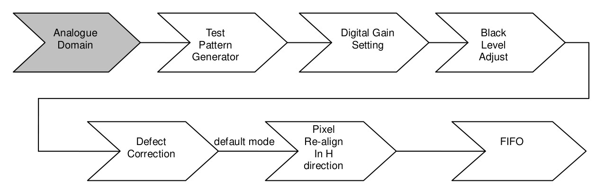

#### 6-1  Test Pattern Generator

The IMX219PQH5-C can output test signals using the internal pattern generator.

##### 6-1-1  Test Pattern

The test pattern output function outputs fixed pattern image data from the IMX219PQH5-C. Built-in image patterns can be output by setting the necessary registers. The registers must be set by communication to output the test pattern. There are no restrictions on the sequence for setting the registers related to test pattern output. The prescribed output is obtained by setting the necessary registers while the sensor is operating. Analogue Domain Test Pattern Generator Digital Gain Setting Black Level Adjust Defect Correction Pixel Re-align In H direction FIFO default mode

---

## Page 63

**Table 26 Description of Test Pattern Registers**

| Address | Name | Description |
| --- | --- | --- |
| 0x0600 | test pattern mode_ | 0000h– no pattern (default) 0001h – solid color 0002h – 100 % color bars 0003h – fade to grey color bar 0004h – PN9 0005h – 16 split color bar 0006h – 16 split inverted color bar 0007h – column counter 0008h – inverted column counter 0009h – PN31 |
| 0x0601 |  |  |
| 0x0602 | TD R[9:8]| test data red_ test data red_ |
| 0x0603 | TD R[7:0]|  |
| 0x0604 | TD GR[9:8]| test data greenR_ test data greenR_ |
| 0x0605 | TD GR[7:0]|  |
| 0x0606 | TD B[9:8]| test data blue_ test data blue_ |
| 0x0607 | TD B[7:0]|  |
| 0x0608 | TD GB[9:8]| test data greenB_ test data greenB_ |
| 0x0609 | TD GB[7:0]|  |
| 0x060A | H CUR WIDTH[15:8] | horizontal cursor width_ horizontal cursor width_ |
| 0x060B | H CUR WIDTH[7:0] |  |
| 0x060C | H CUR POS[15:8] | horizontal cursor position_ horizontal cursor position_ |
| 0x060D | H CUR POS[7:0] |  |
| 0x060E | V CUR WIDTH[15:8] | vertical cursor width_ vertical cursor width_ |
| 0x060F | V CUR WIDTH[7:0] |  |
| 0x0610 | V CUR POS[15:8] | vertical cursor position_ vertical cursor position_ |
| 0x0611 | V CUR POS[7:0] |  |
| 0x0612 | FRM RST OFF_ | Frame reset control w/ PN9,PN31 0: Frame reset ON (default) 1: Frame reset OFF |
| 0x0620 | TP WINDOW X OFFSET[11:8]  | test pattern window x offset_   |
| 0x0621 | TP WINDOW X OFFSET[7:0]  |  |
| 0x0622 | TP WINDOW Y OFFSET[11:8]  | test pattern window y offset_   |
| 0x0623 | TP WINDOW Y OFFSET[7:0]  |  |
| 0x0624 | TP WINDOW WIDTH[11:8] | test pattern window width_  |
| 0x0625 | TP WINDOW WIDTH[7:0] |  |
| 0x0626 | TP WINDOW HEIGHT[11:8] | test pattern window height_  |
| 0x0627 | TP WINDOW HEIGHT[7:0] |  |

---

## Page 64

###### 6-1-1-1  Pattern Description

**Table 27 Description of Test Patterns**

100 % color bar, `test_pattern_mode = 0002h`

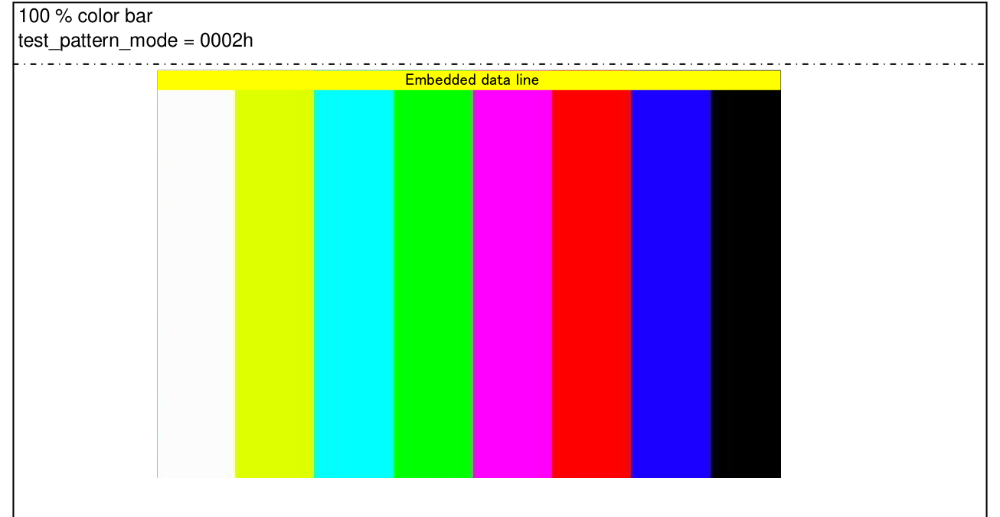

fade to gray color bar, `test_pattern_mode = 0003h`

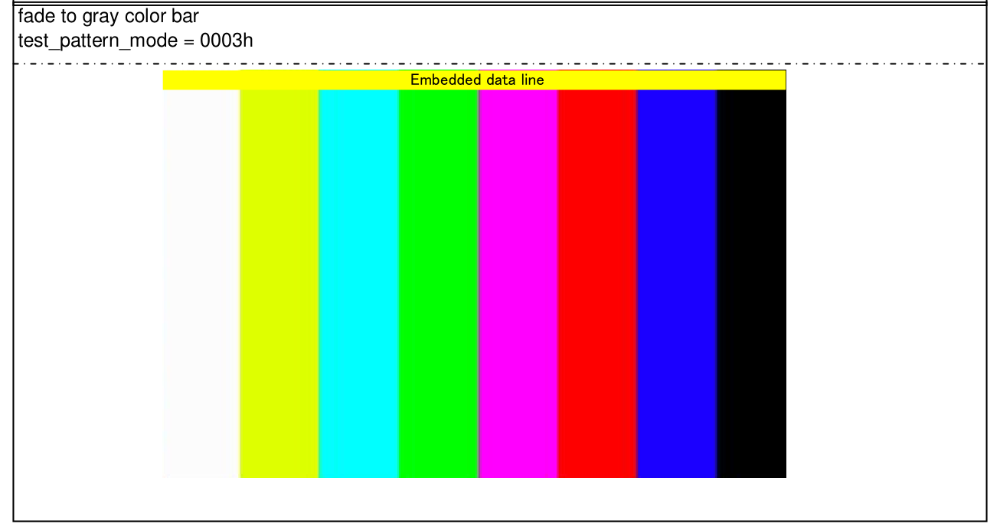

---

## Page 65

16 split Color Bar Chart, `test_pattern_mode = 0005h`

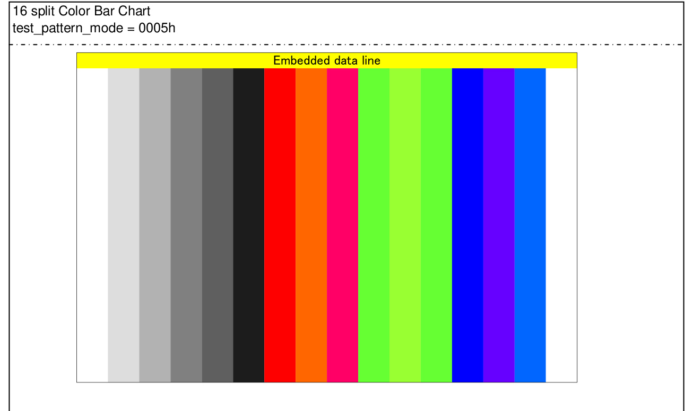

Inversed 16 split Color Bar Chart, `test_pattern_mode = 0006h`

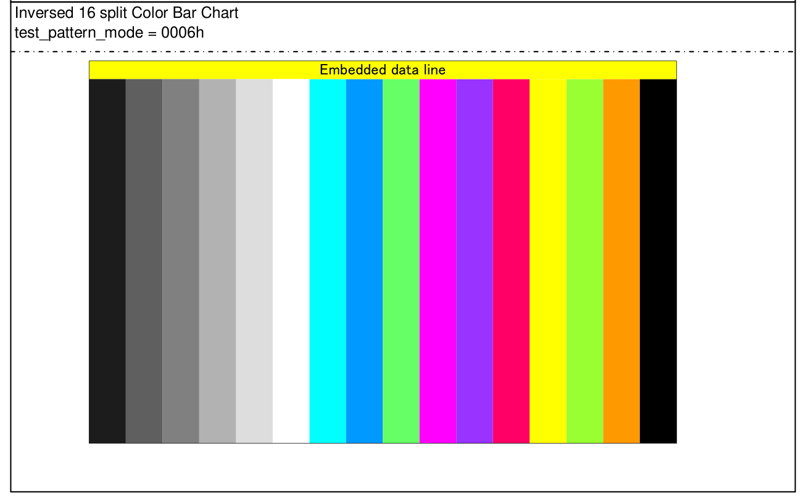

---

## Page 66

column counter, `test_pattern_mode = 0007h`

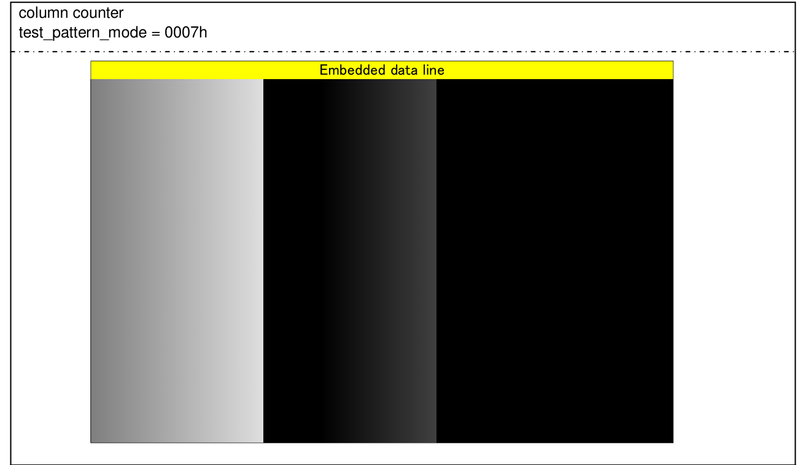

inverted column counter, `test_pattern_mode = 0008h`

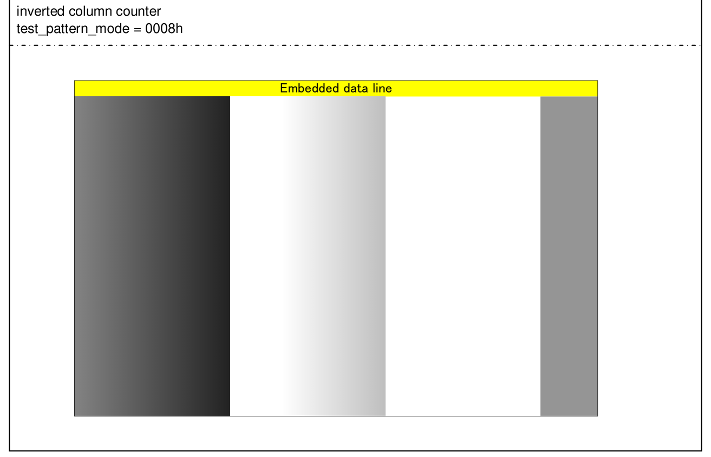

---

## Page 67 — 6-2 Digital Gain Setting; 6-3 Black Level Adjust; 6-4 Defect Correction

#### 6-2  Digital Gain Setting

See Digital gain settings section.

#### 6-3  Black Level Adjust

The register required to set the Black Level Adjust is as follows.

**Table 28 Black Level Adjust Setting Register**

| Index (HEX) | Bit | Register Name | RW | Comment | Re-Timed | Default (HEX) |
| --- | --- | --- | --- | --- | --- | --- |
| D1EA | [1:0] | DT_PEDESTAL[9:8]| RW | Set Black Level |  | 0 |
| D1EB | [7:0] | DT_PEDESTAL[7:0]| RW |  |  | 40 |

#### 6-4  Defect Correction

The registers required to set the Defect Correction are as follows. 3 different functions are implemented; (Please refer to “7-5 Defects Address registration” session); 1.Static single defect pixel correction 2.Static same color adjoin pixel correction 3.Static 2x4 defect pixel correction Defect addresses for mapped_couplet_correct (couplet defect: two adjacent defect pixels of the same color) are stored in NVM , and sensor processes them in itself.

#### 6-5  Pixel Re-alignment H Direction

The registers required to set the Pixel Re-alignment H Direction are as follows.

**Table 29 Pixel Re-alignment H Direction Setting Registers**

| Index | Byte | Register Name | RW | Comment | Re-Time | Default (HEX) | Embd DL |
| --- | --- | --- | --- | --- | --- | --- | --- |
| 0x0164 | [3:0] | X_ADD_STA A[11:8]  | RW | x addr start_ | Frame Bank | 0 | ○ |
| 0x0165 | [7:0] | X_ADD_STA A[7:0]  | RW |  |  | 00 | ○ |
| 0x0166 | [3:0] | X_ADD_END A[11:8]  | RW | x addr end_ | Frame Bank | C | ○ |
| 0x0167 | [7:0] | X_ADD_END A[7:0]  | RW |  |  | CF | ○ |
| 0x0264 | [3:0] | X_ADD_STA B[11:8]  | RW | x addr start_ | Frame Bank | 0 | ○ |
| 0x0265 | [7:0] | X_ADD_STA B[7:0]  | RW |  |  | 00 | ○ |
| 0x0266 | [3:0] | X_ADD_END B[11:8]  | RW | x addr end_ | Frame Bank | C | ○ |
| 0x0267 | [7:0] | X_ADD_END B[7:0]  | RW |  |  | CF | ○ |
| 0x0174 | [0] | BINNING_MODE H A_  | RW | defines binning mode (H-direction). 0: no-binning, 1: x2-binning 2: x4-binning 3: x2-analog (special) binning | Frame Bank | 0 | ○ |

---

## Page 68 — 6-6 Pixel Re-alignment V Direction

| Index | Byte | Register Name | RW | Comment | Re-Time | Default (HEX) | Embd DL |
| --- | --- | --- | --- | --- | --- | --- | --- |
| 0x0274 | [0] | BINNING_MODE H B_  | RW | defines binning mode (H-direction). 0: no-binning, 1: x2-binning 2: x4-binning 3: x2 analog (special) binning | Frame Bank | 0 | ○ |

#### 6-6  Pixel Re-alignment V Direction

The registers required to set the Pixel Re-alignment H Direction are as follows.

**Table 30 Pixel Re-alignment V Direction Setting Registers**

| Index | Byte | Register Name | RW | Comment | Re-Time | Default (HEX) | Embd DL |
| --- | --- | --- | --- | --- | --- | --- | --- |
| 0x168 | [3:0] | Y_ADD_STA A[11:8]  | RW | y addr start_ | Frame Bank | 00 | ○ |
| 0x169 | [7:0] | Y_ADD_STA A[7:0]  | RW |  | Frame Bank | 00 | ○ |
| 0x16A | [3:0] | Y_ADD_END A[11:8]  | RW | y addr end_ | Frame Bank | 09 | ○ |
| 0x16B | [7:0] | Y_ADD_END A[7:0]  | RW |  | Frame Bank | 9F | ○ |
| 0x268 | [3:0] | Y_ADD_STA B[11:8]  | RW | y addr start_ | Frame Bank |  | ○ |
| 0x269 | [7:0] | Y_ADD_STA B[7:0]  | RW |  | Frame Bank |  | ○ |
| 0x26A | [3:0] | Y_ADD_END B[11:8]  | RW | y addr end_ | Frame Bank |  | ○ |
| 0x26B | [7:0] | Y_ADD_END B[7:0]  | RW |  | Frame Bank |  | ○ |
| 0x175 | [0] | BINNING_MODE V A_  | RW | defines binning mode (V-direction). 0:no-binning 1:x2-binning 2:x4-binning 3:x2 analog (special) binning | Frame Bank |  | ○ |
| 0x275 | [0] | BINNING_MODE V B_  | RW | defines binning mode (V-direction). 0:no-binning 1:x2-binning 2:x4-binning 3:x2 analog (special) binning | Frame Bank |  | ○ |

---

## Page 69 — 7. NVM Memory Map; 7-1 Block Diagram; 7-2 NVM Functions

### 7.  NVM Memory Map

#### 7-1  Block Diagram

CCI Control Block NVM Access Control (ECC) NVM Pipeline Pixel Controller

*Fig. 33 Block Diagram*

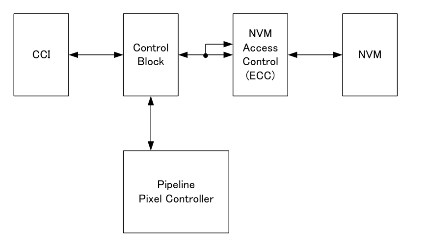

NVM is composed of 12 pages (from 0 to 11) and 64 bytes per page. ECC is also applied for every 16 address (bytes), 4 rows in 1 page.

*Fig. 34 NVM Map structure*

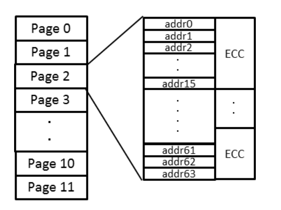

#### 7-2  NVM Functions

NVM block has following functions.

**Table 31 Functions via NVM**

| No | Item | Description |
| --- | --- | --- |
| 1 | Data Interface | User can write/read data via CCI by the unit of page |
| 2 | Writing Reg. Value | Writing assigned address and values which are transferred into the assigned registers. (Please refer to Related Registers session “Then when writing; ”) |
| 3 | Writing Defect address | Writing assigned address, whose values are used for defect corrections (Please refer to Defects Address registration session) |
| 4 | Reading | Reading NVM data by the unit of page, not ECC region (Please refer to Related Registers session “Then when reading;”) |
| 5 | ECC Function | Can apply ECC for each 16 bytes (1-row) block. 1-bit per 16 bytes can be corrected. |

---

## Page 70 — 7-3 Related Registers

6 ECC status Can check while reading/writing that ECC is applied by page. 1. Read data is correct. No ECC is applied. 2. Read data is correct with 1-bit correction of ECC. 3. Read data is incorrect though ECC is applied (means >2 bits per a unit of 16-byte (row) are incorrect).

#### 7-3  Related Registers

**Table 32 Related Registers**

Before writing / reading following steps are required 1. Set Sensor being SW-Standby by 0x0100 = 0h 2. Wait one frame time (See t0 in 8-2 Power off sequence session) when previous status is streaming. 3. Set monitor output to check writing pulse by 0x5E54=00h and 0x5E59=FFh, 4053=0Ah. (option, debug purpose only) 4. Set OTP write clock setting. (target = 25 µS) (When INCK = 12.0 MHz, “wrcnt” should be set to 012Ch (target = 25µs : 300d) at 0x3302, 0x3303) Then when writing; 1. Set controller "ECC ON" or ECC OFF" by 0x3300 = "20h" (ECC ON) or "28h" (ECC OFF) 2. Set Write by 0x3200 = "3h." 3. Set page from 0 to 11 by 0x3202. 4. Set 0x3204 to 0x3243 OTPIF_DT_0to 63 = xxh (Data to Write) Please overwrite all values when you program next page.

| Index | Byte | Register Name | RW | Comment | Re-Time | Default (HEX) | Embd DL | Comments |
| --- | --- | --- | --- | --- | --- | --- | --- | --- |
| 0100 | [0] | Mode sel| RW | Mode select 0: SW- Standby 1: Streaming |  | 0 |  |  |
| 3300 | [7:0] | SYSOTP IF MODE1_ | RW | OTP mode setting [1:0]: control access cycle to fuse cell 00: INCK cycle 01: INCK/2 cycle 10: INCK/4 cycle 11: INCK/8 cycle [3]: ECC disable switch 0: ECC on,1:ECC off [5]:write mode; 0: test mode 1: recommended |  | 00 |  |  |
| 5E54 | [7:0] | OUTF | RW | Monitor Output Enable |  | C0 |  |  |
| 5E59 | [7:0] | TESTMNT1 | RW | Monitor Output |  | 00 |  |  |
| 4053 | [7:0] | TEST FSTRB| RW | Set FStrobe pin to monitor |  | 00 |  |  |
| 012A | [7:0] | EXCK_FREQ [15:8]| RW | input clk frequency mhz (defa_ult = 7.6[MHz])  |  | 07 |  |  |
| 012B | [7:0] | EXCK_FREQ [7:0]| RW |  |  | 99 |  |  |
| 3302 | [7:0] | SYSOTP IF WRCNT[15:8] | RW | OTP write clock setting |  | 00 |  |  |
| 3303 | [7:0] | SYSOTP IF WRCNT[7:0] | RW |  |  | 00 |  |  |
| 3200 | [2:0] | OTPIF CTRL| RW | OTP I/F control register [0] enable [1]R/W [2]error clear |  | 0 |  |  |
| 3201 | [1:0] | OTPIF STATUS| RO-D | OTP I/F status; [0] read ready [1] write ready [2] 0: normal 1: Data error exists, and cannot be corrected by ECC. Read data is incorrect. |  | 0 |  |  |
| 3202 | [2:0] | OTPIF PAGE SELECT_ | RW | otpif page select_ |  | 0 |  |  |
| 3204 | [7:0] | OTPIF DT 0_ | RW | otpif data 0_ |  | 00 |  |  |
| (DT 1 to DT 62) |  |  |  |  |  |  |  |  |
| 3243 | [7:0] | OTPIF DT 63_ | RW | otpif data 63_ |  | 00 |  | Trigger to start write sequence |

---

## Page 71

OTP controller does NOT clear previous values automatically. 5. Set last byte of OTP buffer 0x3243 need to write again with same value of step4 6. Wait write sequence finish ( >12.8msec:target [25µs /bit] x 8 bit x 16btye x 4row) 7. Repeat the above (3) – (6) sequence again for twice write process. Then when reading; 1. Set controller “ECC ON” or “ECC OFF” by 0x3300 = 00h (ECC ON), 08h (ECC OFF) ; 2. Set Read by 0x3200 = "1h." 3. Set page from 0 to 11 by 0x3202. 4. Set 0x3204 to 0x3243 OTPIF_DT_0to 63 = xxh (Data to Write)

---

## Page 72 — 7-4 NVM Memory Map

#### 7-4  NVM Memory Map

**Table 33 NVM Memory capacity**

| Capacity | data Owner |
| --- | --- |
| 768 byte | Total |
| 672 byte | Integrator |
| 96 byte | Sony |

**Table 34 NVM Memory Map Example**

| Page (dec) | Row (dec) | Addr (hex) | Category | Name | data Owner |
| --- | --- | --- | --- | --- | --- |
| 0 | 0-3 | 000 - 03F |  |  | Integrator |
| 1 | 4-7 | 040 - 07F |  |  | Integrator |
| 2 | 8-11 | 080 - 0BF |  |  | Integrator |
| 3 | 12-15 | 0C0 - 0FF |  |  | Integrator |
| 4 | 16-19 | 100 - 13F |  |  | Integrator |
| 5 | 20-23 | 140 - 17F |  |  | Integrator |
| 6 | 24-27 | 180 - 1BF |  |  | Integrator |
| 7 | 28-31 | 1C0 - 1FF |  |  | Integrator |
| 8 | 32-35 | 200 - 23F |  |  | Integrator |
| 9 | 36-39 | 240 - 27F |  |  | Integrator |
| 10 | 40-41 | 280 - 29F |  |  | Integrator |
| 10 | 42 | 2A0 | memcfg1 | Defines availability of each data [7:1] reserved [0]: defect address available Value 0x00 makes sensor skip copying data from NVM to register. | Integrator |
| 10 | 42 | 2A1 | Defect Correction | defect num[7:0]| Integrator |
| 10 | 42 | 2A2 | Defect Correction | {DFCT SRC 10[1:0]CP DFCT DIR 10[1:0]    H DFCT ADDR 10[11:9]}  | Integrator |
| 10 | 42 | 2A3 | Defect Correction | H DFCT ADDR 10[7:0]  | Integrator |
| 10 | 42 | 2A4 | Defect Correction | V DFCT ADDR 10[11:4]  | Integrator |
| 10 | 42 | 2A5 | Defect Correction | {V DFCT ADDR 10[3:0]  DFCT SRC 11[1:0]CP DFCT DIR 11[1:0]}    | Integrator |
| 10 | 42 | 2A6 | Defect Correction | H DFCT ADDR 11[11:4]  | Integrator |
| 10 | 42 | 2A7 | Defect Correction | {H DFCT ADDR 11[3:0], V DFCT ADDR 11[11:8]}     | Integrator |
| 10 | 42 | 2A8 | Defect Correction | V DFCT ADDR 11[7:0]  | Integrator |
| 10 | 42 | 2A9 | Defect Correction | {DFCT SRC 12[1:0]CP DFCT DIR 12[1:0]    H DFCT ADDR 12[11:8]}  | Integrator |
| 10 | 42 | 2AA | Defect Correction | H DFCT ADDR 12[7:0]  | Integrator |
| 10 | 42 | 2AB | Defect Correction | V DFCT ADDR 12[11:4]  | Integrator |
| 10 | 42 | 2AC | Defect Correction | {V DFCT ADDR 12[3:0]  DFCT SRC 13[1:0]CP DFCT DIR 13[1:0]}    | Integrator |
| 10 | 42 | 2AD | Defect Correction | H DFCT ADDR 13[11:4]  | Integrator |
| 10 | 42 | 2AE | Defect Correction | {H DFCT ADDR 13[3:0], V DFCT ADDR 13[11:8]}     | Integrator |
| 10 | 42 | 2AF | Defect Correction | H DFCT ADDR 13[7:0]  | Integrator |
| 10 | 43 | 2B0 | please don't write | Defect number | Sony |
| 10 | 43 | 2B1 | please don't write | Defect address (single, 2 adjacent in same color , 2x4 static),10 address | Sony |

---

## Page 73

| Page (dec) | Row (dec) | Addr (hex) | Category | Name | data Owner |
| --- | --- | --- | --- | --- | --- |
| 10 | 43 | 2B2 | please don't write | Defect address (single, 2 adjacent in same color , 2x4 static),10 address | Sony |
| 10 | 43 | 2B3 | please don't write | Defect address (single, 2 adjacent in same color , 2x4 static),10 address | Sony |
| 10 | 43 | 2B4 | please don't write | Defect address (single, 2 adjacent in same color , 2x4 static),10 address | Sony |
| 10 | 43 | 2B5 | please don't write | Defect address (single, 2 adjacent in same color , 2x4 static),10 address | Sony |
| 10 | 43 | 2B6 | please don't write | Defect address (single, 2 adjacent in same color , 2x4 static),10 address | Sony |
| 10 | 43 | 2B7 | please don't write | Defect address (single, 2 adjacent in same color , 2x4 static),10 address | Sony |
| 10 | 43 | 2B8 | please don't write | Defect address (single, 2 adjacent in same color , 2x4 static),10 address | Sony |
| 10 | 43 | 2B9 | please don't write | Defect address (single, 2 adjacent in same color , 2x4 static),10 address | Sony |
| 10 | 43 | 2BA | please don't write | Defect address (single, 2 adjacent in same color , 2x4 static),10 address | Sony |
| 10 | 43 | 2BB | please don't write | Defect address (single, 2 adjacent in same color , 2x4 static),10 address | Sony |
| 10 | 43 | 2BC | please don't write | Defect address (single, 2 adjacent in same color , 2x4 static),10 address | Sony |
| 10 | 43 | 2BD | please don't write | Defect address (single, 2 adjacent in same color , 2x4 static),10 address | Sony |
| 10 | 43 | 2BE | please don't write | Defect address (single, 2 adjacent in same color , 2x4 static),10 address | Sony |
| 10 | 43 | 2BF | please don't write | Defect address (single, 2 adjacent in same color , 2x4 static),10 address | Sony |
| 11 | 44 | 2C0 | please don't write | Defect address (single, 2 adjacent in same color , 2x4 static),10 address | Sony |
| 11 | 44 | 2C1 | please don't write | Defect address (single, 2 adjacent in same color , 2x4 static),10 address | Sony |
| 11 | 44 | 2C2 | please don't write | Defect address (single, 2 adjacent in same color , 2x4 static),10 address | Sony |
| 11 | 44 | 2C3 | please don't write | Defect address (single, 2 adjacent in same color , 2x4 static),10 address | Sony |
| 11 | 44 | 2C4 | please don't write | Defect address (single, 2 adjacent in same color , 2x4 static),10 address | Sony |
| 11 | 44 | 2C5 | please don't write | Defect address (single, 2 adjacent in same color , 2x4 static),10 address | Sony |
| 11 | 44 | 2C6 | please don't write | Defect address (single, 2 adjacent in same color , 2x4 static),10 address | Sony |
| 11 | 44 | 2C7 | please don't write | Defect address (single, 2 adjacent in same color , 2x4 static),10 address | Sony |
| 11 | 44 | 2C8 | please don't write | Defect address (single, 2 adjacent in same color , 2x4 static),10 address | Sony |
| 11 | 44 | 2C9 | please don't write | Defect address (single, 2 adjacent in same color , 2x4 static),10 address | Sony |
| 11 | 44 | 2CA | please don't write | Defect address (single, 2 adjacent in same color , 2x4 static),10 address | Sony |
| 11 | 44 | 2CB | please don't write | Defect address (single, 2 adjacent in same color , 2x4 static),10 address | Sony |
| 11 | 44 | 2CC | please don't write | Defect address (single, 2 adjacent in same color , 2x4 static),10 address | Sony |
| 11 | 44 | 2CD | please don't write | Defect address (single, 2 adjacent in same color , 2x4 static),10 address | Sony |

---

## Page 74

| Page (dec) | Row (dec) | Addr (hex) | Category | Name | data Owner |
| --- | --- | --- | --- | --- | --- |
| 11 | 44 | 2CE | please don't write | Defect address (single, 2 adjacent in same color , 2x4 static),10 address | Sony |
| 11 | 44 | 2CF | please don't write | Defect address (single, 2 adjacent in same color , 2x4 static),10 address | Sony |
| 11 | 45 | 2D0 | please don't write | Defect address (single, 2 adjacent in same color , 2x4 static),10 address | Sony |
| 11 | 45 | 2D1 | please don't write | Defect address (single, 2 adjacent in same color , 2x4 static),10 address | Sony |
| 11 | 45 | 2D2 | please don't write | Defect address (single, 2 adjacent in same color , 2x4 static),10 address | Sony |
| 11 | 45 | 2D3 | please don't write | Defect address (single, 2 adjacent in same color , 2x4 static),10 address | Sony |
| 11 | 45 | 2D4 - 2DF | please don't write | Sony Calibration Area | Sony |
| 11 | 46 | 2E0 - 2E5 | please don't write | Sony Calibration Area | Sony |
| 11 | 46 | 2E6 | Fabrication, copy to 0x0002 | Sony Calibration Area | Sony |
| 11 | 46 | 2E7 | Lot_ID, copy to 0x0004 | Sony Calibration Area | Sony |
| 11 | 46 | 2E8 | Lot_ID, copy to 0x0005 | Sony Calibration Area | Sony |
| 11 | 46 | 2E9 | Lot_ID, copy to 0x0006 | Sony Calibration Area | Sony |
| 11 | 46 | 2EA | Wafer_Number, copy to 0x0007 | Sony Calibration Area | Sony |
| 11 | 46 | 2EB | Chip_Number, copy to 0x000D | Sony Calibration Area | Sony |
| 11 | 46 | 2EC | Chip_Number, copy to 0x000E | Sony Calibration Area | Sony |
| 11 | 46 | 2ED | Process revision, 0x000F | Sony Calibration Area | Sony |
| 11 | 46 | 2EE - 2EF | please don't write | Sony Calibration Area | Sony |
| 11 | 47 | 2F0 - 2FF | please don't write | Sony Calibration Area | Sony |

---

## Page 75 — 7-5 Defects Address registration

#### 7-5  Defects Address registration

The single defect, the same color adjoining (SCA) defect and 2 x 4 defect are stored into NVM and corrected.

##### 7-5-1  Single defect address

*Fig. 35 Single defect*

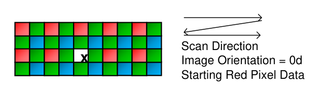

##### 7-5-2  Same Color Adjoining defect address

1. Target Address; (x, y) = (xt, yt) *Output area is Effective Area Output size is 3280x2464 (0,0) - (3279,2463) x = image area address + offset; offset = 8d y = image area address + offset; offset = 48d (not include embedded lines) 2.  Directions are also described in the following figure 0d = defect in right adjoining 1d = defect in right bottom adjoining 2d = defect in bottom adjoining 3d = defect in left bottom adjoining

*Fig. 36 Same Color Adjoining defect*

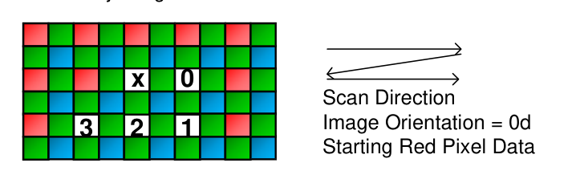

##### 7-5-3  2x4 defect address

1.  Target Address; (x, y) = (xt, yt) *Output area is Effective Area Output size is 3280x2464 (0,0) - (3279,2463) x = image area address + offset; offset = 8d y = image area address + offset; offset = 48d (not include embedded lines) 2. Only upper left pixel address needed in this case, always RED pixels

*Fig. 37 2x4 defect*

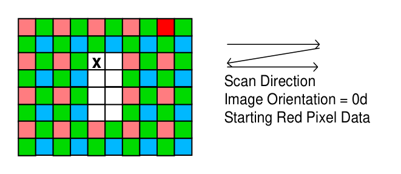

Scan Direction Image Orientation = 0d Starting Red Pixel Data Scan Direction Image Orientation = 0d Starting Red Pixel Data Scan Direction Image Orientation = 0d Starting Red Pixel Data

---

## Page 76

##### 7-5-4  Example Setting

Example when defect addr are 1st: (228d, 522d), func: adjoin, dir: 1 2nd: (2846d, 1460d), func: 2x4 3rd: (26d, 20d), single → Offset values are (physical address) 1st: (236d, 570d) , func: adjoin,   SRC = 2, DIR = 1, H_ADR = ECh, V_ADR = 23Ah 2nd: (2854d, 1508d) , func:2x4   SRC = 3, DIR = 0, H_ADR = B26h, V_ADR = 5E4h 3rd: (34d, 68d), func: single   SRC = 1, DIR = 0, H_ADR = 22h, V_ADR = 44h

**Table 35 Example setting of defect pixel**

| Addr (hex) | description | Value (hex) |
| --- | --- | --- |
| 2A0 | Defines availability of each data [7:1] reserved [0]: defect address available Value 0x00 makes sensor skip copying data from NVM to register. | 01 |
| 2A1 | defect num[7:0]| 3 |
| 2A2 | {DFCT SRC 10[1:0]CP DFCT DIR 10[1:0]    H DFCT ADDR 10[11:9]}  | 90 |
| 2A3 | H DFCT ADDR 10[7:0]  | EC |
| 2A4 | V DFCT ADDR 10[11:4]  | 23 |
| 2A5 | {V DFCT ADDR 10[3:0]  DFCT SRC 11[1:0]CP DFCT DIR 11[1:0]}    | AC |
| 2A6 | H DFCT ADDR 11[11:4]  | B2 |
| 2A7 | {H DFCT ADDR 11[3:0], V DFCT ADDR 11[11:8]     | 65 |
| 2A8 | V DFCT ADDR 11[7:0]  | E4 |
| 2A9 | {DFCT SRC 12[1:0]CP DFCT DIR 12[1:0]    H DFCT ADDR 12[11:8]}  | 40 |
| 2AA | H DFCT ADDR 12[7:0]  | 22 |
| 2AB | V DFCT ADDR 12[11:4]  | 04 |
| 2AC | {V DFCT ADDR 12[3:0]  DFCT SRC 13[1:0]CP DFCT DIR 13[1:0]}    | 40 |
| 2AD | H DFCT ADDR 13[11:4]  | 00 |
| 2AE | {H DFCT ADDR 13[3:0], V DFCT ADDR 13[11:8]     | 00 |
| 2AF | H DFCT ADDR 13[7:0]  | 00 |

---

## Page 77 — 8. How to operate IMX219PQH5-C; 8-1 Power on sequence

### 8.  How to operate IMX219PQH5-C

#### 8-1 Power on sequence

Power on sequence of IMX219PQH5-C is below figure. Startup Sequence in 2-wire Serial Communication Mode Perform power-on according to the following sequence. The XCLR pin must be released (Low → High) after all the power supplies (VANA,VDIG,VDDL) are completed.

*Fig. 38 Power-on Sequence in 2-wire Serial Communication Mode*

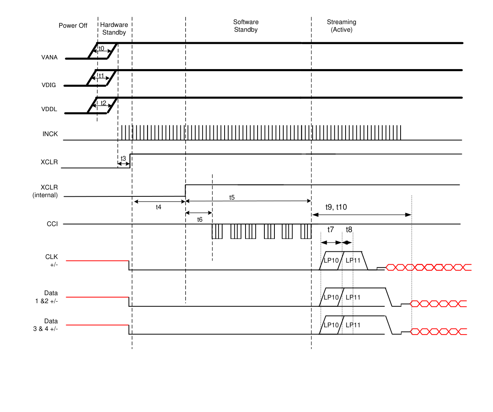

XCLR CCI INCK Streaming (Active) Software Standby Power Off Hardware Standby CLK +/- Data 1 &2 +/- Data 3 & 4 +/- LP10 LP10 LP10 LP11 LP11 LP11 t7 t8 t9, t10 XCLR (internal) VDDL (1.1V) VDIG VANA

---

## Page 78

**Table 36 Operation Specifications 2-wire Serial Communication Mode**

Start streaming sequence with 2-wire serial communication IMX219PQH5-C requires the command sequence below to output image data.

*Fig. 39 Start streaming sequence with 2-wire serial communication (external reset)*

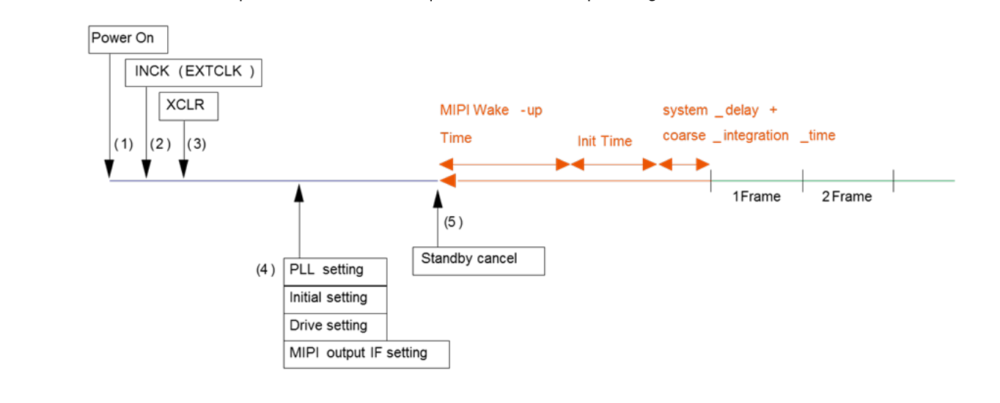

**Table 37 Initialization sequence with XCLR**

| Constraint | Label | Min. | Max. | Units | Comment |
| --- | --- | --- | --- | --- | --- |
| Sequence free of VDDs rising | t0, t1, t2 | VANA, VDIG, VDDL may rise in any order. |  | ns |  |
| XCLR rising | t3 | 0.5 | ― | µs |  |
| Internal XCLR is Low to High after VDDs & XCLR supplied | t4 |  | 200 | µs |  |
| releasing software standby after XCLR Low to High | t5 | 6 | ― | ms | charge up VRL |
| Initializing time of silicon | t6 | ― | 32000 | clocks | clock is INCK Case of INCK = 6[MHz], 5.3[msec] |
| D-PHY power-up | t7 | 1 | 1.1 | ms |  |
| D-PHY init | t8 | 100 | 110 | µs |  |
| After releasing software standby to data streaming time | t9 | 1.2 ms + exposure time | ― |  |  |
| Quick launch up time | t10 | ― | 1 | frame | stable time until optimal image quality |

---

## Page 79 — 8-2 Power off sequence

#### 8-2 Power off sequence

Perform the power-off in the sequence shown below. XCLR CCI INCK CLK +/- Hardware Data 1 &2 +/- Data 3 & 4 +/- XCLR (internal) VANA VDIG VDDL VBAT

*Fig. 40 Power-off Sequence in 2-wire Serial Communication*

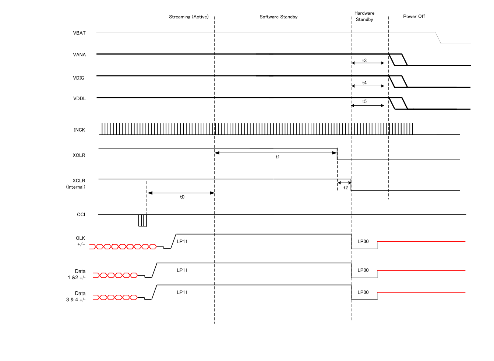

**Table 38 Operation Specifications in 2-wire Serial Communication**

(*1) One frame time = 1/(Frame_Rate[frame/s]) Can set fast standby mode when fast standby register (0x0106)] set to enable (0x01). Sequence for fast standby mode; (1) 0x0106 set to 0x01 ( fast standby mode is enable) (2) 0x0100 set to 0x00 ( SW standby ) (3) Can change to SW standby after read out of current line.

| Constraint Label Min. | Max. Units | Comment |
| --- | --- | --- |
| Communication end – Software standby t0 | One frame s time (*1) | Until frame output |
| Software standby - XCLR H → L t1 0 | ns |  |
| Falling time of internal XCLR after t2 XCLR H → L | 10 µs |  |
| VANA, VANA falling - VDIG falling - VDDL falling t3,t4,t5 may f | VDIG and VDDL ns all in any order. |  |

---

## Page 80

To in power-off sequence varies depending on the CCI communication end timing as shown below. 1. When the CCI communication is performed with Software Standby between SOF and EOF, all communicated frame data is output and the status is converted to Software Standby.

*Fig. 41 Software Standby Operation Pattern 1*

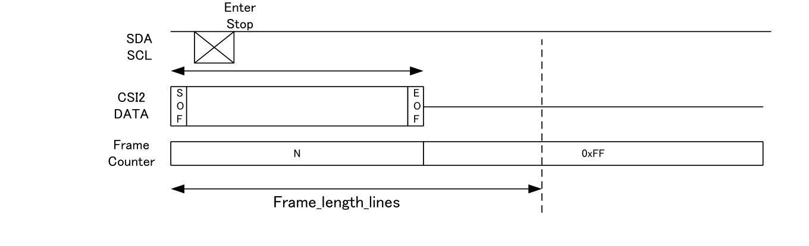

2. When the CCI communication is performed with Software Standby during FrameBlanking, the status is converted to Software Standby immediately after communication.

*Fig. 42 Software Standby Operation Pattern 2*

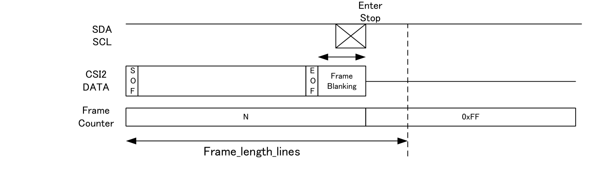

S O F E O F N 0xFF SDA SCL CSI2 DATA Frame Counter Enter Stop Frame_length_lines SDA SCL CSI2 DATA Frame Counter Enter Stop

| S E Frame O O Blanking F F | 0xFF |
| --- | --- |
| N | 0xFF |
| Frame length lines |  |

---

## Page 81 — 9. Other Functions; 9-1 Clock System

### 9.  Other Functions

#### 9-1  Clock System

##### 9-1-1  Clock Structure

The IMX219PQH5-C clock system has the following structure.

*Fig. 43 Clock System Block Diagram*

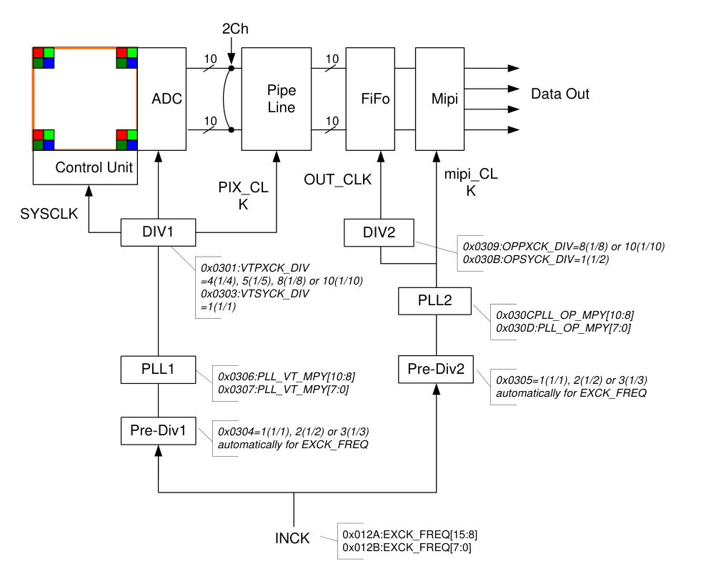

The IMX219PQH5-C is comprised of 2 ch Pipe-Line, and 2 PLL for both pixel read domain and Output data domain. See following section (Clock Setting Example) for detail.

Relationships between 2 domains are the followings;

1. If Pix Rate of PLL1 domain < Data Rate of PLL2 domain, data is always correctly output from the sensor
2. If Pix Rate of PLL1 domain > Data rate of PLL2 domain, Else If de-rating (binning and sub-sampling without resize), FiFo can handle.

##### 9-1-2  EXCK_FREQ setting depend on INCK frequency

The IMX219PQH5-C has the function that automatically set Pre-Div1 and Pre-Div2 by setting the register of EXCK_FREQ, case of changing INCK frequency.

**Table 39 EXCK_FREQ setting table**

| INCK (Input Pin) | EXCK_FREQ (0x012A/0x012B) | PREPLLCK_VT_DIV (0x0304) | PREPLLCK_OP_DIV (0x0305) | Remark |
| --- | --- | --- | --- | --- |
| 6 to 12 MHz | 6d to 12d (06h to 0Ch) | 01h (auto set) | 01h (auto set) | |
| 12 to 24 MHz | 12d to 24d (0Ch to 18h) | 02h (auto set) | 02h (auto set) | |
| 24 to 27 MHz | 24d to 27d (18h to 1Bh) | 03h (auto set) | 03h (auto set) | |

---

## Page 82 — 9-2 Clock Setting Example

#### 9-2  Clock Setting Example

| | CSI-2 | CSI-2 | CSI-2 |
| --- | --- | --- | --- |
| ADC bit width | 10 | 10 | 10 |
| Data Mode | Raw10 | Raw10 | Raw10 |
| FPS | 30 frame/s | 180 frame/s | 21 frame/s (*) |
| Lanes | 4 | 4 | 2 |
| Bin / Sub | Full-Pel | 2 (V) ×2 (H) analog (special) binning | Full-Pel |
| Output Size (H, V) | 3280 × 2464 | 1408 × 792 | 3280 × 2464 |
| pll1_vt_freq | 702 MHz | 702 MHz | 456 MHz |
| EXCK_FREQ | 12 | 12 | 12 |
| VTSYCK_DIV | 1 | 1 | 1 |
| vt_pix_clk_div | 5 | 5 | 10 |
| Pix Rate | 280.8M pix | 280.8M pix | 182.4M pix |
| Actual freq (VTCK) | 140.4 MHz | 140.4 MHz | 91.2 MHz |
| pll2_op_freq | 726 MHz | 726 MHz | 912 MHz |
| op_sys_clk_div | 1 | 1 | 1 |
| op_pix_clk_div | 10 | 10 | 10 |
| de-rating | 1 | 1 | 1 |
| Output Lanes | 4 | 4 | 2 |
| Actual freq (OPCK) | 72.6 MHz | 72.6 MHz | 91.2 MHz |
| Actual MIPI-freq (byte) | 90.75 MHz | 90.75 MHz | 114 MHz |
| Speed/Lane (Ch) | 726 Mbps | 726 Mbps | 912 Mbps |
| Total Output Rate | 2.904 Gbps | 2.904 Gbps | 1.824 Gbps |

\* Max. frame rate is 21 frame/s

This table is **full-array** examples (not the project 1920×1080 V-crop). 2-lane column matches the 912 Mbps/lane datasheet max.

---

## Page 83 — 9-3 Temperature Sensor

#### 9-3  Temperature Sensor

Registers to be related about temperature sensor are the followings.

**Table 40 Temperature setting registers**

The temperature sensor measures the junction temperature of the sensor silicon. The target range is -10 to 95 degrees in C, with +/- 5 degree in C deviation. The sensor is operated immediately after streaming mode, and the value will be stored in the register. The following table shows the relationship between temperature and stored value.

| Index | Byte | Register Name | RW | Comment | Re-Time | Default (HEX) | Embd DL | Comments |
| --- | --- | --- | --- | --- | --- | --- | --- | --- |
| 0x0140 | [7] | TEMPERATURE_EN| RW | start register to measure sensor temperature |  | 0 |  |  |
|  | [6:0] | TEMPERATURE_VAL| RO-D | result of measurement of sensor temperature |  | 00 |  |  |

| Temperature[℃] | temperature val[dec] | temperature val[hex] |
| --- | --- | --- |
| -10 |  0 |  0 |
| -5 | 6 | 6 |
| 0 | 12 | C |
| 5 | 18 | 12 |
| 10 | 24 | 18 |
| 15 | 30 | 1E |
| 20 | 36 | 24 |
| 25 | 43 | 2B |
| 30 | 49 | 31 |
| 35 | 55 | 37 |
| 40 | 61 | 3D |
| 45 | 67 | 43 |
| 50 | 73 | 49 |
| 55 | 79 | 4F |
| 60 | 85 | 55 |
| 65 | 91 | 5B |
| 70 | 97 | 61 |
| 75 | 104 | 68 |
| 80 | 110 | 6E |
| 85 | 116 | 74 |
| 90 | 122 | 7A |
| 95 | 128 | 80 |

---

## Page 84 — 10. Electrical Characteristics; 10-1 Absolute Maximum Ratings; 10-2 Recommended Operating Conditions

### 10.  Electrical Characteristics

#### 10-1  Absolute Maximum Ratings

**Table 41 Absolute Maximum Ratings**

| Item | Symbol | Min. | Typ. | Max. | Unit | Remarks |
| --- | --- | --- | --- | --- | --- | --- |
| Supply voltage (analogue) | V ANA | -0.3 |  | 3.3 | V |  |
| Supply voltage (Core) | V DDL | -0.3 |  | 2.0 | V |  |
| Supply voltage (IF) | V DIG | -0.3 |  | 3.3 | V |  |
| Input voltage | V I | -0.3 |  | 3.3 | V |  |
| Output voltage | V O | -0.3 |  | 3.3 | V |  |
| Operating temperature (function) | Topr | -20 |  | 60 | ˚C | Junction temperature |
| Storage temperature | Tstg | -30 |  | 80 | ˚C | Junction temperature |
| Performance guarantee temperature | Tspec | -20 |  | 60 | ˚C | Junction temperature |

#### 10-2  Recommended Operating Conditions

**Table 42 Recommended Operating Conditions**

| Item | Symbol | Min. | Typ. | Max. | Unit | Remarks |
| --- | --- | --- | --- | --- | --- | --- |
| Supply voltage (analogue) | V ANA | 2.6 | 2.8 | 3.0 | V |  |
| Supply voltage (Core) | V DDL | 1.08 | 1.2 | 1.3 | V |  |
| Supply voltage (IF) | V DIG | 1.62 | 1.8 | 1.98 | V |  |

---

## Page 85 — 10-3 Electrical Characteristics

#### 10-3  Electrical Characteristics

**Table 43 DC Characteristics**

| Item | Pins | Symbol | Min. | Typ. | Max. | Unit |
| --- | --- | --- | --- | --- | --- | --- |
| Supply voltage | VDDHFIL1,2 | V ANA | 2.6 | 2.8 | 3.0 | V |
|  | VDDHCM1,2 |  |  |  |  |  |
|  | VDDHAN |  |  |  |  |  |
|  | VDDHPL |  |  |  |  |  |
|  | VDDHSN1,2 |  |  |  |  |  |
|  | VDDMCO | V DIG | 1.62 | 1.8 | 1.98 | V |
|  | VDDLSC1-8 | V DDL | 1.08 | 1.20 | 1.30 | V |
|  | VDDLCN1,2 |  |  |  |  |  |
|  | VDDLIO1,2 |  |  |  |  |  |
| Digital input/output voltage | SCL, SDA, GPO | VIL | -0.5 |  | 0.3V DIG | V |
|  |  | VIH | 0.7V DIG |  | V + 0.5 DIG | V |
|  |  | VOL |  |  | 0.25V DIG | V |
|  |  | VOH | 0.75V DIG |  |  | V |
| Digital output voltage | FSTROBE | VOL |  |  | 0.45 | V |
|  |  | VOH | V - 0.45 DIG |  |  |  |
| Digital input voltage | XCLR,INCK | VIL | -0.3 |  | 0.35V DIG | V |
|  |  | VIH | 0.65V DIG |  | V + 0.3 DIG |  |

---

## Page 86 — 10-4 AC Characteristics; 10-5 Electrical Characteristics

#### 10-4  AC Characteristics

##### 10-4-1  Master Clock Waveform Diagram

###### 10-4-1-1  INCK Square Waveform Input Specifications

Input specifications are shown below when square-wave inputs directly into the external pin INCK.

*Fig. 44 Master Clock Square Waveform Diagram*

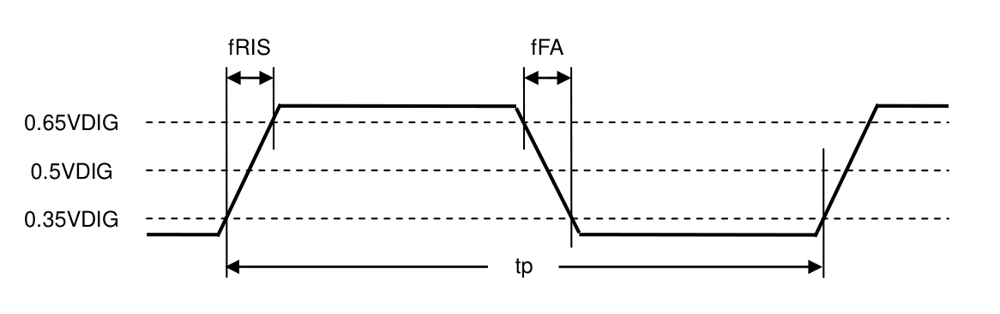

**Table 44 Master Clock Square Waveform Input Characteristics**

| Item | Symbol | Min. | Typ. | Max. | Unit | Comment |
| --- | --- | --- | --- | --- | --- | --- |
| Frequency | fSCK | 6 | 18 | 27 | MHz |  |
| jitter (period, peak-to-peak) | Tjitter |  |  | 600 | ps |  |
| Rise Time | fRISE | 1 |  | 10 | ns |  |
| Fall Time | fFALL | 1 |  | 10 | ns |  |
| Duty Cycle | fDUTY | 40 |  | 60 | % |  |
| Input Leakage | fILEAK | -10 |  | 10 | µA |  |

#### 10-5  Electrical Characteristics

**Table 45 Electrical Characteristics**

| Item | Symbol | Min. | Typ. | Max. | Unit | Comment |
| --- | --- | --- | --- | --- | --- | --- |
| Current consumption (Full,30 frame/s) | IVAVA strm|  | 33 | 38 | mA | VTmax is max speed read out from pixel array CSI2 4 lanes, V current ANA |
|  | IVDDL strm|  | 100 | 160 | mA | VTmax is max speed read out from pixel array CSI2 4 lanes, V current DDL Defect Correction, L.S.C. function off |
| HW-Standby current | ISTB ana|  |  | 50 | µA | XCLR = Lo, V current ANA |
|  | ISTB dig|  |  | 10 | µA | XCLR = Lo, V current DIG |
|  | ISTB Iddl|  |  | 50 | µA | XCLR = Lo, V current DDL |

---

## Page 87 — 11. Spectral Sensitivity Characteristic

### 11.  Spectral Sensitivity Characteristic

(Neither lens characteristics nor light source characteristics is included.)

*Fig. 45 Spectral sensitivity characteristics*

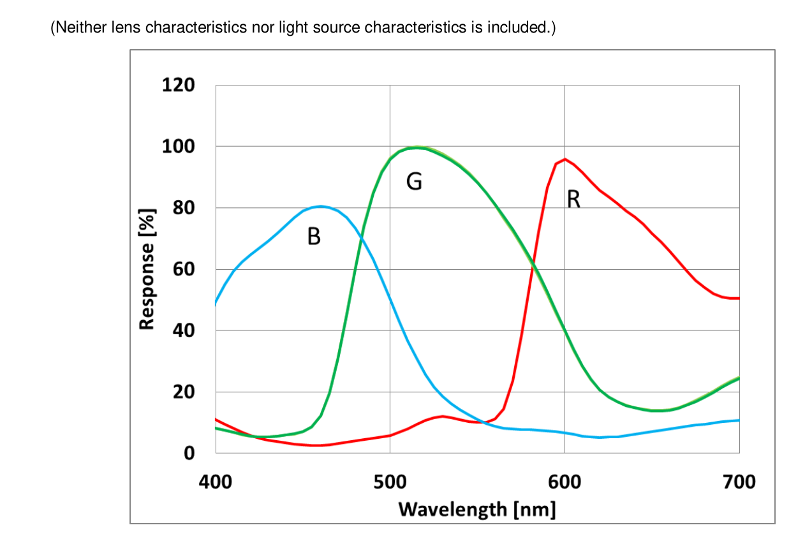

---

## Page 88 — 12. Image Sensor Characteristics; 12-1 Image Sensor Characteristics; 12-2 Zone Definition used for specifying image sensor characteristics

### 12.  Image Sensor Characteristics

#### 12-1  Image Sensor Characteristics

**Table 46 Image Sensor Characteristics**

(30 frame/s, VANA = 2.8 V, VDIG = 1.2 V, VIF = 1.8 V, Tj = 60 ˚C) LSB is the abbreviation of Least Significant Bit. 10 bits = 1023 digital is the maximum output code for the output unit. The base gain in which the saturation signal output matches with 1023 LSB is 0[dB] when the OB level is 64 LSB (standard recommended value). The data described at this image sensor characteristics are the measurement standard without base gain setting, and indicates the results evaluated with OB as a reference.

#### 12-2  Zone Definition used for specifying image sensor characteristics

*Fig. 46 Zone Definition Diagram*

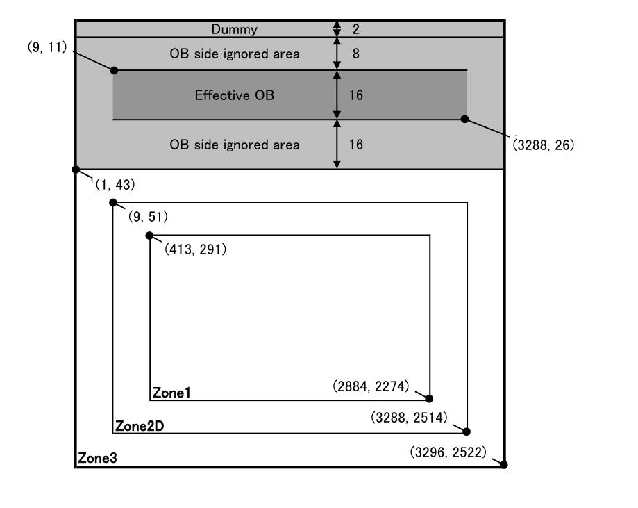

---

## Page 89 — 13. Measurement Method for Image Sensor Characteristics; 13-1 Measurement conditions; 13-2 Color Coding of This Image Sensor and Readout

### 13.  Measurement Method for Image Sensor Characteristics

#### 13-1  Measurement conditions

The device operation conditions are at the typical values of the bias and clock voltage.

**Table 47 Measurement Conditions**

| | |
| --- | --- |
| Supply voltage | Analog 2.8 V, digital 1.2 V, IF 1.8 V |
| Clock | INCK (EXTCLK) 18 MHz |

In the following measurements, spot pixels are excluded and, unless otherwise specified, the optical black (OB) level is used as the reference for the signal output, which is taken as the value of the Gr, Gb, R and B digital signal outputs of the measurement system. As an example of 1 LSB, the typical value is 1 LSB ≈ 0.357 mV in all-pixel output 10-bit operation mode.

#### 13-2  Color Coding of This Image Sensor and Readout

The primary color filters of this image sensor are arranged in the layout shown in the figure below. Gr and Gb denote the G signals on the same line as the R signal and the B signal, respectively. The R signal and Gr signal lines and the Gb signal and B signal lines are output successively. All pixel signals are output successively in a 1/15 s period.

*Fig. 47 Color coding alignment*

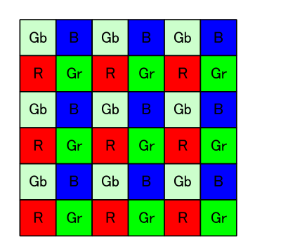

First line of the figure: **Gb B**; second line: **R Gr** (same as project Bayer **GBRG** when Pin 1 is upper-right / `image_orientation=0`).

#### 13-3  Definition of Standard Imaging Conditions

Standard imaging condition I Use a pattern box (luminance: 706 cd/m2, color temperature of 3200 K halogen source) as a subject. (Pattern for evaluation is not applicable.) Use a testing standard lens with CM500S (t = 1.0 mm) as an IR cut filter and image at F2.8. The luminous intensity to the sensor receiving surface at this point is defined as the standard sensitivity testing luminous intensity. Standard imaging condition II A testing lens with CM500S (t = 1.0 mm) is used as an IR cut filter for light source with 3200 K color temperature. The luminous intensity to the sensor receiving surface is adjusted to the luminous intensity level shown in each measurement item by the light source output, lens aperture or storage time control by the electronic shutter. Standard imaging condition III A recommended testing lens with CM500S (t = 1.0 mm) is used as an IR cut filter for light source with 3200 K color temperature. The luminous intensity to the sensor receiving surface is adjusted to the luminous intensity level shown in each measurement item by the light source output or storage time control by the electronic shutter.

| Gb | B | Gb | B | Gb | B |
| --- | --- | --- | --- | --- | --- |
| R | Gr | R | Gr | R | Gr |
| Gb | B | Gb | B | Gb | B |
| R | Gr | R | Gr | R | Gr |
| Gb | B | Gb | B | Gb | B |
| R | Gr | R | Gr | R | Gr |

---

## Page 90 — 13-4 Measurement method

#### 13-4  Measurement method

Sensitivity Set the measurement condition to the standard imaging condition I. After setting the luminous intensity of 10 times that of the standard imaging condition and the electronic shutter mode with a shutter speed of 1/150 s, measure the Gr and Gb signal outputs (VGr, VGb) at the center of imaging area, and substitute the values into the following formula. S = {((VGr + VGb)/2) × (1/10) × (150/120)} [LSB] Sensitivity ratio Set the measurement condition to the standard imaging condition II. After adjusting so that the average value of the Gr and Gb signal output is 333 [LSB], measure the R signal output (VR [LSB]), the Gr and Gb signal outputs (VGr, VGb [LSB]) and the B signal output (VB [LSB]) at the imaging area Center in frame readout mode, and substitute the values into the following formulas. VG = (VGr + VGb)/2 RG = VR/VG RB = VB/VG Saturation signal Set the measurement condition to the standard imaging condition II. After adjusting the luminous Intensity to 20 times the intensity with the average value of the Gr, Gb signal outputs, 333 [LSB], measure the average value of the Gr, Gb, R and B signal outputs. Video signal shading Set the measurement condition to the standard imaging condition III. With the lens diaphragm at F2.8, adjust the luminous intensity so that the average value of the Gr and Gb signal outputs is 333 [LSB]. Then measure the maximum value (Gmax [LSB]) and minimum value (Gmin [LSB]) of the Gr and Gb signal outputs, and substitute the values into the following formula. SH = ((Gmax – Gmin)/Gmax) × 100 [%] Dark signal Measure the output difference between 1/15 [s] signal output (Va) and 1/15000 or less [s] signal output (Vb) at the device ambient temperature of 60 ˚C and the device in the light-obstructed state, and calculate the signal output at 1/15 [s] storage by them using the following approximate formula. Then, this is Vdt [LSB]. Vdt = (Va – Vb) × (1/15)/(1/15) – (1/15000) ≈ (Va –Vb) [LSB]

---

## Page 91 — 14. Spot Pixel Specification

### 14.  Spot Pixel Specification

**Table 48 Spot Pixel Specifications**

(15 frame/s, VANA = 2.8 V, VDIG = 1.2 V, VIF = 1.8 V, Tj = 60 ˚C) Note) 1. D...Spot pixel level. 2. Continuous same color pixels in the horizontal or vertical direction are NG. 3. he above chart (hereinafter referred to as the “Spot Pixel Specifications”) is the standard only for sorting image sensor products in this specification book (hereinafter referred to as the “P ODUC S”) before shipment from a manufacturing factory. Sony Corporation and its distributors (collectively hereinafter referred to as the “Seller”) disclaim and will not assume any liability even if actual number of distorted pixels of the PRODUCTS delivered to you exceeds the maximum number set forth in the White and Black Pixel Specifications. You are solely liable for any claim, damage or liability arising from or in connection with such distorted pixels. If the Seller separately has its own product warranty program for the P ODUC S (the “Program”), the conditions in this specification book shall prevail over the Program and the Seller shall not assume any liability under the Program to the extent there is contradiction.

---

## Page 92 — 15. Notice on White Pixels Specifications

### 15.  Notice on White Pixels Specifications

After shipment inspection of CMOS image sensors, pixels of CMOS image sensors may be distorted and then distorted pixels may cause white point effects in dark signals in picture images. (Such white point effects shall be hereinafter referred to as "White Pixels.") Cosmic radiation is one of the causes of White Pixels. Unfortunately, it is not possible with current scientific technology for CMOS image sensors to prevent such distorted pixels. It is recommended that when you use CMOS image sensors, you should consider taking measures against White Pixels, such as adoption of automatic compensation systems for White Pixels and establishment of quality assurance standards. White Pixels may be also caused by alpha radiation, which will be emitted in a process of decay of radioactive isotopes which inevitably exist in the air in minute amounts and may exist in materials or parts of CMOS image sensor devices (e.g. packaging materials, seal glass, wiring materials and IC chips). It is recommended that you should use materials or parts which do not include radioactive isotopes, which are sources of alpha radiation, and consider taking measures, such as adoption of vacuum packaging technologies in order to ensure that the PRODUCTS are not exposed to the air. As the density of radioactive isotopes in the air of the underground space may become thicker than that on the ground, it is highly recommended to ensure the PRODUCTS are not exposed to the air in using or storing the PRODUCTS at the underground space. [For Your Reference] The Annual number of White Pixels Occurrence Caused by Cosmic Radiation The data in the below chart shows the estimated annual number of White Pixels occurrence caused by cosmic radiation in a single-story building in Tokyo at an altitude of 0 meters. The data shows estimated number of White Pixels based on records of past field tests calculated taking structures and electrical properties of each device into account. However, the data in the chart is for your reference purpose only, and shall not be construed as part of any CMOS image sensor product specifications which the Seller warrants. Example of Annual Number of Occurrence Note 1) The above data indicates the number of White Pixels occurrence when a CMOS image sensor is left for a year. Note 2) The annual number of White Pixels occurrence fluctuates depending on the CMOS image sensor storage environment (such as altitude, geomagnetic latitude and building structure), time (solar activity effects) and so on. Moreover, there may be statistic errors. Please take notice and understand that this is an example of test data with experiments that have being conducted over a specific time period and in a specific environment. Note 3) This data does not guarantee the upper limits of the annual number of White Pixels occurrence. Note 4) As this data does not take occurrence of White Pixels caused by alpha radiation into account, White Pixels are likely to occur at higher value than the rate set forth in such data. For Your Reference: The annual number of White Pixels occurrence caused by cosmic radiation at an altitude of 3,000 meters will be from 5 to 10 times higher than that at an altitude of 0 meters because of the density of the cosmic rays. In addition, in high latitude geographical areas such as London and New York, the density of cosmic rays increases due to a difference in the geomagnetic density, so the annual number of White Pixels occurrence caused by cosmic radiation in such areas approximately doubles when compared with that in Tokyo.

| White Pixel Level (in case of integration time = 1/30 s) (Tj = 60 ˚C) | Annual number of occurrence |
| --- | --- |
| 5.6 mV or higher 10.0 mV or higher 24.0 mV or higher 50.0 mV or higher 72.0 mV or higher | 0.8 pcs 0.5 pcs 0.3 pcs 0.2 pcs 0.1 pcs |

---

## Page 93 — 15-1 Measurement Method for Spot Pixels; 15-2 Spot Pixel Pattern Specifications

#### 15-1  Measurement Method for Spot Pixels

Measure under the standard imaging condition II.

#### 15-2  Spot Pixel Pattern Specifications

Black or white pixels at high light After adjusting the average value of the Gr/Gb signal output to 333 [LSB], measure the local dip point (black pixel at high light, VXB) and peak point (white pixel at high light, VXK) in the Gr/Gb signal output Vx (x = Gr/Gb), and substitute the values into the following formula.

*Fig. 48 Measurement Method for Spot Pixels*

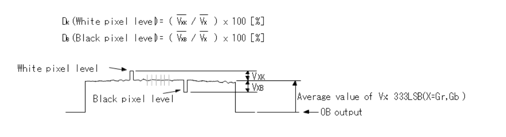

White pixels in the dark Set the device to a dark setting and measure the local peak point of the signal output waveform using the average value of the dark signal output as a reference.

---

## Page 94 — 16. Chief Ray Angle Characteristics

### 16.  Chief Ray Angle Characteristics

*Fig. 49 Chief Ray Angle Characteristics*

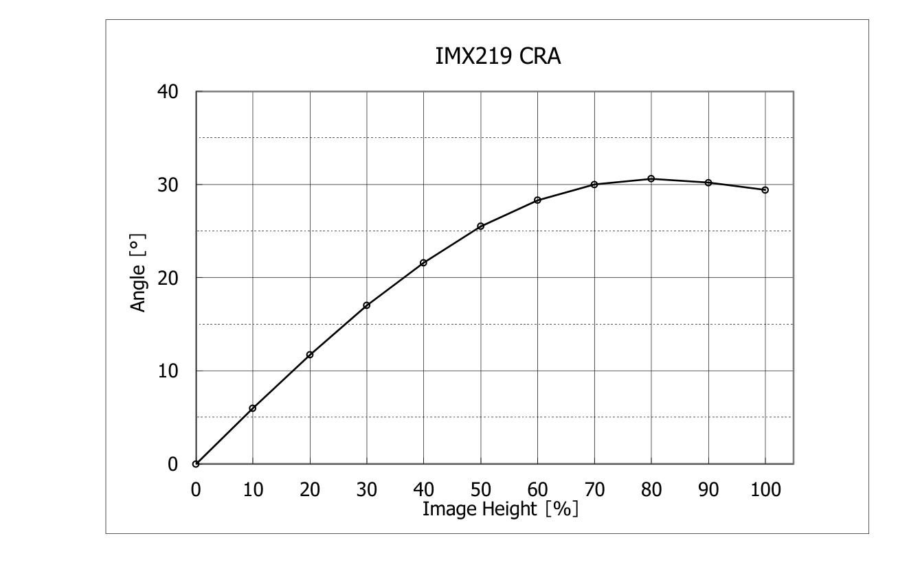

0 10 20 30 40 0 10 20 30 40 50 60 70 80 90 100 Angle ［°］ Image Height ［%］ IMX219 CRA

---

## Page 95 — 17. Connection Example

### 17.  Connection Example

*Fig. 50 Recommended Circuit*

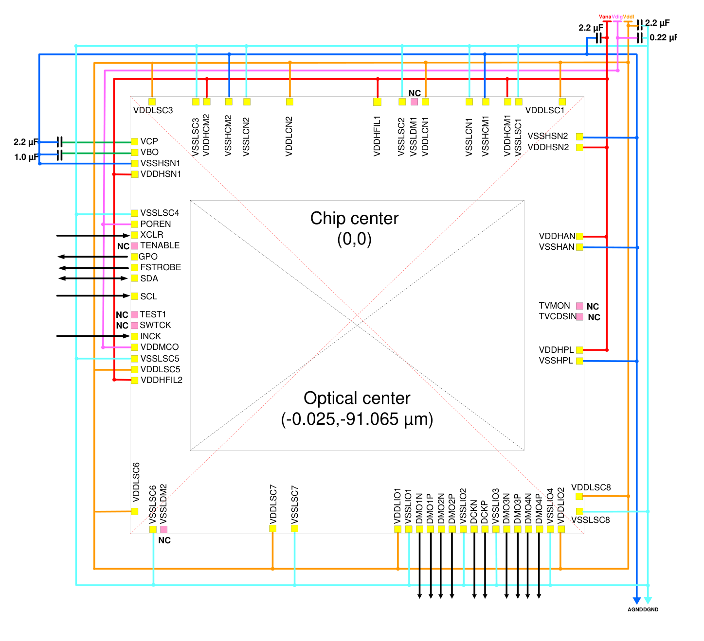

Pad open size 75 µm × 75 µm *1 Pad pitch 120 µm *1 85 µm × 85 µm (Only VDDHFIL1 pad) Note)  When fixing the voltage of chip back side, fix it to VDDHSN voltage Note)  GPO must be connected to GND, when GPO function is not enable.

---

## Page 96 — 18. Notes On Handling

### 18.  Notes On Handling

1. Static charge prevention Image sensors are easily damaged by static discharge. Before handling be sure to take the following protective measures. (1) Either handle bare handed or use non-chargeable gloves, clothes or material. Also use conductive shoes. (2) Use a wrist strap when handling directly. (3) Install grounded conductive mats on the floor and working table to prevent the generation of static electricity. (4) Ionized air is recommended for discharge when handling image sensors. (5) For the shipment of mounted boards, use boxes treated for the prevention of static charges. 2. Protection from dust and dirt (1) Perform all work in a clean environment. (2) Do not touch the chip surface with hand and make any object contact with it. (3) Keep in a dedicated case to protect from dust and dirt. To prevent dew condensation, preheat or precool when moving to a room with great temperature differences. 3. Others (1) Do not expose to strong light (sun rays) for long periods, as the color filters of color devices will be discolored. (2) Exposure to high temperature or humidity will affect the characteristics. Accordingly avoid storage or use in such conditions. (3) This product is precision optical parts, so care should be taken not to apply excessive mechanical shocks or force. (4) Reliability assurance of this product should be ignored because it is a bare chip. (5) Note that imaging characteristics of the sensor may be affected when approaching strong electromagnetic wave or magnetic field during operation. (6) Note that X-ray inspection may damage characteristics of the sensor. (7) Note that the sensor may be damaged when using ultraviolet ray and infrared laser for mounting it. (8) Note that image may be affected by the light leaked to optical black when using an infrared cut filter that has transparency in near infrared ray area during shooting subjects with high luminance.

---
