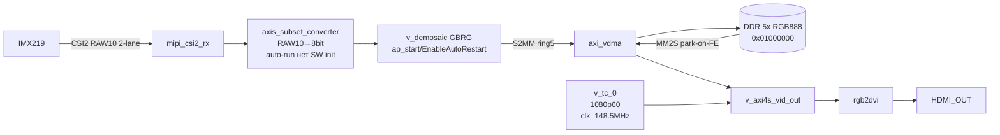

# План: камера → HDMI OUT

## Цель

Передать картинку с камеры на **HDMI OUT** Digilent **Zybo Z7-7020**.

| Что | Значение |
|-----|----------|
| Камера | Sony **IMX219** (Raspberry Pi Camera v2.1, ~8 Мп) |
| Даташит | [`doc_imx219/pdf/IMX219_datasheet/IMX219_datasheet.md`](../doc_imx219/pdf/IMX219_datasheet/IMX219_datasheet.md) |
| Плата | Zybo Z7-20, выход **HDMI OUT** |
| Режим | **1920×1080**, RAW10, Bayer **GBRG**, **2-lane** CSI-2 |
| Кадры/с | **~30 fps** (RPi 1080p30). В даташите max **60 fps** @1080p V-crop — мы целимся в 30 |
| Буферы | **5** кадров в DDR |
| После FE | завершённый кадр → показ на HDMI |

**Не 1280×1080** — такого режима у IMX219 нет. Ближайшие: 1920×1080 или 1280×720. В проекте — **1920×1080**.

## Пайплайн



HDMI тайминг: **1080p60** (VTC + rgb2dvi). Сенсор ~30 fps, HDMI повторяет кадры.

**`axis_subset_converter` (axis_raw10to8)** — IP auto-run (`tdata[9:2]`), инициализация SW не нужна.

## Маркеры кадра (CSI-2 short packets)

По даташиту (Table 14 / p.47):

| Маркер | DT | Смысл |
|--------|-----|--------|
| Frame Start (**FS**) | `0x00` | начало кадра |
| Frame End (**FE**) | `0x01` | конец кадра |
| Line Start / End | `0x02` / `0x03` | на этом MIPI IP обычно n/a |

Данные кадра: CSI DT **RAW10 = `0x2B`** (`0x018C/0x018D = 0x0A/0x0A`).

В PL short packets разбирает **MIPI CSI-2 RX**. В DDR после demosaic лежат уже **RGB-пиксели**, не raw CSI.

**Правило показа:** когда кадр дописан (= FE / S2MM frame-done) → **MM2S park** на этот буфер → HDMI читает последний полный кадр. Запись S2MM идёт в следующие слоты кольца из 5.

## Размер кадра в DDR (обязательно)

После demosaic храним **RGB888**, не RAW10 и не u16 «как в старом UDP».

| Параметр | Значение |
|----------|----------|
| Ширина × высота | 1920 × 1080 |
| BPP | 3 (R,G,B) |
| HSIZE / stride | `1920 × 3 = 5760` байт/линия |
| VSIZE | 1080 |
| **1 кадр** | `5760 × 1080 = 6 220 800` байт (~5.93 MiB) |
| **5 буферов** | `5 × 6 220 800 = 31 104 000` байт (~29.7 MiB) |
| Шаг store | `0x00600000` (6 MiB) |
| База | `0x01000000` (внутри окна линкера `0x00100000..0x0FFFFFFF`) |

Адреса:

```
num/buf=1/0x01000000
num/buf=2/0x01600000
num/buf=3/0x01C00000
num/buf=4/0x02200000
num/buf=5/0x02800000
```

На проводе CSI (только для диагностики MIPI, **не** размер DDR-кадра):

- word count линии RAW10: `1920 × 10/8 = 2400` байт
- в старых UDP-логах HSIZE=3840 было `1920×2` (u16) — **сюда не копировать**; для HDMI HSIZE=**5760**

## Логика работы (порядок)

1. Поднять bars в DDR buf0 + VDMA MM2S park на buf0 → **затем включить VTC** (HDMI timing) → HDMI показывает bars.
2. GPIO XCLR: Low → High, ждать ≥6 ms (t5), I2C probe chip ID `0x0219` @ `0x10`.
3. IMX219 config: 2-lane **до** выхода из standby, RAW10, PLL/FL/LL ~30 fps, crop 1920×1080, **без** test pattern (`0x0601=0`).
4. Включить CSI RX + demosaic + VDMA **S2MM** ring из 5 адресов.
5. `0x0100=1` — streaming.
6. На каждый **FE / frame-done**: park MM2S на завершённый буфер → картинка на HDMI.
7. UART: баннер, Config blocks, BUF, периодический `[PIPE]`, диагностика FS…FE.

## Что сейчас не так (дыры)

| Место | Сейчас | Нужно |
|-------|--------|-------|
| BD bitstream | xlconstant_one есть в TCL, но **rebuild ещё не сделан** | `flash_hdmi.cmd` |
| SW `StartVtc()` | **закомментирован** в `pipeline.c` P06 | раскомментировать после rebuild |
| `axi_smc NUM_MI` | потенциально не 4 | проверить после rebuild, задать `CONFIG.NUM_MI {4}` |
| PL `c_num_fstores` | уже исправлено в TCL (`{5}`) | rebuild bitstream |
| `VIDEO_NUM_FRAMES` | 5 ✓ | уже OK |
| Store-адреса | 5 разных шаг 6 MiB от `0x01000000` ✓ | уже OK |
| Test pattern | `0x0601=0` ✓ | уже OK |

## VTC — главный блокер HDMI

### Почему сейчас HDMI чёрный

VTC (`v_tc_0`) генерирует HSYNC/VSYNC для `v_axi4s_vid_out`. Без работающего VTC HDMI-выход не даёт сигнала — монитор покажет **«Нет сигнала»**, даже если в DDR есть bars.

### Причина старого hang: `s_axi_aclken` / `clken`

Когда `s_axi_aclken` или `clken` VTC не подключены (floating = 0), AXI-Lite интерфейс VTC зависает — CPU пытается читать/писать `0x43C20000` и получает **data abort** (arready никогда не приходит). Это и было причиной комментария «VTC aborts MMU-off».

**Исправление уже в TCL** (`scripts/add_hdmi_and_build.tcl`, строки 178–179):
```tcl
[list [get_bd_pins xlconstant_one/dout] [get_bd_pins v_tc_0/s_axi_aclken]]
[list [get_bd_pins xlconstant_one/dout] [get_bd_pins v_tc_0/clken]]
```
После `flash_hdmi.cmd` VTC AXI будет отвечать.

### Дополнительно: VTC `resetn` clock domain

TCL отключает VTC от `rst_hdmi` (зависит от clk_wiz_hdmi lock) и подключает к `proc_sys_reset_0/peripheral_aresetn` (100 MHz domain, строки 220–226). Это корректно — VTC синхронизирует resetn внутри IP с `clk` (148.5 MHz).

### Что нужно сделать SW после rebuild

После rebuild VTC AXI будет отвечать. В `pipeline.c` функция `StartVtc()` **уже написана** и устанавливает:

- 1080p60 timing: H=1920/88/44/148, V=1080/4/5/36
- `XVtc_EnableGenerator()` + `XVtc_Enable()` — включают генератор HSYNC/VSYNC

Достаточно раскомментировать вызов в `Pipeline_Start()`:

```c
// строка P06 в pipeline.c — убрать /*...*/ вокруг:
if (StartVtc() != XST_SUCCESS) {
    xil_printf("[P06] StartVtc FAILED — continue\r\n");
}
```

После этого `flash.cmd` (только SW, битстрим не трогать).

### Почему `Xil_DisableMMU()` не мешает VTC

`Xil_DisableMMU()` отключает MMU трансляцию. `Xil_Out32`/`Xil_In32` работают по физическим адресам — это корректно для PL MMIO, пока AXI slave не вешается. Когда VTC AXI был hung, abort приходил **от AXI (arready=0)**, а не от MMU miss. После исправления xlconstant MMU-off не является проблемой для StartVtc.

## axi_smc NUM_MI — второй возможный блокер MMIO

AXI Smart Connect (axi_smc) на GP0 должен иметь ровно **4 MI** (4 slave'а):

| MI | Slave | Адрес |
|----|-------|-------|
| M00 | mipi_csi2_rx_subsyst | `0x43C00000` |
| M01 | axi_vdma_0 (ctrl) | `0x43010000` |
| M02 | v_demosaic_0 | `0x43C10000` |
| M03 | v_tc_0 | `0x43C20000` |

Если `NUM_MI > 4`, лишние MI с `arready=0` вешают весь GP0 (все MMIO). TCL строки 211–218:
```tcl
set smc [get_bd_cells -quiet axi_smc]
if {[llength $smc]} {
  set_property CONFIG.NUM_MI {4} $smc
}
```
После rebuild проверить: пока работает `Xil_In32(VDMA_BASE)` и `Xil_In32(CSI_BASE)` без hang — GP0 чист.

## VDMA linebuffer vs HSIZE

В BD: `c_mm2s_linebuffer_depth {4096}` и `c_s2mm_linebuffer_depth {4096}`.
VDMA linebuffer depth — в 64-bit словах (AXI data width). 4096 × 8 байт = 32 768 байт >> HSIZE=5760. **Достаточно.**

## Изменения по файлам

### 1. PL — [`scripts/add_hdmi_and_build.tcl`](../scripts/add_hdmi_and_build.tcl)

Все изменения уже в файле:
- `CONFIG.c_num_fstores {5}` ✓
- `xlconstant_one` → `v_tc_0/s_axi_aclken` и `v_tc_0/clken` ✓
- `axi_smc NUM_MI {4}` ✓
- VTC resetn от `proc_sys_reset_0` (не от `rst_hdmi`) ✓

**Действие:** запустить `flash_hdmi.cmd` (rebuild bitstream + XSA + flash).

### 2. Параметры — [`sw/src/parameters.h`](../sw/src/parameters.h)

Уже корректны:
- `VIDEO_NUM_FRAMES = 5` ✓
- `FRAMEBUF_BASE = 0x01000000` ✓
- `FRAMEBUF_ADDR(i) = BASE + i * 0x00600000` ✓
- `VIDEO_STRIDE = 5760`, `VIDEO_FRAME_LEN = 6220800` ✓

### 3. Pipeline — [`sw/src/pipeline.c`](../sw/src/pipeline.c)

- Пять **разных** адресов S2MM + MM2S ✓
- Circular S2MM; по frame-done — MM2S park на этот индекс ✓
- `HoriSize=5760`, `VertSize=1080`, `Stride=5760` ✓
- **НУЖНО:** раскомментировать `StartVtc()` в `Pipeline_Start()` (строка P06)
- `DumpStatus`: VDMA CR/SR/Park, MIPI ISR/CSR, VC0 lines/bytes/`dt=0x2B` ✓

### 4. Камера — [`sw/src/imx219.c`](../sw/src/imx219.c)

Уже готово:
- Test pattern выключен (`0x0600=0`, `0x0601=0`) ✓
- Config blocks с PrintConfigBlock ✓
- Checklist readback через `Imx219_CfgChecklist()` ✓
- FL=1763, LL=3448 (~30 fps) ✓

### 5. Main — [`sw/src/main.c`](../sw/src/main.c)

Порядок уже правильный: HDMI+bars → GPIO/I2C/XCLR → IMX219 → stream → loop. ✓

Нет ETH/DHCP/UDP — ✓

### 6. Прошивка

| Что изменилось | Команда |
|----------------|---------|
| BD / XDC / IP (VTC fix) | `flash_hdmi.cmd` |
| Только C | `flash.cmd` |

JP5=JTAG, камера в Pcam, монитор на **HDMI OUT**, UART **COM4 115200**.

## Ожидаемые логи (COM4)

```powershell
$port = New-Object System.IO.Ports.SerialPort COM4,115200,None,8,One
$port.Open()
while($true) { if($port.BytesToRead -gt 0) { Write-Host $port.ReadExisting() -NoNewline } }
```

Целевой вид (без UDP/ETH; HSIZE=5760 под RGB888):

```
*** imx219_cam alive ***
*** BUILD 0x........  pool5  HSIZE=5760 VSIZE=1080 ***
======================================
 IMX219 Camera -> HDMI Out (Zybo Z7)
 1920 x 1080  RAW10  Bayer GBRG  2 lane CSI-2
 frame 30.00 Hz  (RPi 1080p30; datasheet max 60 @1080p)
 HDMI 1080p60
======================================
[MAIN] GPIO...
[GPIO] pin 54 configured
[MAIN] I2C...
[I2C] Initialised (100 kHz)
[HINT] Pcam FFC: metal contacts toward the HDMI edge
[GPIO] pin54 = 0  (camera in reset)
[I2C] Scan 0x08..0x77:
  (no devices)
[GPIO] pin54 = 1  (camera enabled — waiting for XCLR t5)
[I2C] Controller re-init...
[IMX219] Initialising sensor...
[IMX219] Probe 0x10
  ID@0x0000 = 0x0219 rc=0
[IMX219] Detected IMX219 at 0x10
---------------------------------------------------------------
| Config: Soft reset
| 01 03 01
---------------------------------------------------------------
...
| Config: MIPI -> 2 lane
| 01 14 01
...
| Config: DT -> RAW10
| 01 8C 0A
| 01 8D 0A
...
| Config: PLL (1920x1080 / 2-lane @30fps)
...
| Config: Frame timing -> FL=1763 LL=3448 (~30 fps)
...
| Config: Resolution -> 1920x1080 crop
...
[IMX219] Initialised: 1920x1080 RAW10, 2-lane MIPI
[IMX219] X_OUT=1920 Y_OUT=1080  CSI RAW10 WC=2400 bytes/line
[IMX219] frame_len=1763 line_len=3448  lanes=2  CSI_FMT=0x0A0A
[MAIN] MIPI...
[MIPI] CSI-2 RX core enabled (2 lanes)
[MAIN] VDMA...
[BUF] 5 DDR buffers — num/buf=N/0xADDR:
[BUF]   num/buf=1/0x01000000
[BUF]   num/buf=2/0x01600000
[BUF]   num/buf=3/0x01C00000
[BUF]   num/buf=4/0x02200000
[BUF]   num/buf=5/0x02800000
[VDMA] ring5 park+aim  size=6220800
[VDMA] hsize 5760 stride 5760 vsize 1080
---------------------------------------------------------------
| Config: Standby/Stream -> STREAMING
| 01 00 01
---------------------------------------------------------------
[IMX219] Streaming started
[MAIN] fw=pool5  hsize=5760 vsize=1080 stride=5760
[MAIN] frame 1920x1080  expect=6220800 (1920*1080*3 RGB888)
[MAIN] Capture loop starting...
[PIPE] VDMA CR=... SR=... Park=...
[PIPE] MIPI ... VC0 lines≈1080 bytes=2400 dt=0x2B
Frame Start (FS) DT = 0x00  Data=0
line 0           payload ...
line 1           payload ...
...
line 1078        payload ...
line 1079        payload ...
Frame End   (FE) DT = 0x01  Data=0
```

Ошибки в старом UDP-образце, которые **не** переносим сюда:

- баннер «UDP Stream» / DHCP / `recv.py` — путь теперь **HDMI**
- `HSIZE=3840` / `expect=4147200` — то было u16 RAW; для HDMI **5760 / 6220800**
- адреса буферов с шагом `0x00400000` — для RGB888 шаг **`0x00600000`**
- базовый адрес `0x10000000` — в коде **`0x01000000`** (внутри линкер-окна)

## HDMI чёрный экран — диагностика

| Симптом по UART | Вероятная причина | Что проверить |
|-----------------|-------------------|---------------|
| hang на `[P05] VTC word0=...` (нет ответа) | VTC AXI hang (aclken=0) | rebuild с xlconstant; проверить `Xil_In32(0x43C20000)` |
| `[P06] StartVtc SKIPPED` | StartVtc закомментирован | раскомментировать, flash.cmd |
| `[P06] VTC: LookupConfig failed` | XSA устарело, VTC нет в xparameters.h | rebuild XSA, rebuild BSP |
| `[VDMA] HW fstores=3 < pool5` | BD ещё со старым c_num_fstores=3 | flash_hdmi.cmd |
| VTC OK, VDMA OK, bars нет на мониторе | clk_wiz_hdmi не locked (нет FCLK1) | проверить `FPGA1_CLK_CTRL` в логах |
| bars есть, camera нет | IMX219 не стримит или demosaic не работает | чекнуть `[PIPE] dt=0x2B lines>=1080` |
| `[CHK] CSI WANT DT=0x2B` (dt=0x00) | камера в standby или CSI RX не принимает | проверить `0x0100=1`; XCLR pin54=1 |
| `[CHK] buffer all zero` | S2MM не пишет (TUSER/SOF нет) | CSI reset, demosaic bayer_phase=2 |

## Критерии готово

1. COM4: баннер **HDMI**, chip ID `0x0219`, Config blocks, 5 адресов (`0x01000000`…), `expect=6220800`.
2. Монитор на **HDMI OUT**: сначала bars, затем live с камеры (не test pattern).
3. `[PIPE]`: VC0 `dt=0x2B`, lines≈1080, CSI bytes=2400; VDMA без fatal halt.
4. После FE кадр виден на HDMI; store не пишут все в один адрес.
5. `[CHK] PASS: DDR looks like live RGB888` — не bars, не нули.
